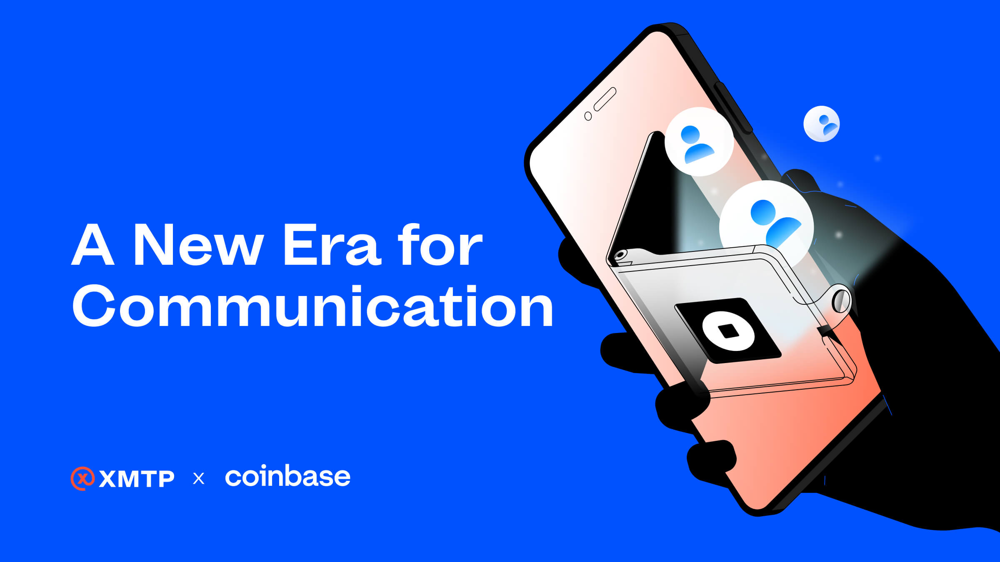
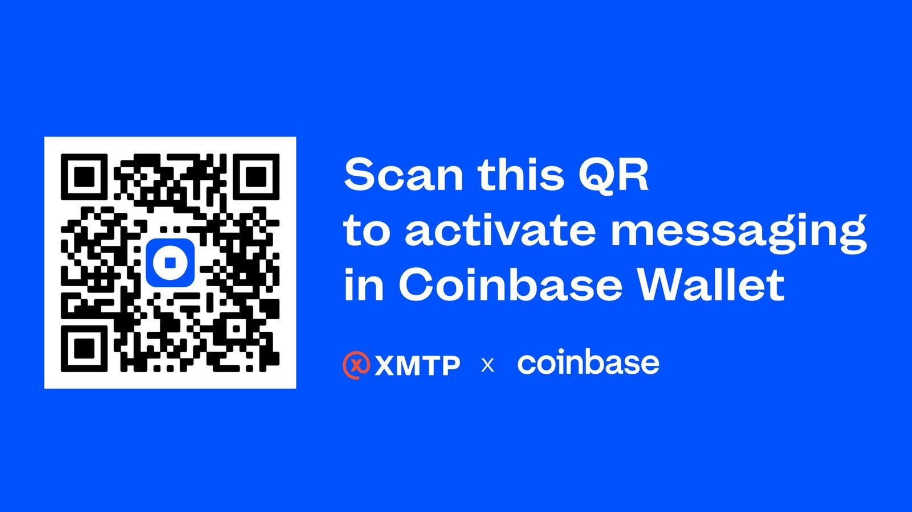

Anyone in the world can now send free global payments with a private and secure text message. This is just the beginning of individuals having more control, privacy, and ownership over their assets, identity, and now communication.

<!--truncate-->

I'm thrilled to announce that Coinbase Wallet is now part of the XMTP network, unlocking tons of possibilities for all apps built with XMTP. Techcrunch wrote a great article about this here. Join the conversation on Twitter here.

Our partnership with Coinbase Wallet signifies a leap forward, allowing all developers building with XMTP to reach users right where they are. It also validates the XMTP mission: building a secure, interoperable messaging network that all developers can benefit from.

We've always faced a challenge - how do you reach the users without forcing them to download a new app? Today, we've solved that. Now, all developers can reach the wallet.

- Dapps can now re-engage their users directly inside the wallet
- Users can add utility to their web3 identity with secure messaging
- People can send free payments globally directly in-chat

Coinbase Wallet's implementation of the XMTP protocol promises absolute security and privacy - no one has access to users’ messages, and they're safely stored on our progressively decentralized communication network.

This innovation also brings the ease of global digital transactions right into the user's inbox. It's as seamless and intuitive as using Whatsapp and Cashapp but all in the same app. Free global payments are now as simple as a message.

Most importantly, users retain full control over their communications. Their messages and contacts are tied to their web3 identity, providing consistency across the XMTP network. I believe owning your communication will be bigger than owning your assets in the future.

Scan the provided QR code to join us on this remarkable journey and get access to your secure inbox. If you are another wallet, developer, Dapp, or brand… I’d love to connect. Please email me shane@xmtp.com.

Today, we are not just launching a product; we're unveiling the future of communication. One where XMTP is ubiquitous with web3 communication. A privacy-preserving network that enables secure and private conversations between users in a way that actually works for developers.

Say hello, I'd love to hear from you.

_Shane Mac_
