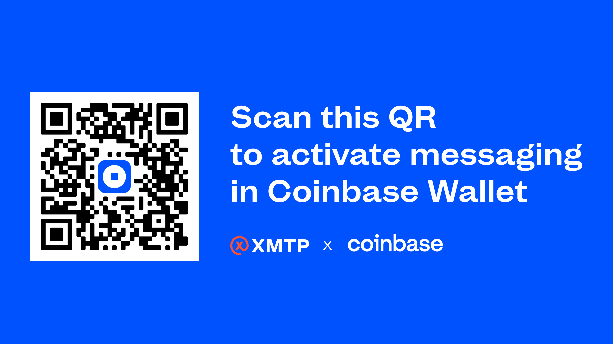

import ReactPlayer from 'react-player'
import FeedbackWidget from '/src/components/FeedbackWidget'

*No more cold starts: plug into the XMTP network to reach users where they are.*

Coinbase Wallet has officially joined the XMTP network! Now every app built with XMTP can use their in-app messaging to reach users on Coinbase Wallet.

Finally, *we can reach the wallet*.

<ReactPlayer width="100%" controls url='/img/cbw-messaging-final.mp4' muted playing="true" />

 

<!--truncate-->

Until now, driving growth for a new web3 app kinda sucked. Existing solutions for sending a secure message to a wallet address were all missing the key to an important dilemma: where would the user receive this message? If they have to download a new app to hear about your new app… we have a problem.

**Being able to reach major wallets unlocks growth and innovation for the whole web3 space.**

Coinbase Wallet’s integration of XMTP secure messaging is a major milestone in building a network any dev can plug into, to reach users where they are. With XMTP, web3 innovation finally has the reach it needs to grow, improve, and succeed.

**This commitment from Coinbase further validates the need for an interoperable and secure network every developer can benefit from.**

Coinbase Wallet built its inbox using XMTP to ensure that:

- **All messages are fully secure and private.** Messages are encrypted end-to-end between participants and stored in XMTP's progressively decentralized network. Coinbase does not have access to users’ messages, ensuring that their conversations remain private.
- **Digital assets can be transacted using the same inbox.** The ability to send global payments for free in a way that feels like WhatsApp + Cash App is such a massive innovation for the entire web3 space.
- **End-users own their communications.** The Coinbase Wallet inbox is tied to users’ web3 identity, which means they will find their messages and contacts in every other app within the XMTP network, including Lenster, ConverseApp, OrbApp, and others. ([Explore apps](/built-with-xmtp))

**Get access**

Scan the QR code below to unlock messaging in your Coinbase Wallet app. If you don't have the Coinbase Wallet app yet, the QR code will redirect you to download it.

Scanning this QR code will redirect you to message `gm.xmtp.eth` – which, if you do, will qualify you to receive a commemorative NFT!

Once you're in, you'll be able to invite anyone you know using your personal QR code!

:::tip Get in touch

If you’re a project interested in, or already building with XMTP, [get in touch with the Partnerships team](https://docs.google.com/forms/d/e/1FAIpQLSeQWPBt7cgngVJi2UQJIMNqXEPtP38ghjisuX4_yHWBmcr36A/viewform)! We’d love to connect and work with you.

:::

 
<FeedbackWidget />
