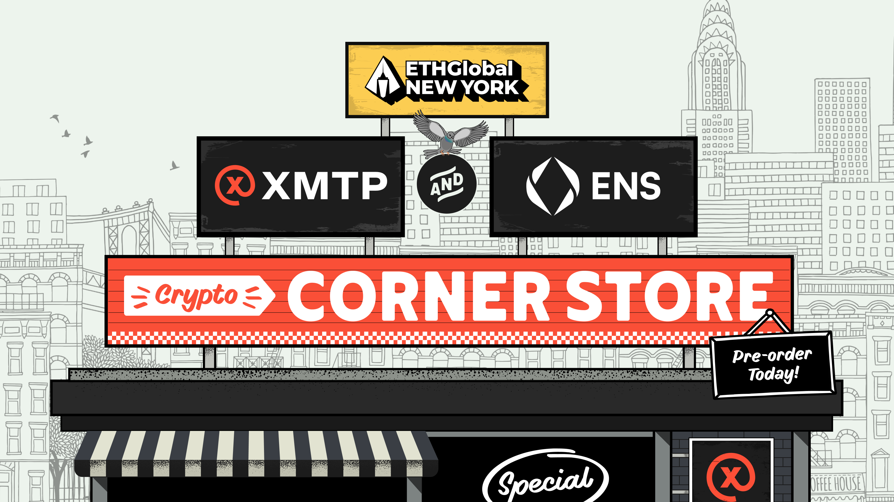

import ReactPlayer from 'react-player'
import FeedbackWidget from '/src/components/FeedbackWidget'

### This September we’re teaming up with ENS to run a crypto corner store at ETH Global NYC, powered by XMTP.

<!--truncate-->

Some of you might remember the [Base cafe](https://twitter.com/CoinbaseWallet/status/1683940629104001025) we hosted with Coinbase Wallet in July at ETH Paris. Anyone could place their order by texting an ENS we had set up, and pay for it in-chat using USDC. All gas-free on BASE. 

Secure wallet messaging unlocks real utility, that can sometimes feel like magic because of the current systems we’re used to. For example: 

- Avoiding credit card fees when paying for $1 coffee in a foreign country
- Having secure enough messaging that orders can be automated and paid for in-chat, without you having to enter *any* payment information (you’re already messaging from your wallet address).

It feels like texting a friend to grab you coffee.**

We’re bringing that feeling back this September, and taking it to the next level — by partnering with ENS to bring to life even more use cases for secure and private messaging. 

## Secure

Devs will be able to order both physical goods, like Red Bull, pizza, toothpaste, as well as digital goods including Base & Polygon testnet ETH, a Lens NFT, exclusive POAPs, and much more… 

Here’s where more magic takes place: no further identity or payment information is needed to avoid spoofs, scams, or misuse. 

Because this is built with XMTP, the sender & receiver of the chat are unfalsifiable — the wallet who signed has to be who they say they are because of the cryptographic signature that XMTP uses to sign identities. 

At the same time, projects can verify if a sender is who they say they are by looking at their on-chain history and seeing if they hold the right NFTs, or have received the funds already, etc. 

Having this level of security in messaging means we’re also able to fully automate and customize the chat experience — with bots! Configured by our friends at [Chainjet](https://chainjet.io/). More to come on this…

## Private

In Paris we noticed a bunch of people would create burner wallets to avoid having their on-chain identity be tied to their messaging identity. Which is very understandable but messy… wouldn’t it be so much easier, and make way more sense, if we could use our web3 identity for ~everything? 

With ENS, you can keep your primary wallet address and its on-chain history private, and use a subname specifically for messaging. That subname, like `hi.name.eth`, is tied to a new 0x address but still linked to your ENS — so your web3 identity can benefit from all that utility!

**Quite literally because on top of it, all of these items are free! We know you’ll get us back by building with XMTP and winning first place. 🙂

 
 
<FeedbackWidget />
