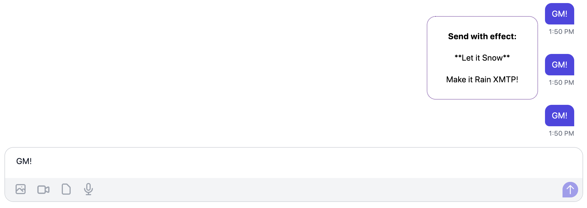

import FeedbackWidget from '/src/components/FeedbackWidget'

### Demonstrating the versatility of XMTP custom content types with a festive example


As we celebrate the holiday season, we’re excited to showcase the flexibility of XMTP with a whimsical winter-themed ScreenEffect in the [xmtp.chat](https://xmtp.chat/) example app. 

<!--truncate-->

This ScreenEffect may be just for fun, but it's a glimpse into the creative possibilities of custom content types more generally.

Interested in how it works? Simply long-press the send button in the app and choose the effect you’d like to run your message with.



Custom content types in XMTP empower developers to enrich their app's capabilities and can ultimately **elevate the entire XMTP ecosystem**.

Differing from standard content types, custom content types like this one don't require formal adoption through the XIP process because they’re still considered “experimental.” 

This opens the door for immediate experimentation and use in your own projects. Creating a custom content type can be a helpful first step toward getting a new content type adopted as an XMTP standard through the [XIP process](https://github.com/xmtp/XIPs).

However, it’s important to remember that custom content types aren't automatically supported across apps. To use someone else's custom content type, you'll need to implement its code in your app. That's why sharing the content type, as we did with this ScreenEffect content type in the [`experimental`](https://github.com/xmtp/xmtp-js-content-types/tree/main/experimental/content-type-screen-effect) directory, is crucial for community collaboration.

## 🔍 Delve into the code

Curious about crafting your own custom content type to share with other XMTP apps? Let's dive into the codec powering [xmtp.chat](https://xmtp.chat/).

Here's a quick glossary of fields that are required for all content types:

- `authorityId`: Identifies the entity that governs the content type, its definition, and implementation. Authority ID should be unique and widely recognized as belonging to the entity. DNS domains or ENS names can serve this purpose (e.g. `alix.eth`). The `xmtp.org` authority ID is reserved for standard content types, as well as this custom content type used for demonstration purposes.

- `typeId`: Identifies the particular type of content that can be handled by a specific implementation of the content type’s encoding/decoding rules.

- `versions`: Allows future evolution of the content type definition. Captured in the common major.minor form.

- `fallback`: Provides a way to display an alt-like text description in an app that doesn’t support a content type. However, in this case, we set `fallback` to `undefined` because displaying an alt-text description provides little value and may even be considered noise. Additionally, the `undefined` value enables apps to filter out your custom content type if they don’t support it.

The `parameters.messageId` and `parameters.effectType` parameters are used specifically for this content type and identify which effect to run when a particular message is being rendered.

Here’s the full code block for the ScreenEffect content type:

```jsx
import { ContentTypeId } from "@xmtp/xmtp-js";
import type { ContentCodec, EncodedContent } from "@xmtp/xmtp-js";

export type EffectType = "SNOW" | "RAIN";

export const ContentTypeScreenEffect = new ContentTypeId({
  authorityId: "xmtp.org",
  typeId: "screenEffect",
  versionMajor: 1,
  versionMinor: 0,
});

export type ScreenEffect = {
  messageId: string;
  effectType: EffectType;
};

export type ScreenEffectParameters = Pick<
  ScreenEffect,
  "messageId" | "effectType"
>;

export class ScreenEffectCodec
  implements ContentCodec<ScreenEffect | undefined>
{
  get contentType(): ContentTypeId {
    return ContentTypeScreenEffect;
  }

  encode(content: ScreenEffect): EncodedContent<ScreenEffectParameters> {
    return {
      type: ContentTypeScreenEffect,
      parameters: {
        messageId: content.messageId,
        effectType: content.effectType,
      },
      content: new Uint8Array(),
    };
  }

  decode(
    content: EncodedContent<ScreenEffectParameters>,
  ): ScreenEffect | undefined {
    const { messageId, effectType } = content.parameters;

    return {
      messageId,
      effectType,
    };
  }

  fallback() {
    return undefined;
  }
}
```

## 🤠 Guidelines for creating custom content types

- Consider alternative storage methods if your content type is intended only for internal use. Content types are not mutable. For example, when using this ScreenEffect content type, we need to store locally on [xmtp.chat](https://xmtp.chat) whether an effect has been run, so that it doesn’t re-run on every render.
- Keep it generic so others can use it! We recommend not including any app-specific logic in your custom content type, so others can consume it.
- For content types that do not have an appropriate fallback (like this one), setting the `fallback` to `undefined` helps maintain a seamless user experience across different apps.

## 💡 Try it and give us feedback!

Whether you want to give the ScreenEffect content type a spin in your own app, or if you want to try out your own, let us know what you learn! 

The XMTP core team has done some experimenting already and found it very illuminating, so we’d love to hear anything you run into as you try these out as well.

Note for React Native developers: Custom content types are now supported in React Native, so you’ll be able to try this out, too!

Here's to a festive season filled with creativity and coding! 💻🎉
