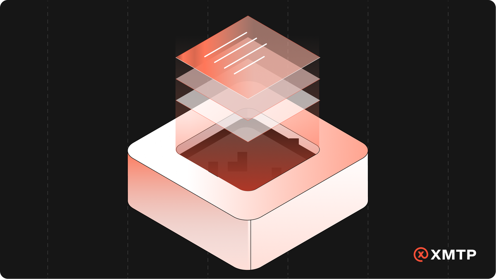
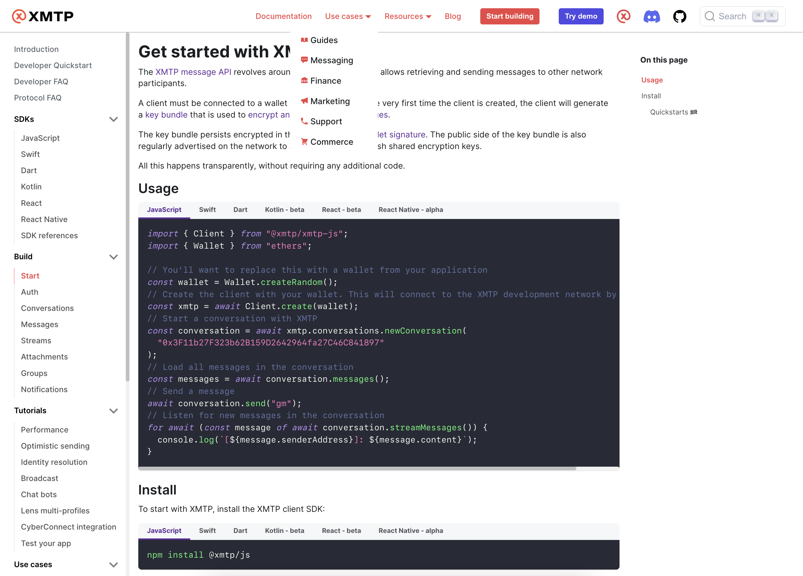
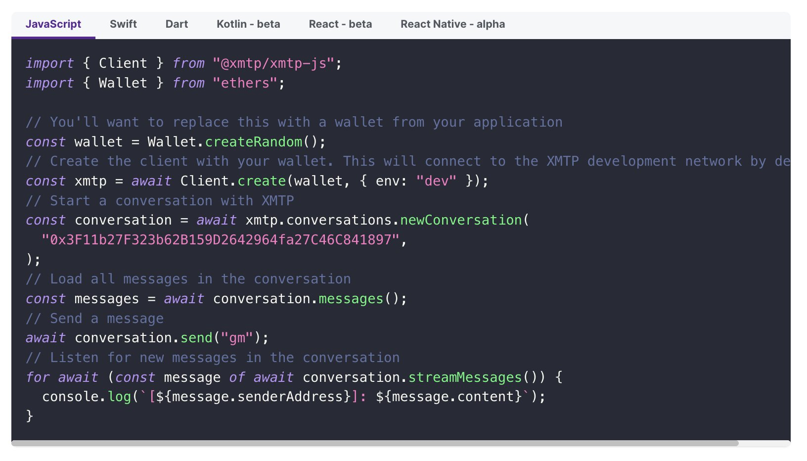

# Say hello to a seamless journey for building chat apps

We are incredibly excited to announce the launch of the completely revamped XMTP developer documentation!

The mission was clear — to create a seamless and inspiring developer experience by eliminating unnecessary friction and telling a captivating story.

Let’s take a closer look at what’s new on this update of the documentation of XMTP and how it will revolutionize your journey in building chat apps.

<!--truncate-->

## Tabs for Multi-SDK Consistent Storytelling **🧩**

XMTP's commitment to interoperability and accessibility is reflected in their multi-SDK approach. Now the documentation simplified, making it language agnostic, while highlighting consistency in the SDKs through tabbed code sections.

## **Core Concepts for Building with XMTP 🏗**

We’ve abstracted the core concepts to help you build with XMTP more swiftly. Think of it as a TV show guiding you on how to integrate secure and private chat into your application. These are the chapters you wouldn’t want to miss:

1. [Get started](https://xmtp.org/docs/build/get-started)
2. [Authenticate](https://xmtp.org/docs/build/authentication)
3. [Conversations](https://xmtp.org/docs/build/conversations)
4. [Messages](https://xmtp.org/docs/build/messages)
5. [Streams](https://xmtp.org/docs/build/streams)
6. [Attachments](https://xmtp.org/docs/build/attachments)
7. [Groups](https://xmtp.org/docs/build/group-chats)
8. [Notifications](https://xmtp.org/docs/build/notifications)

## **Left Nav Centralization 📘**

All documentation in a single Left Nav. It's like the chapters of a book, ensuring the lowest friction experience for learning software. This single tab approach ensures that you have a consistent navigation experience without the clutter.

On top of this all external sources where updated. Sources like Readme’s and independent pages that point only to the Docs, preventing outdated content from appearing again. This ensures everyone interacting with XMTP gets the latest and best experience, always.

import Quickstarts from "@site/src/components/Quickstarts/index.md";

<Quickstarts />

## **Use Cases to Spark Your Imagination 💡**

We've organized XMTP around various use cases in Finance, Commerce, Marketing, Automation, Support, and more. Draw inspiration and see how XMTP can be the backbone of your creative solutions.

- **[Messaging](https://xmtp.org/docs/use-cases/messaging) 💬**: Unlock the future of Messaging and build secure peer-to-peer apps or team platforms with end-to-end encryption, media attachments, group chats, and more. Communication reimagined!
- **[DeSo](https://xmtp.org/docs/use-cases/deso) 🌿**: Step into the world of Decentralized Social, like Lens Protocol apps did using XMTP. Discover new friends, create groups, share memes, and enjoy a world of possibilities.
- **[Marketing](https://xmtp.org/docs/use-cases/marketing) 📣**: Send secure newsletters to wallet owners, reach NFT collectors & token holders. Engage and analyze with confidence.
- **[Support](https://xmtp.org/docs/use-cases/support) ☎️**: Redefine customer support and engage in finance transactions on chat, automate with AI bots, and streamline DAO operations - all through secure channels.
- **[Commerce](https://xmtp.org/docs/use-cases/commerce) 🛍️**: Enhance e-commerce with encrypted communication between buyers and sellers.
- **[DeFi](https://xmtp.org/docs/use-cases/defi) 🏦**: Empower Decentralized Finance by sending secure transaction confirmations, notifications, token transfers, NFT minting, etc.
- **[Automation](https://xmtp.org/docs/use-cases/automation) 🤖**: Employ secure messaging for web3 automation tools, including triggers, notifications, and customer service bots.
- **[Gaming](https://xmtp.org/docs/use-cases/gaming) 🎮**: Create secure and immersive gaming experiences with real-time messaging, multiplayer group chats, in-game notifications, and more.

## **Tutorials: The Developer’s Arsenal 🛠**

Our tutorials are technical deep-dives that feature integration partners, highlight use cases, and educate on specific concepts. They are code-heavy, designed for rapid deployment, and perfect for developers looking to experiment and showcase possibilities.

- [Chat bots 🤖](/docs/tutorials/identity-resolution)
- [Identity resolution 🔑](/docs/tutorials/identity-resolution)
- [Attachments 📸](/docs/build/attachments)
- [Optimistic messages 💨](/docs/tutorials/optimistic-sending)
- [Group chats 👩‍👩‍👧‍👦 (alpha)](/docs/build/group-chats)
- [Notifications 🔔](/docs/build/notifications)

## **Language Simplification 🗣**

We’ve streamlined the language to keep it simple and relatable. For instance, Preview, Dev Preview, and General Availability are now `Alpha`, `Beta` & `Production` ✅. Also, many independent docs have been merged into traditional Developer `FAQs`.

## **Hackathons Hub 🏁**

Discover a hub dedicated to hackathons that is updated ad-hoc, providing a centralized space for showcasing possibilities and aligning with XMTP priorities when building at hackathons.

https://xmtp.org/docs/hackathons

### **Conclusion 🏁**

We owe a huge thanks to the incredible XMTP community and the exceptional team behind the protocol. Building this documentation has been an absolute joy! We can’t wait to see the innovative chat apps you’ll create with XMTP 🚀
