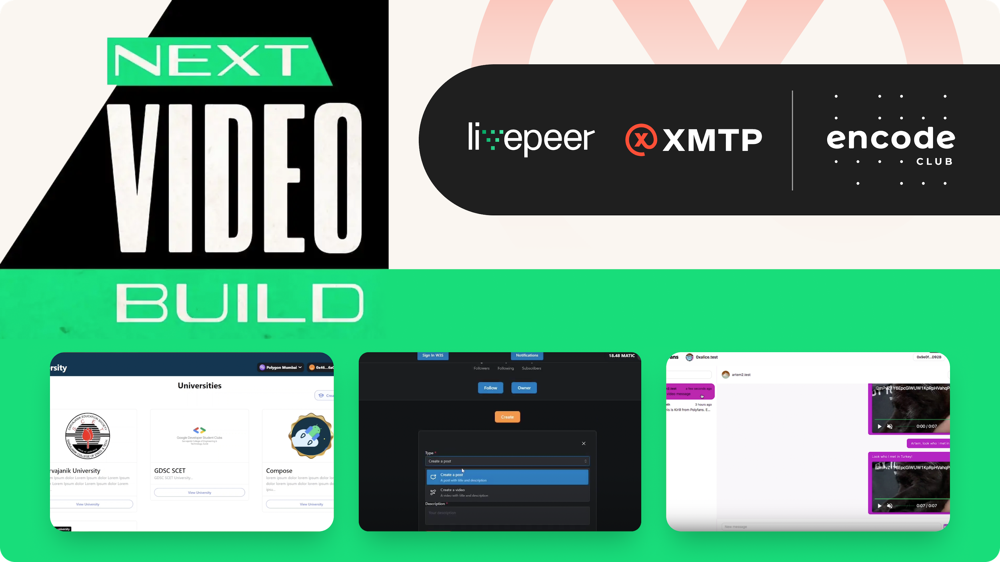

import ReactPlayer from 'react-player'
import FeedbackWidget from '/src/components/FeedbackWidget'

Next Video Build: Livepeer x XMTP awards wrap-up: DeUniversity’s education platform, Polyfans Messenger token-gated livestream, and Livopedia’s creator tools take top honors.

<!--truncate-->

There is no question that video is at the core of consumer and business experiences across the web. Nearly 92% of internet users watch videos daily and 82% of all internet traffic in 2022 came from video.

But building scalable video services is non-trivial, especially when they are fully decentralized across both frontend experiences and backend storage and streaming. Developers are looking to infrastructure providers like XMTP and Livepeer to provide fully composable services to build rich user experiences around video, that meet and exceed user expectations. For that reason, XMTP partnered with Livepeer and Encode Club to sponsor developers from around the world to build full decentralized video applications.

The results were awesome. Nearly 30% of the 88 teams competing built applications using XMTP across a completely diverse set of use cases. These included video streaming, peer-to-peer video messaging, and even token-gated chat to enable new business models from content creators.

**Here are the XMTP award winners:**

## Best use - DeUniversity 🥇

DeUniversity is a completely decentralized university platform that allows users to create and enroll in courses, conduct live classes, interact with students, and solve problems using Livepeer and XMTP. Using XMTP, DeUniversity built messaging experiences allowing students to chat during live streams, DM professors with questions, as well as with other students over end-to-end encrypted chats that preserve privacy.

  <ReactPlayer
    className='player'    
     width='100%'
    height='100%'  
    controls 
    muted  
    playing="true" 
    url='https://vimeo.com/787437507'
  />

 

**Check out the GitHub repo here:** [https://github.com/sambitsargam/de-university](https://github.com/sambitsargam/de-university)

---

## Best use - Polyfans Messenger 🥈

Enabling new and unique business models for content creators is core to the mission of web3. Polyfans built a messenger on top of XMTP, Lens protocol, Livepeer, and IPFS, which allows fans to chat with creators using both text and video. Creators can then token-gate livestreams and receive payments in chat from fans, allowing streamers to start generating revenue from day 1, all through a completely decentralized service infrastructure.

  <ReactPlayer
    className='player'    
     width='100%'
    height='100%'  
    controls 
    muted  
    playing="true" url='/img/polyfans-messenger-demo.mp4'
  />

 

**Check out the GitHub repo here:** [https://github.com/kmadorin/polyfans/tree/messenger](https://github.com/kmadorin/polyfans/tree/messenger)

---

## Best use - Livopedia 🥉

Livopedia built a creator studio for content creators to make building and deploying revenue-generating video messaging applications easy. With Livopedia, content creators can both gate uploaded and hosted videos, as well as token-gate livestreams for their fans. Using XMTP, content creators can then broadcast messages when livestreams start, as well as chat with fans across the XMTP network, and even send video messages to specific users, embedded right in the chat experience.

  <ReactPlayer
    className='player'    
     width='100%'
    height='100%'  
    controls 
    muted  
    playing="true"  url='https://youtu.be/00Jl-_G5MqQ'
  />

 

**Check out the GitHub repo here:** [https://github.com/Ahmed-Aghadi/Livopedia](https://github.com/Ahmed-Aghadi/Livopedia)

---

It’s truly impressive to see that developers are able to build fully decentralized video streaming and hosted experiences using XMTP, Livepeer, and IPFS. By being able to utilize fully composable and interoperable infrastructure, developers are opening the door to new and unique business models for content creators that will greatly reduce the friction to generate revenue through video and expand the possibilities of where content businesses can live online.

As web3 adoption continues to grow, it’s clear that developers will be able to stand up scalable video solutions that have massive impact on the adoption of decentralized solutions.

For more information about XMTP and Livepeer, check out the links below:

- [XMTP](https://xmtp.org/)
- [Livepeer](https://livepeer.org/)

**Have a video idea you’re working on? Connect with us and let us know.**

- 👾 Discord - [https://discord.gg/xmtp](https://discord.gg/xmtp)
- 🐦 X - [https://x.com/xmtp\_](https://x.com/xmtp_)
- 📖 Careers at XMTP Labs - [https://blog.xmtp.com/careers/](https://blog.xmtp.com/careers/)

 
<FeedbackWidget />
