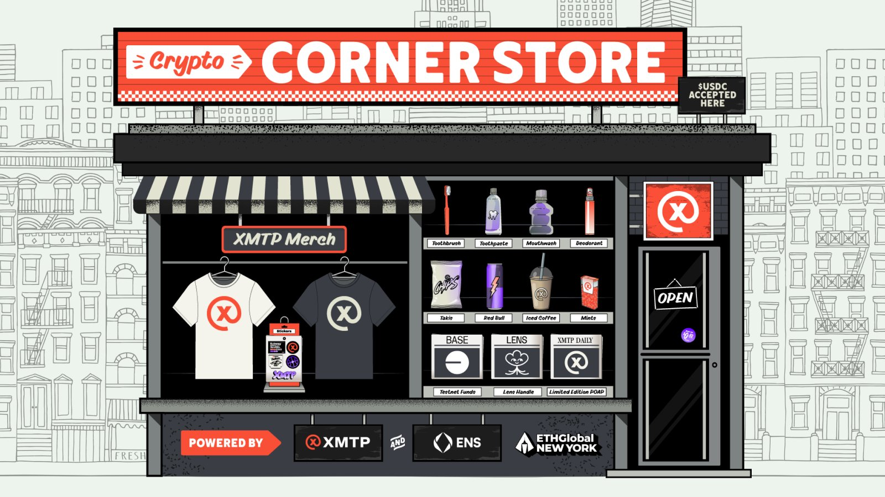
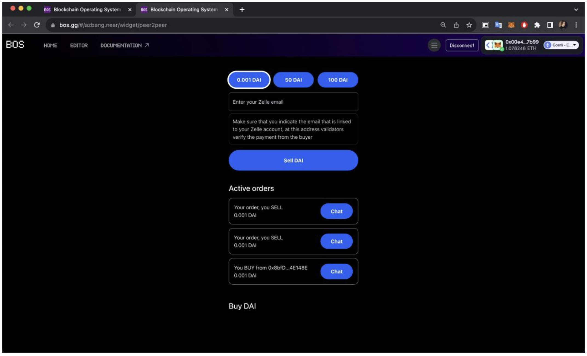
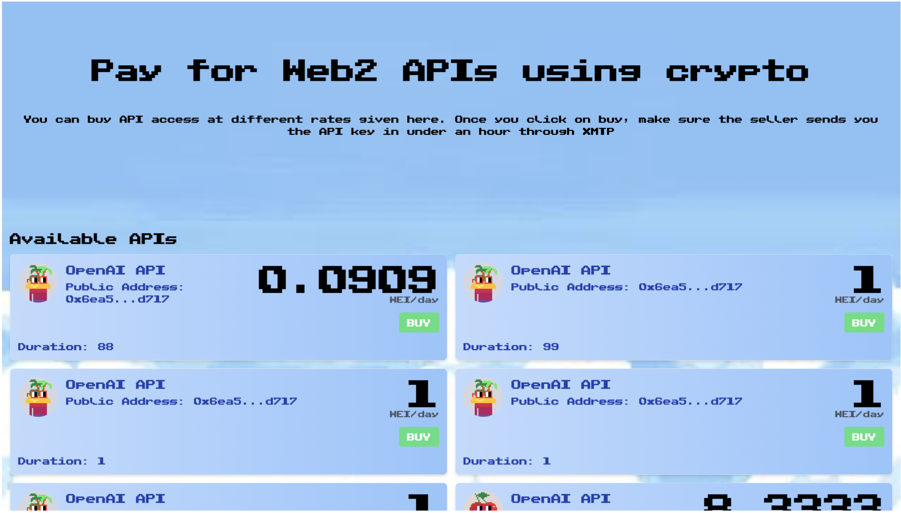
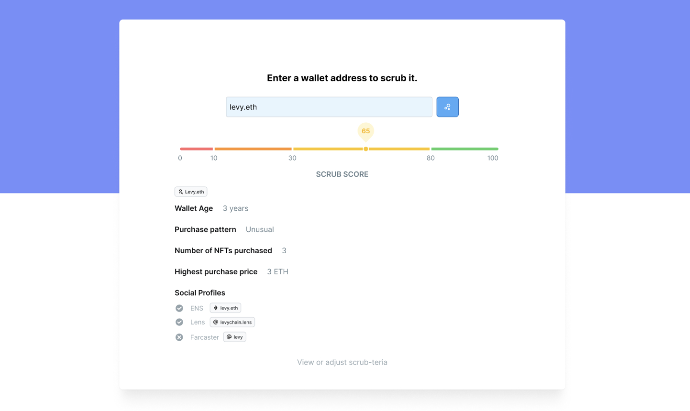
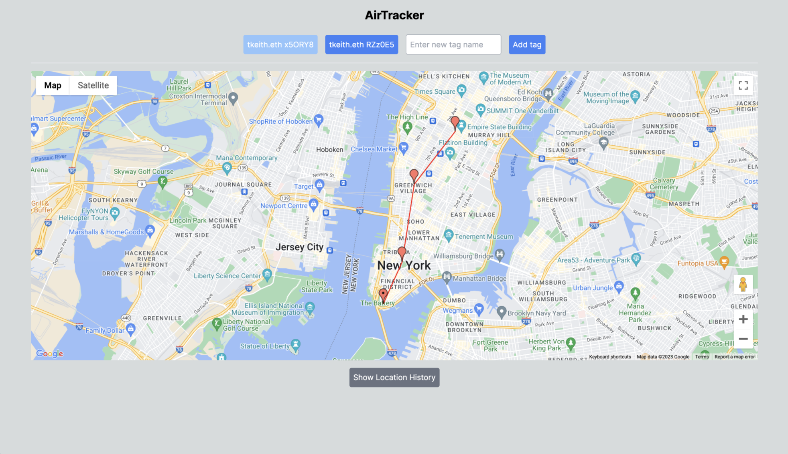
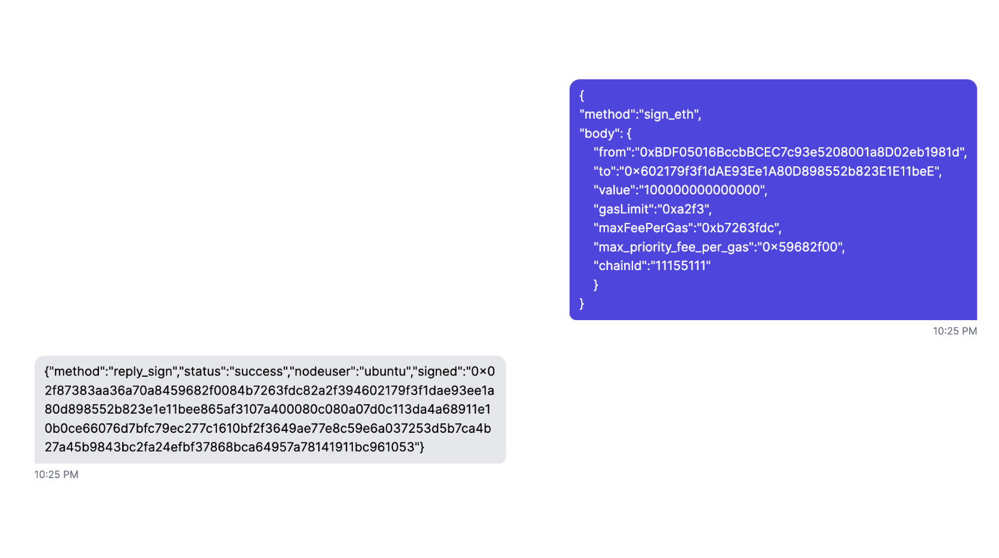

import FeedbackWidget from "/src/components/FeedbackWidget";
import { TwitterTweetEmbed } from "react-twitter-embed";

It's been an amazing weekend in the city of New York! 🗽 Lots of people chose XMTP for building and sending secure messages, from Airtag trackers to DeFi notifications. We also had a great run on our newest version of the CryptoCornerStore.eth, in partnership with [**ENS**](https://ens.domains) and powered by [**Chainjet**](https://chainjet.io).

<!--truncate-->

  <TwitterTweetEmbed tweetId={"1705298317150658768"} />

The CryptoCornerStore was a huge success, with over 50% of devs placing orders on the XMTP network. We had a lot of fun with the store, and we hope you did too!

## The Winners

🥇 **TrueP2P**: Winning the Best Use of XMTP award and a $2500 prize, TrueP2P is a swaps market based on onchain wire transfer confirmation

_How it uses XMTP_: The whole process of verification of bank transactions is built on top of the XMTP protocol. It is the key element of the service. XMTP is used for secret chat during P2P transfers and for sending the Zelle email extension key, which is needed to send USD

[https://ethglobal.com/showcase/truep2p-9wbj6](https://ethglobal.com/showcase/truep2p-9wbj6)

🥈 **Soho**: Soho grabs the second place with a $1500 prize, revolutionizing API marketplaces by leveraging XMTP for secure API key transfers via XMTP, making centralized APIs more accessible.

_How it uses XMTP_: XMTP was the most important feature of our Application for securely transferring the API keys

[https://ethglobal.com/showcase/soho-xo1fi](https://ethglobal.com/showcase/soho-xo1fi)

🥈 **Upper Social**: Upper is a social network with a twist; you can become a creator and sell your fragments to your fans and other creators. Fragment holders can trade creators' fragments and vote for proposals, allowing creators to borrow from the fragments pool and create more content.

_How it uses XMTP_: Once a fan acquire a Fragment it will give access to the Creator's chat. Chat is only accessible by holding Fragments.

[https://ethglobal.com/showcase/upper-social-nq3iw](https://ethglobal.com/showcase/upper-social-nq3iw)

📲 **Vouch messenger**: A native iOS app which is on a mission to make sure you know who you're talking to, through verification and social graphs we're creating a safe place to connect and have fun.

_How it uses XMTP_: The messaging protocol is built upon XMTP with a layer of authentication built upon it.

[https://ethglobal.com/showcase/vouch-messenger-qqvjm](https://ethglobal.com/showcase/vouch-messenger-qqvjm)

🤖 **Scrubbie**: Scrubbie enhances messaging experiences by allowing XMTP clients to filter spam through a specialized API.

_How it uses XMTP_: We built an API to allow for all XMTP clients to have a simple way to filter for spam wallets. Clients do not have to trust our criteria, using our API that can set the criteria they care about the most to filter out spam wallets from messaging their users.

[https://ethglobal.com/showcase/scrubbie-k7mn1](https://ethglobal.com/showcase/scrubbie-k7mn1)

#### Honorable Mentions

🏊 **AirTracker**: $500 for AirTracker. Airtracker brings decentralized asset tracking into the mainstream by using XMTP messaging to notify users about significant changes in their assets’ locations.

_How it uses XMTP_: Messages are sent to users' XMTP accounts to update them when the location of their asset changes significantly (by more than a few hundred meters)

[https://ethglobal.com/showcase/airtracker-8qstn](https://ethglobal.com/showcase/airtracker-8qstn)

🦿 **RemoteEOA**: Another $500 for RemoteEOA. Remote Control of EOA wallets allow 3rd parties to script and manage wallets on your behalf without ever exposing private keys.

_How it uses XMTP_: We're using XMTP as a communication protocol between a client where a user can control custodial and a server of these custodial wallets

[https://ethglobal.com/showcase/remoteeoa-ocgsq](https://ethglobal.com/showcase/remoteeoa-ocgsq)

The future of web3 and secure, private messaging looks brighter than ever. We can't wait to see how these projects develop and what new ones will emerge in the future.

Looking forward to seeing everyone at the next event! 🚀
