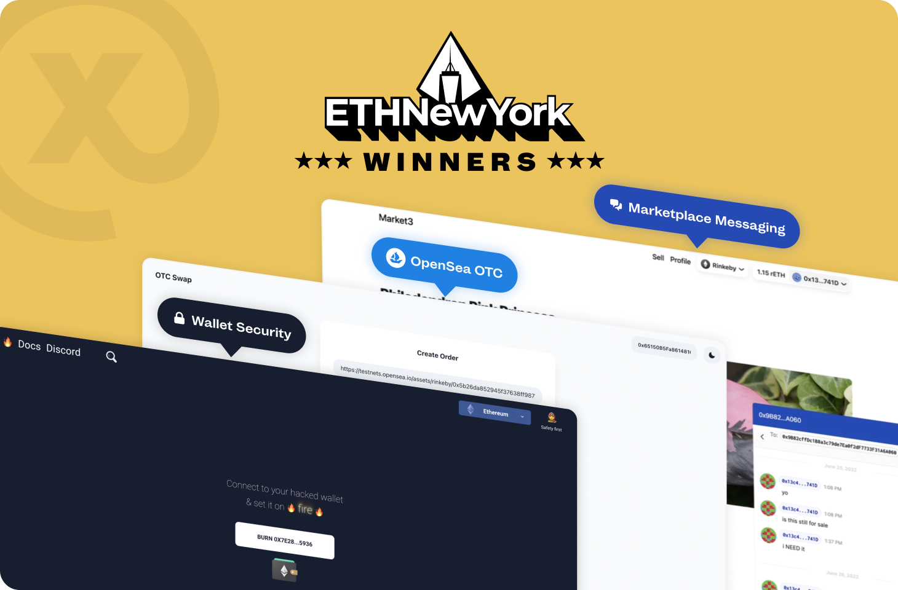
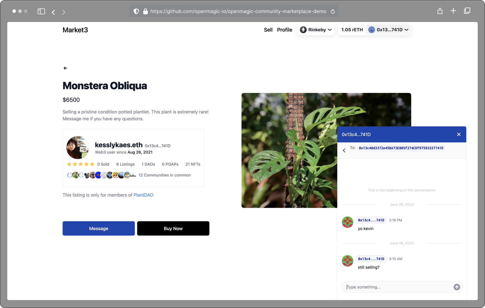
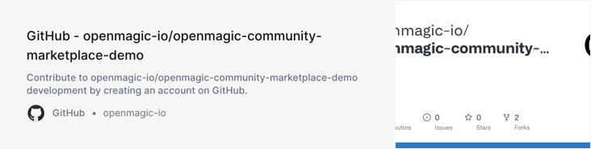
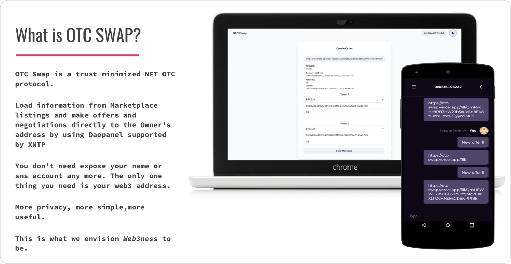
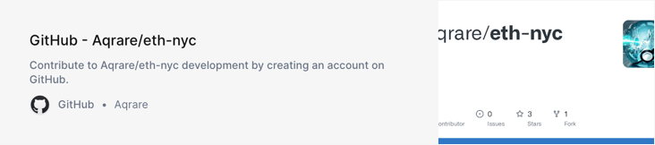
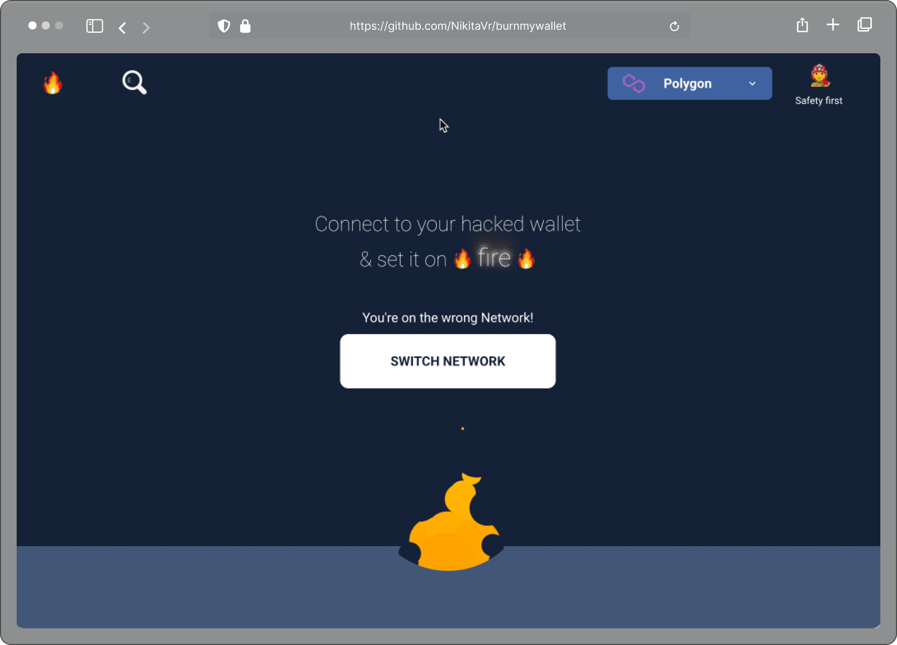
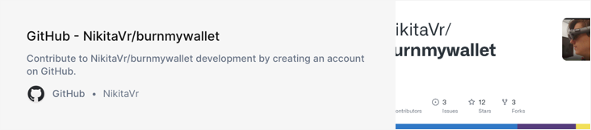

We just got back from [ETH NYC](https://ethglobal.com/) and what a great event. 1,300 builders, 50 sponsors, so much energy…

<!--truncate-->

We’re amped to share a few of the hackathon submissions that won awards at the event and we’re looking forward to being with everyone at [ETH SF](https://sf.ethglobal.com/) in November.

We’re highlighting 3 hackathon submissions so you can see some examples of end-to-end use cases that demonstrate web3 messaging scenarios and user value using XMTP.

---

## Market3 & Walletscan - 1st place 🥇

Merchants and customers need systems that eliminate fraud in a verified/ trusted chat. The Market3 demo showcased how both buyer and seller will have E2EE chats through an Intercom-type widget.

* Development team: [@RealKevinYang ](https://twitter.com/RealKevinYang), [@zihuajliu](https://twitter.com/zihuajliu)
* Live demo: [https://www.loom.com/share/21c1bf50846b4d25a2e0886a59057386](https://www.loom.com/share/21c1bf50846b4d25a2e0886a59057386)
* Github repo:

---

## OTC Swap - 2nd place 🥈

OTC Swap created a messaging-based bartering system for NFT P2P trading by using OpenSea Seaport and XMTP. The prospective buyers can give an OpenSea URL on an NFT/ token and then make an offer directly to the owner's address using XMTP.

OTC Swap showed that it’s possible for buyers and sellers to have an experience built on verified wallet communication. This means the buyer has proof that the seller they are communicating with owns the item they are interested in. OTC Swap allows buyers and sellers to communicate with complete control over their identity and the experience.

OTC Swap was able to accomplish this in eight hours by combining XMTP, [OpenSea Seaport](https://opensea.io/blog/announcements/launching-seaport-saving-the-community-millions-in-fees/), IPFS, and EPNS.

* Development team: [@0x_Yuzu](https://twitter.com/0x_Yuzu)
* Live demo:[ https://otc-swap.vercel.app/](https://otc-swap.vercel.app/)
* Github repo:

---

## Burn My Wallet - 3rd place 🥉

Burn My Wallet created a "kill switch" for a stolen wallet. When a user reports their wallet as stolen, Burn My Wallet creates a non-transferable token that marks the wallet hacked. This means applications will have a source of truth for the wallet status.  Messaging apps using XMTP can integrate the Burn My Wallet API, and easily check if wallets have been hacked. One user benefit is that this will automatically lock the conversation of the hacked wallet to prevent any spoofing or sharing of sensitive information.

* Development team: [@NikitaVarabei](https://twitter.com/NikitaVarabei), [@erinleelikes](https://twitter.com/erinleelikes)
* Live demo:[ https://burnmywallet.com/](https://burnmywallet.com/)
* Docs [https://docs.burnmywallet.com/](https://docs.burnmywallet.com/)
* Github repo:

---

## Got an idea you’re working on? Connect with us.

* 👾 Official Discord Access - [https://xmtp.typeform.com/early-access](https://xmtp.typeform.com/early-access)
* 🐦 XMTP Official Twitter - [https://twitter.com/xmtp_](https://twitter.com/xmtp_)
* 🌐 XMTP Website - [https://xmtp.com/](https://xmtp.com/)
* 📖 Careers at XMTP Labs - [https://blog.xmtp.com/careers/](https://blog.xmtp.com/careers/)
