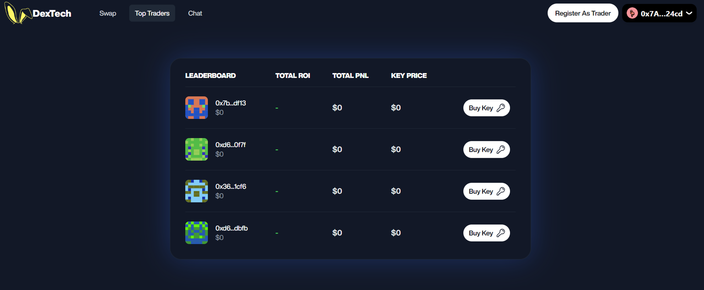

**_Explore how the winning projects at ETHOnline 2023 leveraged XMTP in unique ways, from engaging AI-powered NPCs to connecting with pro traders and receiving lessons from tutors who tokenize their time._**

<!--truncate-->

ETHOnline 2023, the flagship online event from ETHGlobal recently came to an end! It’s an async hackathon that took place across three weeks, from October 6th through the 27th, with over $200,000 in prizes. XMTP participated as a prize contributor, and we have three outstanding winners recognized for their implementations of our web3 messaging protocol.

The categories we chose to honor for our participants were:

- Best Onboarding
- Best Encrypted Message
- Best Use

From chats with AI powered game characters using token bound accounts, to reputable discussions with pro traders and even direct lessons from tutors with valuable time, these winning project demonstrate the flexibility of XMTP integrations. We hope these will inspire and plant the seed for what’s possible!

## **Cosmic Cowboys: Chat with AI NPCs with Token Bound Accounts**

**Winner of Best Onboarding**

Team Piñata impressed with "Cosmic Cowboys," a web3 game highlighting tokenized game mechanics and interactive NPCs. The NPCs, established as ERC-721 tokens with unique metadata on-chain, each had their own wallets thanks to the ERC-6551 standard for Token Bound Accounts. The project won Best Onboarding by creatively enabling on-chain engagement with NPCs and dynamic AI-driven conversations through OpenAI's chat API.

The project demonstrated XMTP's capabilities by showcasing messaging between wallets, including those owned by NFTs created with the ERC-6551 standard. They utilized XMTP's on-chain messaging for in-game system notifications, extending the possibilities outlined in the ERC-6551 proposal.

You can [view the Cosmic Cowboys’ ETHGlobal entry here.](https://ethglobal.com/showcase/cosmic-cowboys-3q0co)

## Dex Tech: Trusted Chats with Social Finance

**Winner of Best Encrypted Message**

Dex Tech, the "first gamified social DEX," is a decentralized exchange designed for traders to communicate confidently. Professional traders are often hard to reach, and verifying their reputations can be challenging. Dex Tech addresses this by blending a social touch into a unified DEX experience.

Using Social Finance (SoFi or SocialFi), Dex Tech taps into the decentralized social realm and integrates with DeFi principles. In SocialFi, users can create their tokens, representing their value on the platform (called Keys for Dex Tech's traders). Pro traders, with a record of on-chain activity, build trust through their provenance.

Dex Tech's use of XMTP highlights the protocol's flexibility. It token-gates conversations based on the number of Keys in a user's wallet. Holding Keys unlocks a valuable communication line, allowing users to gain insights from respected traders, creating an engaging environment for blockchain-based trading.

Check out [Dex Tech’s entry to ETHGlobal here](https://ethglobal.com/showcase/dextech-x13s5).

## Token Tutor: Censorship-Resistant Lessons with Tutors

**Winner of Best Use**

Token Tutor is a web3 mentoring platform with the motto "Tokenize Time, Maximize Learning, Build the Future." Recognizing challenges in the current tokenization landscape for community leaders, Token Tutor aims to bring real value by tokenizing time for mentors, educators, and leaders.

Mentors can distribute NFTs representing their time, allowing learners to mint these tokens for the chance to interact with thought leaders. This innovative system, powered by XMTP, provides a cost-effective, flexible, decentralized, and trust-less way for learners to connect with experts.

Token Tutor incorporates a Public Good system, enriching both tutors and learners while strengthening the web3 community. The platform empowers educators by offering a direct, censorship-resistant method to monetize their time. XMTP integration facilitates encrypted messaging between learners and tutors, even enabling the transfer of USDC within the chat. The simplicity of sending crypto through XMTP, via Coinbase Wallet, mirrors the ease of sending funds through Apple Pay in iMessage.

As more individuals engage with on-chain activities, tokenizing real-world assets and unique assets like time, there's an increased opportunity for discovery. XMTP plays a crucial role in ensuring secure communication lines among web3 explorers, bridging experiences across various dApps within the network.

[See Token Tutor’s showcase entry for ETHGlobal](https://ethglobal.com/showcase/token-tutor-bfyx4).

## Congratulations!

We want to express our gratitude for these participants showcasing different methods of integrating XMTP for their hackathon submissions at ETHOnline 2023! Congratulations, once again. We hope to continue seeing how far you take the future of messaging, across web3 and beyond. Great use cases like these leave us feeling inspired.
