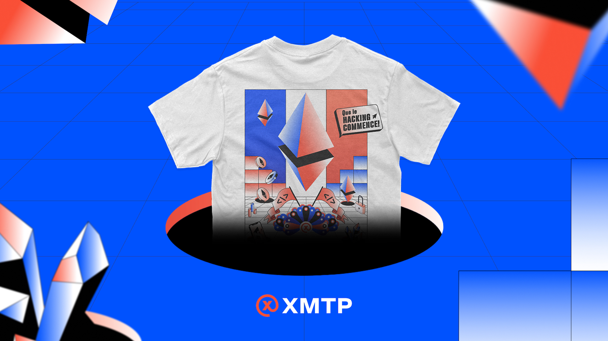
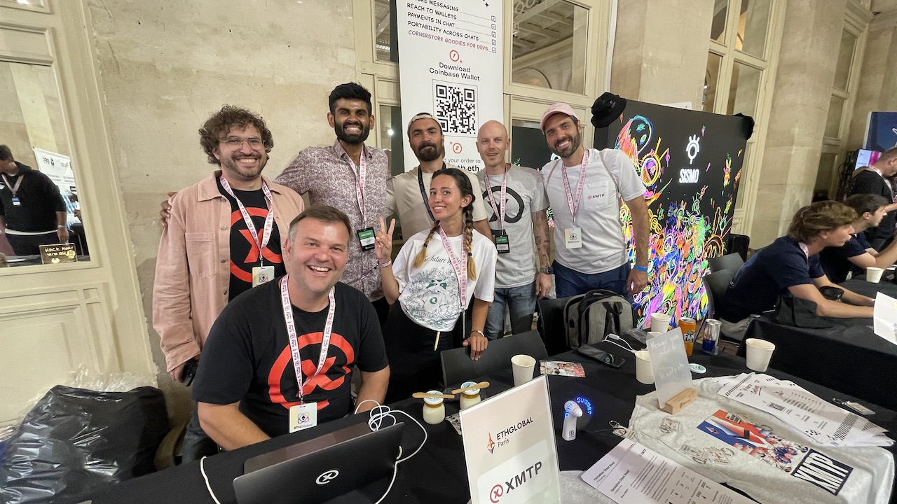
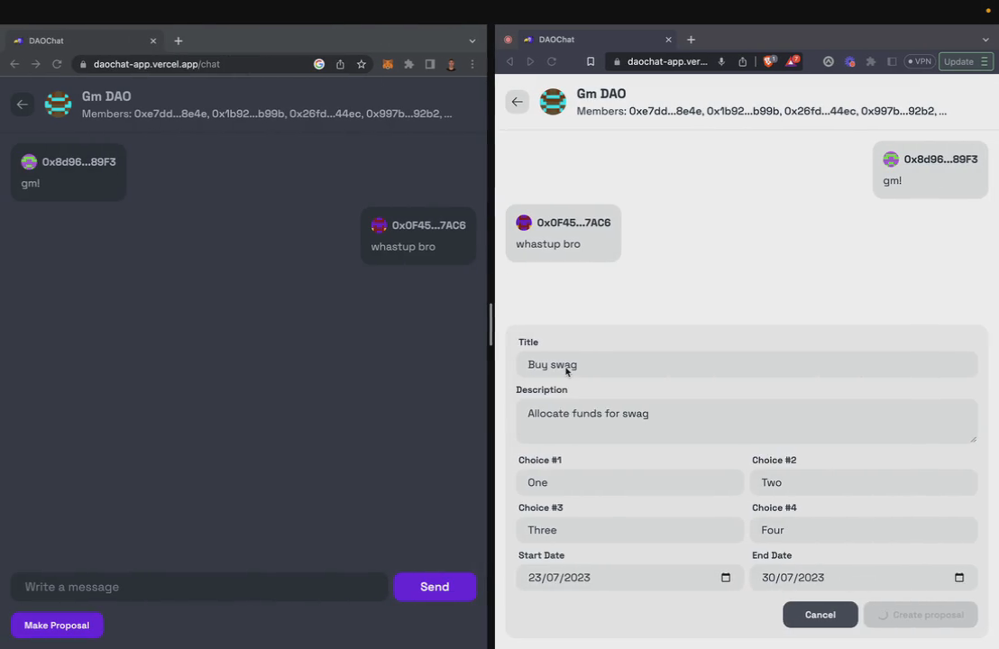
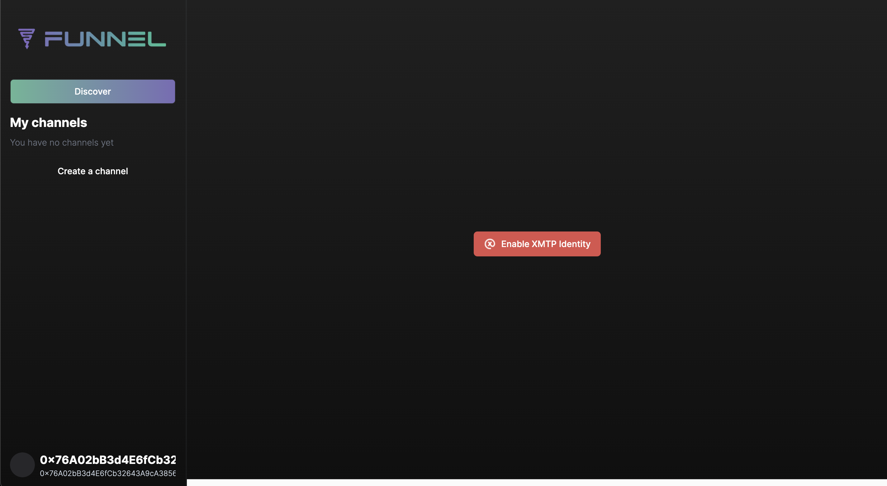
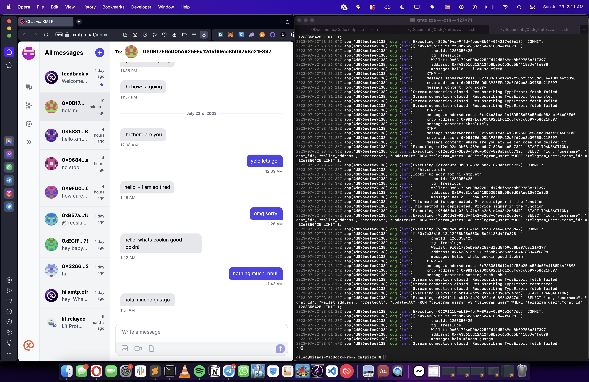

import FeedbackWidget from "/src/components/FeedbackWidget";
import { TwitterTweetEmbed } from "react-twitter-embed";
import signage from "./media/eth-paris/bodega-signage.jpg";
import menu from "./media/eth-paris/bodega-goods.jpg";
import booth from "./media/eth-paris/peter-bodega.jpg";

A huge thank you to everyone who participated and made ETH Paris such an exciting event! The projects we saw being built with XMTP were truly inspiring. They brought forth the many use cases that XMTP’s protocol unlocks: from improving DAO governance with group chats to facilitating freelance work through bounties and crypto payments in chat.

<!--truncate-->

## The Winners

This was one of the most popular hackathons for XMTP, with over 34 submissions. Here are some of the most interesting projects we saw.

🥇 **DAOChat**: This project won the Best Use of XMTP award, with a prize of $2500. DAOChat is a brilliant solution for increasing engagement and participation in DAOs by bringing governance to group chats. This makes the process more familiar and straightforward for everyone involved.

[https://ethglobal.com/showcase/daochat-0q8ws](https://ethglobal.com/showcase/daochat-0q8ws)

🥈 **Funnel**: Funnel won the second prize of $1500. It allows for the creation of on-chain, condition-gated discussion threads and channels. Think of it as a custom-made Reddit threads-like app that can have useful applications in gathering people in a same channel without unveiling their identities.

[https://ethglobal.com/showcase/funnel-z8f80](https://ethglobal.com/showcase/funnel-z8f80)

🥉 **World Chat**: Coming in third and winning $500, World Chat is a Telegram bot that enables users to send and receive messages on XMTP and Push. Users can message the bot, specify ENS or wallet addresses, and get provisioned wallets to exchange messages with these services.

[https://ethglobal.com/showcase/world-chat-z7he4](https://ethglobal.com/showcase/world-chat-z7he4)

🛠️ **Freelense**: Freelense won the TalentLayer and the Best Alert Bot Award, taking home $1000. It is a messaging app that allows hiring managers to create gig posts and receive and approve freelancer proposals. Freelense aims to make the hiring process seamless for gig workers.

[https://ethglobal.com/showcase/freelense-yxw4m](https://ethglobal.com/showcase/freelense-yxw4m)

### Honorable mentions

We celebrated many other innovative projects in the XMTP Prize Pool:

🤖 **Gaston**: Gaston won the Best Alert Bot award, securing $500. The tool can extract event types from any contract and turn them into decentralized notifications.

[https://ethglobal.com/showcase/gaston-8s4dq](https://ethglobal.com/showcase/gaston-8s4dq)

🏊 **SansScript**: SansScript was part of the XMTP Prize Pool, winning $250. This innovative tool combines web2 newsletter features with web3 capabilities, allowing users to create, publish, and subscribe to diverse newsletters in a decentralized and censorship-resistant way.

[https://ethglobal.com/showcase/sansscript-89u46](https://ethglobal.com/showcase/sansscript-89u46)

🏊 **ZAP (ZK Ad Platform)**: Also part of the XMTP Prize Pool, ZAP won $250. ZAP is an ad-tech platform that revolutionizes the advertising industry through recommending optimal ads with AI, empowering publishers and their viewers by sharing ad revenue, and hosting a built-in chat function for viewers to chat directly with the advertisers.

[https://ethglobal.com/showcase/zap-zk-ad-platform-je3nt](https://ethglobal.com/showcase/zap-zk-ad-platform-je3nt)

🏊 **Promoteur**: Another XMTP Prize Pool winner, Promoteur also received $250. This tool simplifies Web3 marketing and promotions by enabling targeted messaging and engagement tracking.

[https://ethglobal.com/showcase/promoteur-j59sh](https://ethglobal.com/showcase/promoteur-j59sh)

### In other important news last week...

- **Coinbase Wallet and XMTP**: In a monumental partnership, Coinbase Wallet introduced wallet-to-wallet messaging powered by XMTP, an important leap forward for secure and frictionless communication between blockchain wallets.

  <TwitterTweetEmbed tweetId={"1679178581224873985"} />

- **Ordering coffee with USDC**: Ordering coffee with USDC through Coinbase Wallet & XMTP is now a reality, making it incredibly easy to transact with cryptocurrencies in everyday life.

  <TwitterTweetEmbed tweetId={"1680929762443706368"} />

- **Photo sharing on Converse App**: Converse App has now launched end-to-end encrypted photo sharing, ensuring secure and private image transfers.

  <TwitterTweetEmbed tweetId={"1679505488784814081"} />

- **AirStack integration**: Reaching communities on the XMTP network just got a lot easier thanks to AirStack!

  <TwitterTweetEmbed tweetId={"1682246364292366338"} />

- **Paragraph announcement**: Wallet newsletters are now a thing. Sign up to receive the next [XMTP Dev Notes](https://paragraph.xyz/@xmtp) straight to your wallet!

  <TwitterTweetEmbed tweetId={"1682107163487993858"} />

- **XMTP Delivers... Bodega goods to devs**

  Throughout the weekend we managed an XMTP bodega that delivered goods to devs if they ordered them through XMTP.

   &emsp;
   &emsp;
  

 

The future of web3 and secure, private messaging looks brighter than ever. We can't wait to see how these projects develop and what new ones will emerge in the future.

Looking forward to seeing everyone at the next event! 🚀
