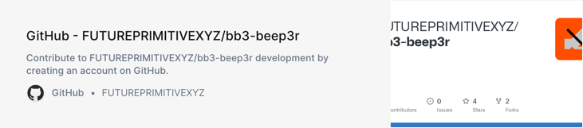
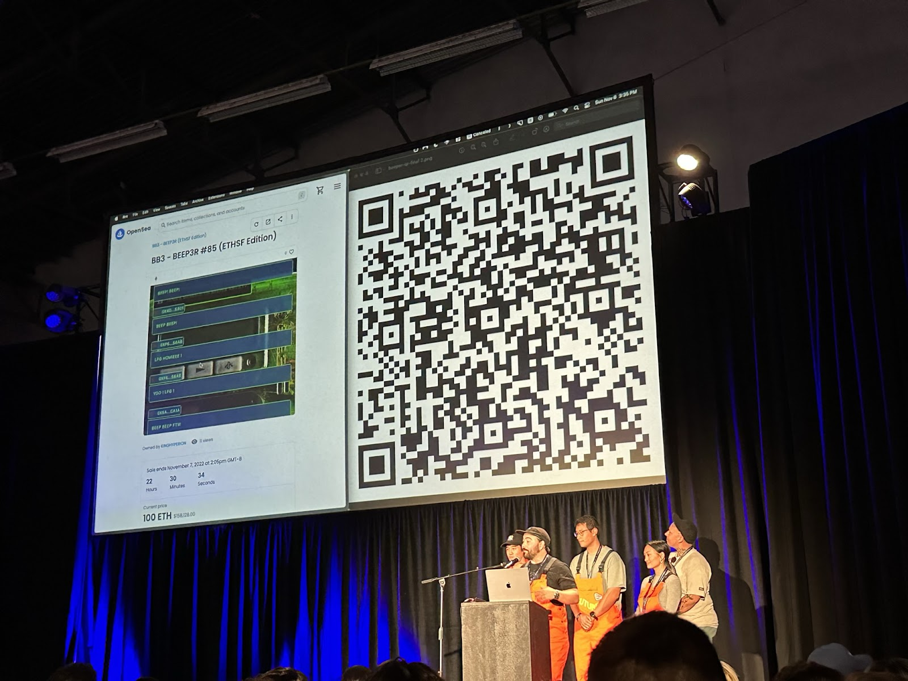
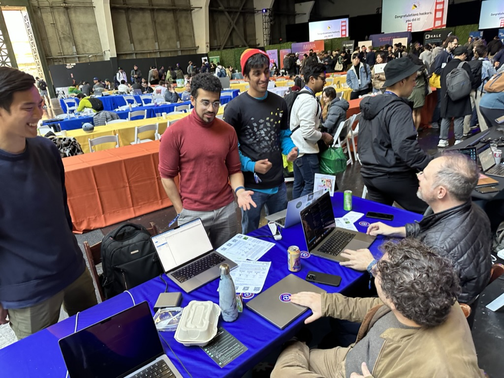
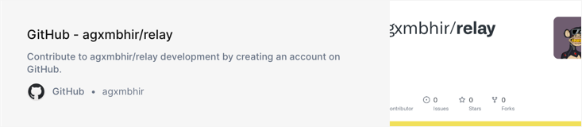
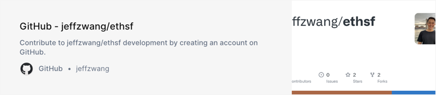
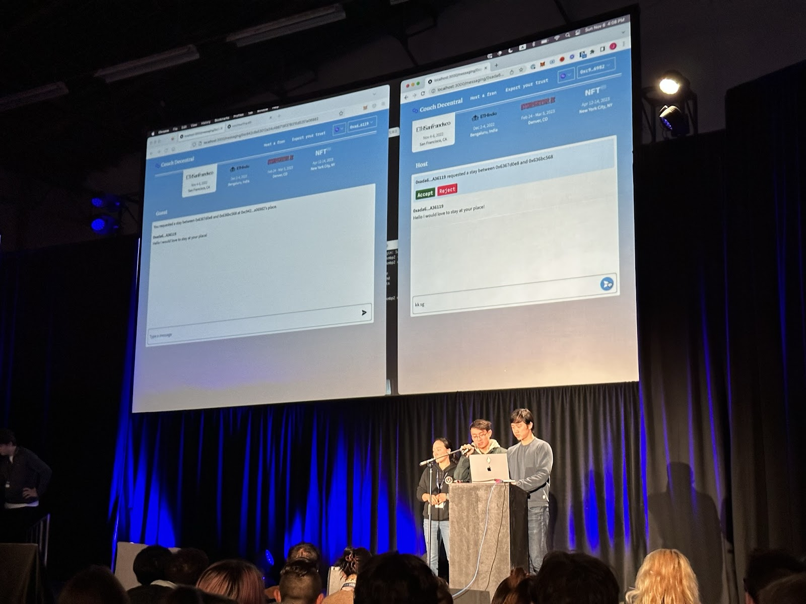
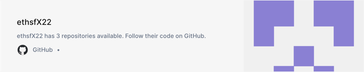
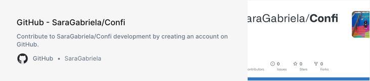

import FeedbackWidget from '/src/components/FeedbackWidget'

"Wow" is just about the best way we could sum up [@ETHGlobal](https://twitter.com/ETHGlobal)'s [#ETHSanFrancisco](https://twitter.com/hashtag/ETHSanFrancisco?src=hashtag_click).

<!--truncate-->

30 teams built with XMTP, exhibiting a level of quality and novelty that blew us away. And top it off, two of them were event finalists.

Here were our top picks for our prizes:

## BB3 - BEEP3R for Best Use 🥇

Also an event finalist! NFT beeper with XMTP as the message relay to broadcast messages to owners. They also swapped their infra in favor of going all in on XMTP.

### Meet the team:

[@bennygiang](https://twitter.com/BennyGiang) [@DruzyDowns](https://twitter.com/DruzyDowns) [@jayden_windle](https://twitter.com/jayden_windle) [@rayzhuynh](https://twitter.com/RayzHuynh) [@Alanahlam](https://twitter.com/alanahlam)

### Check out the repo:

## Torpedo for Best Use 🥇

A crypto marketplace for trading cloud compute. The team used XMTP as an E2EE transport layer to securely transfer session keys peer-to-peer between a provider and buyer. Also won a [@MidpointLabs](https://twitter.com/MidpointLabs) prize!

### Meet the team:

[@ketan_jog](https://twitter.com/ketan_jog) [@jayendra_ram](https://twitter.com/jayendra_ram) [@AnthonyZhou101](https://twitter.com/AnthonyZhou101)

## Relay for Runner Up 🥈

A web3 Zapier which can automate notifications on EVM chains. With Relay, users can configure triggers to generate messages from on-chain activity, delivered with XMTP.

### Meet the team:

[@zeebradoom](https://twitter.com/zeebradoom) @lakejava1022 [@grindsets](https://twitter.com/grindsets) [@NotXenodrome](https://twitter.com/NotXenodrome)

### Check out the repo:

## PreshMail for Runner Up 🥈

PreshMail allows users to be paid to receive messages through XMTP. It has a dynamic pricing model for attention, (based on on-chain behavior), and is a great example of how web3 will change the attention economy.

### Meet the team:

[@zK_enk](https://twitter.com/zK_enk) [@chadxeth](https://twitter.com/chadxeth) [@lowenhere](https://twitter.com/lowenhere)

### Check out the repo:

## Decentral Couch with an Honorable Mention 🥉

Also an event finalist and [@0xPolygon](https://twitter.com/0xPolygon) winner. A decentralized [@airbnb](https://twitter.com/Airbnb) that used XMTP to secure comms between hosts & guests. Built actions into message payloads w/ a custom ContentType.  

### Meet the team:

[@Alexishaebinkim](https://twitter.com/Alexishaebinkim) [@Big_BernZ](https://twitter.com/Big_BernZ)

### Check out the repo:

## GameChat got an Honorable Mention 🥉

A web3-native gaming chat client which used zero-knowledge proofs to allow players to gain additional privileges within chats through identity verification, without revealing details or self-doxxing.

### Meet the team:

[@saharsh_wal](https://twitter.com/saharsh_wal) [@muchsahil](https://twitter.com/muchsahil)

### Check out the repo:

## Confi with an Honorable Mention 🥉

A platform that helps sexual assault victims remain anonymous, aided by end-to-end encrypted messaging with assigned social workers, which validate cases.

### Meet the team:

[@theemadmagz](https://twitter.com/theemadmagz) [@mirnaampuero__](https://twitter.com/mirnaampuero__) [@steflikecurry](https://twitter.com/StefLikeCurry) [@whatwedocolin](https://twitter.com/whatwedocolin) [@sara_diazoporto](https://twitter.com/sara_diazoporto)

### Check out the repo:

Altogether it was an incredible event. With 1,700 devs across 34 countries, [#ETHSanFrancisco](https://twitter.com/hashtag/ETHSanFrancisco?src=hashtag_click) was the largest IRL [@ETHGlobal](https://twitter.com/ETHGlobal) event yet!

Developers continued to amaze us, building apps on XMTP that went far beyond DMs, chat, and obvious messaging use cases.

Awesome work everyone!

 
<FeedbackWidget />