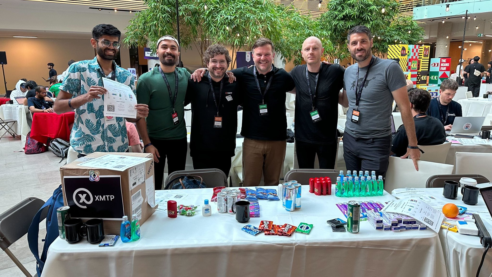
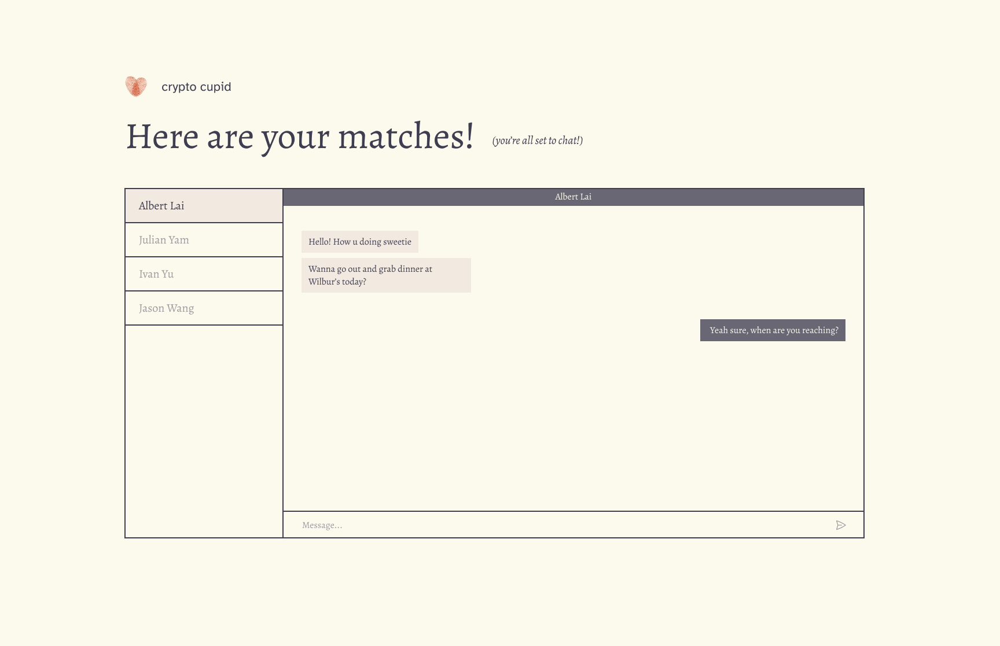

# ETH Waterloo Winning Apps — Built with XMTP

Last Saturday, we had the incredible opportunity to attend ETH Waterloo. For those who may not know, Vitalik went to college in Waterloo, and the first ETH Global event was also held there. We couldn't help but feel the infectious energy and excitement for the future of blockchain technology.

<!--truncate-->

We interacted with many passionate and innovative teams, each expressing a keen interest in building with XMTP: the protocol & open network for secure, private messaging. The response was overwhelming: **we had 16 submissions**, the most we've ever had!

We even decided to run our own "Bodega" at the event as a way to introduce more people to portable, secure messaging.

We gave away toothpaste and toothbrushes in exchange for receiving messages using our flagship ecosystem app **[Converse](https://getconverse.app/)**. Over 100 people sent us requests!

## The Winners: Decentralizing eBay, Dating, and Deck Builder

And now, the moment you've all been waiting for: the winners of ETH Waterloo 2023! 🥁

🥇 **zBay**: zBay revolutionizes online marketplaces by decentralizing eBay, empowering merchants and buyers. It enables seamless communications between buyers and sellers through XMTP.

Read more: [https://ethglobal.com/showcase/zbay-r0724](https://ethglobal.com/showcase/zbay-r0724)

🥈 **CryptoCupid**: A decentralized anonymous human to human dating platform powered by Worldcoin and XMTP. Read more

Read more: [https://ethglobal.com/showcase/cryptocupid-cegju](https://ethglobal.com/showcase/cryptocupid-cegju)

🥉 **The Noun Knockout Card Game**: A fully decentralized deck builder featuring Nouns using XMTP, Airstack, and Near BOS.

Read more: [https://ethglobal.com/showcase/the-noun-knockout-card-game-42sxm](https://ethglobal.com/showcase/the-noun-knockout-card-game-42sxm)

## Honorable Mentions

We also want to highlight the other fantastic projects that built with XMTP:

**Discova**: Discover and engage with NFTs like never before with Discovia. AI-powered search, on-chain engagement, and proportional rewards for your contributions. Join the future of AI-enabled content discovery and get rewarded!

Read more: [https://ethglobal.com/showcase/discova-e3jc2](https://ethglobal.com/showcase/discova-e3jc2)

**Roll a Mate**: A solution for restaurants to send money on Ethereum Mainnet with transfers costing from zero to 4 cents, while creating a telegram chatbot integrated with XMTP.

Read more: [https://ethglobal.com/showcase/roll-a-mate-ob574](https://ethglobal.com/showcase/roll-a-mate-ob574)

**NounifyMyFace**: A Noun-style avatar generator based on user's photo, that allows you to create a unique avatar.

Read more: [https://github.com/TukanFrozen/nounify-my-face](https://github.com/TukanFrozen/nounify-my-face)

Guess who?

A huge thank you to everyone who participated and made ETH Waterloo 2023 such a success. The future of web3 messaging looks bright, and we're excited to continue building it with all of you. See you at the next hackathon! 🚀

**Bonus**:

The last day we decided to catch a local showing of the BlackBerry movie. For those of you who may not know, BlackBerry has deep roots in Waterloo and, incidentally, is where our CEO’s [@shanemac](https://x.com/ShaneMac)'s first startup had its journey culminate in a buyout.

The movie was nothing short of incredible and we recommend you all to give it a watch when you get a chance. It truly was an intriguing glimpse into a piece of tech history and the entrepreneurial spirit that drives the ecosystem.
