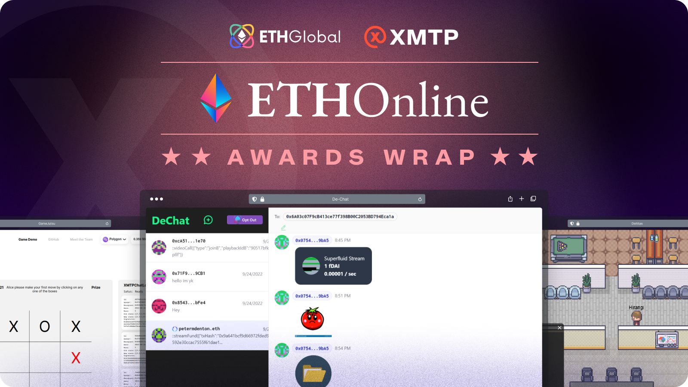
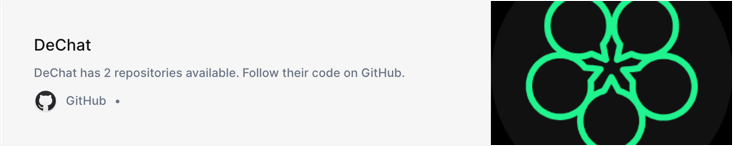

import FeedbackWidget from '/src/components/FeedbackWidget'

ETH Online hackers build incredible apps across video chat, game security, and talent platforms using XMTP.

<!--truncate-->

[ETHOnline](https://online.ethglobal.com/) just wrapped and, once again, the dev community showed up with an incredible range of high-quality projects. Starting September 2nd and ending on the 28th, ETHOnline brought together 1,780 developers who built a total of 357 different projects, making it one of the biggest web3 events to date.

For XMTP, this event represented a new hackathon milestone: 50 projects used our protocol as part of their project–that’s one out of every seven submissions at the event. The quality and variety of projects blew us away as we saw how developers were finding creative and unique ways to integrate secure web3 messaging into their projects.

With XMTP Labs as a sponsor of the event, we were able to pick a few projects that impressed us and award them for their work on their projects. Here is our selection of

## Best Use - De-Chat 🥇

De-chat combines several very popular user features from web3 into a peer-to-peer messaging app. Specifically, De-chat allows in-dApp token sending, fund streaming, in-app purchases, video calling, and the ability to send images and files through IPFS.

For example, take De-Chat’s use of video chat. By using XMTP as the messaging layer, and Livepeer as the video solution, users of De-chat are able to send video messages back and forth through messaging. As De-chat is leveraging decentralized solutions, it greatly reduces the complexity and allows them to deliver a very powerful user experience unique to web3.

De-chat showcases not only how messaging experiences will extend well beyond text but also how dApps can leverage several web3 protocols off the shelf to build rich user experiences.

**Get to know De-Chat:**

- Live demo: [https://de-chat.vercel.app/](https://de-chat.vercel.app/)
- Github repo:

---

## Best Use - GameJutsu 🥈

It’s no secret that on-chain game development is hard, but deciding what goes on-chain is harder. If developers add in the extra complexity around how to keep the game cheat-proof and secure when it comes to off-chain client communications, you can see why many developers spend time with issues that have nothing to do with their game logic.

GameJutsu uses XMTP’s end-to-end encrypted messages as signed game moves between players, thus eliminating any ability for players to manipulate game state offline.

“Most of the communication between game clients happens through game-specific state channels, non-frequently anchored in an on-chain contract…everything is signed by players' private keys and transferred off-chain, with the option to verify the signatures in a contract,” said the GameJutsu team.

The team also emphasized that this doesn’t mean you need to sign every game move with MetaMask, which would severely interrupt the gameplay experience. Instead, they have a special mechanism they’ve implemented that uses XMTP to transmit signed game moves.

GameJustu shows how developers can use encrypted messages to solve peer-to-peer scenarios that need an additional layer of security to create trust.

**Get to know GameJutsu:**

- Live demo: [https://gamejutsu.app/](https://gamejutsu.app/)
- Github repo:

## Best Use - Dehitas 🥉

Hiring is one of the most complex functions in a company’s growth cycle and great software is a critical requirement for companies to succeed.

Dehitas has developed a decentralized hiring platform that enables recruiters to more efficiently qualify talent using customizable assessment tests (built by community members) that certify an applicant meets the skills required for the job.

_Cool side note: if a candidate passes the assessment, they are rewarded with non-transferable NFTs to prove their skill in the future._

Obviously, messaging and communication are central to the Dehitas experience. Using XMTP, candidates and recruiters are given the ability to chat across stages of the assessment process, but also, given the sensitive nature of the personal data, XMTP’s end-to-end encrypted messages, ensure that communications are secure and personal information is safe.

Furthermore, as Dehitas is leveraging decentralized solutions, it greatly reduces the cost of the platform services and makes hiring stronger talent more wildly available to companies across the world.

**Get to know Dehitas:**

- Live Demo: [https://demo.dehitas.xyz/](https://demo.dehitas.xyz/)
- Github repo:

These are just a few of the submissions that utilized XMTP in their ETHOnline showcase. Each is a great example of all the ways web3 messaging can provide user value across many different types of use cases and we hope you’re just as inspired as we are.

---

Are you building something amazing with XMTP? [We’d love to know about it](https://twitter.com/xmtp_).

Want to learn about how to add secure web3 messaging to your project? Check out [Start building with XMTP](/start-building).

 
<FeedbackWidget />
