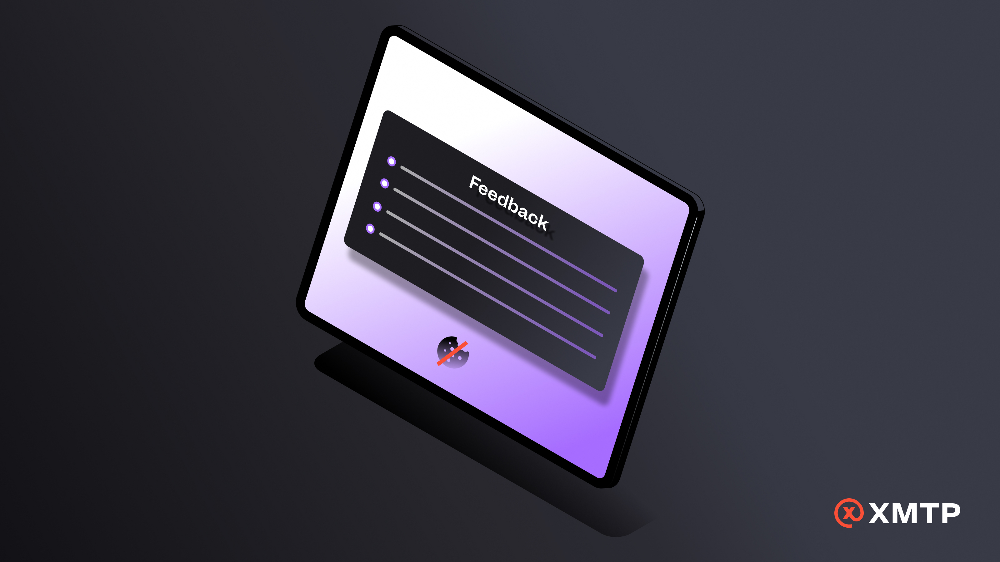
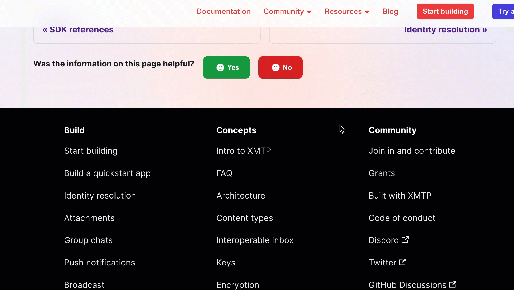
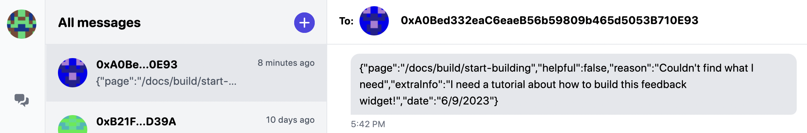
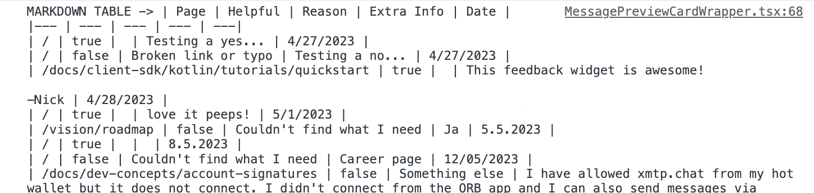

import FeedbackWidget from '/src/components/FeedbackWidget'
import yash from './media/feedback-widget/yash-shaka.gif';
import jha from './media/feedback-widget/peace-pizza.gif';
import eleanor from './media/feedback-widget/eleanor-sparkles.gif';
import darick from './media/feedback-widget/tale-of-two-daricks.gif';
import daria from './media/feedback-widget/daria-and-her-doggo.gif';

I have a feeling that most of you reading this have experienced that magic when collaboration, innovation, and plain ol' FUN converge in a project you're working on. 

We felt that 🔥 recently and thought we'd share the journey with you, along with some code for the tool we built.

<!--truncate-->

But real quick, who is the "we" in this story? XMTP Labs team members. We work alongside the community on projects that support the development and adoption of XMTP. Join the community in the [XMTP Discord](https://discord.gg/xmtp) and check out the open source projects in the [XMTP](https://github.com/xmtp) and [XMTP Labs](https://github.com/xmtp-labs) GitHub repos.

A few weeks ago, Yash, PM of Developer Experience, suggested that we provide a feedback widget on xmtp.org to learn about what’s working and not working for people using the site.

    

 

As a tech writer and one of the site's maintainers, I started looking for a prebuilt solution that we could easily plug into the site.

    

 

These were our _seemingly_ simple requirements for the solution:

- **Collects feedback without using cookies**

  We wanted a cookieless solution to align with XMTP’s overall principle of privacy preservation. For example, on xmtp.org, we use [Plausible](https://plausible.io/) for cookieless analytics.

- **Provides user-friendly and customizable UX and visual design patterns**

  With the help of Eleanor, a UX researcher, we have some hypotheses about the feedback options we want to use. And we’d like to be able to easily adjust them based on our learnings.

    

        
    

  With the help of Darick, a design manager, we have a design system for xmtp.org. And we’d like the visual design of the widget to adhere to the system.

    

    
    

Welp, one solution provided the UX pattern we wanted but uses cookies. And the cookieless solution didn't allow for the UX pattern we wanted. And both solutions would have required some heavy lifting to get them to follow the design system.

I turned to Daria, an engineer and builder on [xmtp.chat](https://xmtp.chat/), and asked, “WDYT - can we build this ourselves?”

 

Daria went to the drawing board and discussed with Pat, another engineer on the team.

Pat mused, “Hey, what if we use XMTP messages to capture and store the feedback?”

And the XMTP feedback widget was born:

## How it works

1. When a user clicks **Yes** or **No**, the widget creates a burner wallet and connects it to XMTP.

2. When a user submits their feedback, the widget sends it in an XMTP message from the burner wallet to a persistent wallet address dedicated to receiving these feedback messages.

3. We can view the feedback message using any app built with XMTP. For example, here’s a feedback message displayed in [xmtp.chat](https://xmtp.chat/), where `0xA08e…0E93` is the sending burner wallet and `0xA0Bed332eaC6eaeB56b59809b465d5053B710E93` is the dedicated feedback widget wallet:

   

4. We use a script to convert the JSON message into Markdown that displays in the browser console:

   

   We can then copy/paste the Markdown into a doc for wider visibility and tracking across the team. In the spirit of action > perfection, we decided to go with this manual export for now and add automation later, if necessary.

In the future, we might enhance the feedback widget to enable a user to optionally connect using their own wallet address so they can have a record of their feedback. But anonymous feedback is working for now. 🥸

## Want to build it on your site?

See this [Feedback Widget PR](https://github.com/xmtp/xmtp-dot-org/pull/344) that provides the widget on xmtp.org, a site powered by Docusaurus.

Want a package you can use to do something similar on your site? Have any other feedback? Let us know using the feedback widget below. ⬇️

Interested in some of the research that informed the widget's UX pattern? See these [design mockups in Figma](https://www.figma.com/file/TlpmopJyaIPq8Fxex0CaBG/xmtp.org-feedback-widget?type=design&node-id=11-79&t=0r2OpWcNKWT5yLx0-4).

 
<FeedbackWidget />
