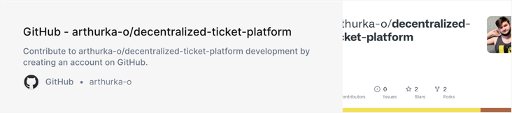
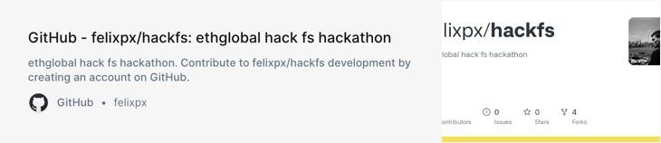
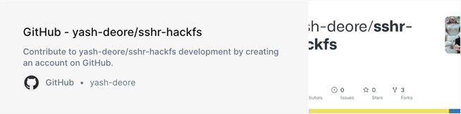
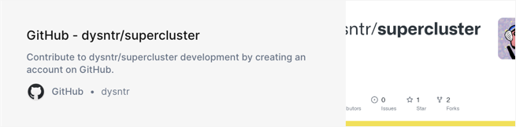

import ReactPlayer from 'react-player'
import FeedbackWidget from '/src/components/FeedbackWidget'

[HackFS](https://fs.ethglobal.com/) by [@ETHGlobal](https://x.com/ETHGlobal) and [@ProtocolLabs](https://x.com/protocollabs) wrapped and, once again, the creativity and quality of the projects was outstanding.

<!--truncate-->

It’s exciting to see developers continue to adopt XMTP messaging in their projects. XMTP was used in 30% of the winning projects, and 15% of the 197 HackFS submissions.

Here are the XMTP Labs award winners.

## Best Use - Decentralized Ticketing Platform 🥇

After hearing countless stories about scams in the online ticketing process, this team set out to build a solution. While there are many centralized solutions to this problem, they often charge high fees to both buyers and sellers. The team came up with a decentralized ticketing solution that enables any user to create an event for which the participants can buy tickets in the form of NFTs. Event organizers can broadcast messages to the ticketholders using the XMTP protocol.

<ReactPlayer width="100%" controls url='https://blog.xmtp.com/content/media/2022/08/dtp.mp4.mp4' />

 

- Development team: @[arthurka_eth](https://x.com/arthurka_eth), @[tenzin_rose](https://x.com/tenzin_rose)
- Github repo:

## Best Use - Optik 🥈

Optik is a web3-enabled video conferencing application. The platform provides a place for DAO contributors, teams, and groups to host meetings, online events, and more. Optik allows teams to set up public or allow list-only video conference calls, store recordings of these videos on IPFS, mint POAPs directly within the video conference, and more. XMTP is used to share invitations among meeting participants.

<ReactPlayer width="100%" controls url='https://blog.xmtp.com/content/media/2022/08/optik.mp4.mp4' />

 

- Development team: @[felixfpx](https://x.com/felixfpx), @[Dominichackett](https://x.com/Dominichackett), @[east9th](https://x.com/east9th)
- Github repo:

## Best Use - GhostShare 🥉

GhostShare is a service for sharing files in a private and decentralized way. The project combines Lit Protocol, Web3.Storage, XMTP, Covalent, and Polygon to allow a user to securely share encrypted files via decentralized storage, and privately communicate about them.

<ReactPlayer width="100%" controls url='https://blog.xmtp.com/content/media/2022/08/ghost.mp4.mp4' />

 

- Development team: @[JorisZierold](https://x.com/JorisZierold), @[jorgeolmos86](https://x.com/jorgeolmos86)
- Github repo:

## Honorable Mention - Self Sovereign Health Records 🙌

SSHR is a dapp that enables users to privately store and share their own electronic health records. The records are stored on a decentralized data network where only the patients can access their information after signing a transaction with their wallets. Patients may share their records with medical professionals, with decryption only possible through valid wallet signatures. Patients can communicate with their providers by using the XMTP-powered chat app, which facilitates secure communication.

<ReactPlayer width="100%" controls url='https://blog.xmtp.com/content/media/2022/08/health.mp4.mp4' />

 

- Development team: @[0xblitzordd](https://x.com/0xblitzordd), @[thinkbynumbers](https://x.com/thinkbynumbers), @[BrahmaSen](https://x.com/BrahmaSen)
- Github repo:

## Honorable Mention - Supercluster 🙌

Supercluster is a Dapp that allows content creators to create private IPFS networks, and enables non-technical users to participate in them. A creator establishes their network by minting an NFT collection on the Polygon network. Once the collection has been minted, NFTs may be purchased or airdropped to interested participants. XMTP enabled the team to create a secure communication channel between each participant and creator.

<ReactPlayer width="100%" controls url='https://blog.xmtp.com/content/media/2022/08/supercluster.mp4.mp4' />

 

- Development team: @[dysntr](https://x.com/dysntr), @[KaiHuang](https://x.com/KaiHuang), @[\_gov218](https://x.com/_gov218), & CompositeFellow
- Github repo:

We were so impressed by the above projects, and as we [shared on 𝕏](https://x.com/xmtp_/status/1552304059289182209?s=20&t=noc0FU0wpTrl2ClkFn0_pA) this week, there were so many other creative ideas. [Take a look](https://x.com/xmtp_/status/1552304059289182209?s=20&t=noc0FU0wpTrl2ClkFn0_pA) for yourself and let us know how you are thinking about web3 messaging.

---

## Have an idea you’re working on? Connect with us.

- 👾 Official Discord Access -[ https://xmtp.typeform.com/early-access](https://xmtp.typeform.com/early-access)
- 🐦 XMTP Official 𝕏 -[ https://x.com/xmtp\_](https://x.com/xmtp_)
- 🌐 XMTP Website -[ https://xmtp.com/](https://xmtp.com/)
- 📖 Careers at XMTP Labs -[ https://blog.xmtp.com/careers/](https://blog.xmtp.com/careers/)

 
<FeedbackWidget />
