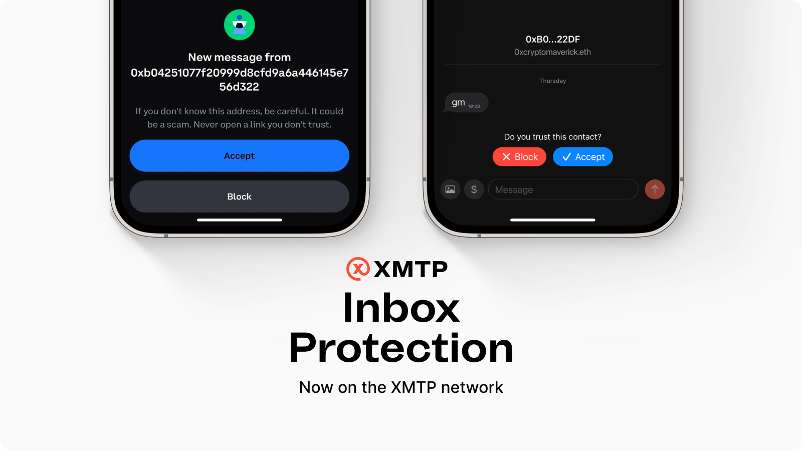

import FeedbackWidget from '/src/components/FeedbackWidget'

### XMTP released a major protocol update that protects users’ allow/ block preferences at the protocol level.

All major inboxes are currently adopting this standard to filter out spam, and innovating on the best user experiences.

<!--truncate-->

[**View New XMTP Improvement Proposal**](https://community.xmtp.org/t/xip-42-universal-allow-and-block-preferences/544)

### A single source of truth, verifiable across apps.

The new XMTP Improvement Proposal gives users control over the messages they want to receive in every inbox they use. 

Users’ preferences to allow or block an address are stored in an encrypted list on the XMTP network. This list is controlled by the user, and only accessible by apps the user logs into.

By gaining access to this list, apps can then verify if a user has allowed or denied to receive messages from another address, and protect these preferences in their app. 

This presents a fundamental shift in the way we communicate, one that is better for users, developers and businesses.

- 🤝 For users, it not only provides a much better user experience, — a user only has to block a sender once for it to be applied across all apps they use — but it also ensures that users maintain complete control over how their data is handled, with no intermediaries intercepting messages.
- 🌱 For apps, user preferences become a public good that developers can leverage and innovate on top of. Apps no longer have to trust other apps, they can trust the state of the network.
- 💌 As more apps plug in, a network based around user preferences is created which benefits businesses and brands as well, since their content is no longer buried amidst spam and can reach users who have truly opted in to receive it.

### Creating the groundwork for apps to innovate.

The new protocol standard provides the basis for every app experience to be user-controlled and therefore high-signal. 

As dapps within the network leverage the same data to respect their users’ preferences, they provide higher quality inboxes that lead to greater user engagement and retention. 

At the same time, the standard remains simple, and gives developers room to design innovative solutions for how users interact with messaging in their app. 

Developers can use on-chain signals to recommend new connections and experiences that are only possible now with the openness of web3 data. Apps can filter and connect people based on network graphs like Farcaster or Lens; or shared POAPs; groups; NFTs; DAOs; friends; and any past interaction. 

Ultimately users have the last word in accepting or declining message requests and contact suggestions, but the opportunities for introducing new relationships and experiences to users are endless. 

:::tip

If you’re a developer building with XMTP, check out Airstack’s [documentation](https://docs.airstack.xyz/airstack-docs-and-faqs/guides/xmtp/spam-filters) on how to build a better, smarter inbox that filters messages.

:::