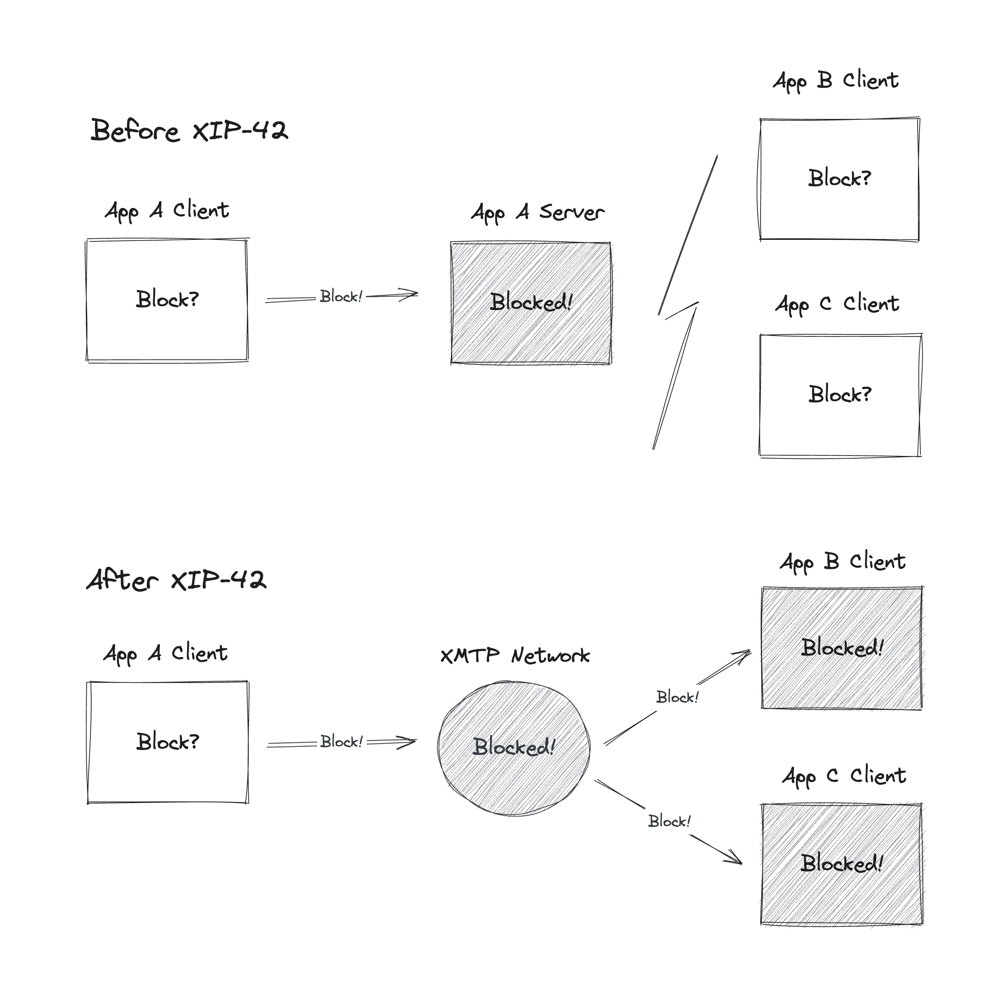

import FeedbackWidget from '/src/components/FeedbackWidget'

### XMTP is getting a major protocol update that brings users’ allow/block preferences to the network-level.

All major inboxes are adopting this standard to respect users’ preferences, and each bringing novel user experiences to enrich it.

<!--truncate-->

[**View New XMTP Improvement Proposal**](https://community.xmtp.org/t/xip-42-universal-allow-and-block-preferences/544)

### A single source of truth, verifiable across apps.

[XIP-42](https://community.xmtp.org/t/xip-42-universal-allow-and-block-preferences/544) introduces a way for users to have control over which senders they want to receive messages from, and then shares those preferences across every inbox app they use. 

Users’ preferences to allow or block an address are stored in an encrypted list on the XMTP network. This list is controlled by the user, and only accessible by apps the user signs into.

After being granted access, apps can then verify if a user has allowed or denied to receive messages from senders, and save these preferences in their app. 

This presents a fundamental shift in the way we communicate, one that is better for users, developers and businesses.

- 🤝 For users, it not only provides a much better user experience—a user only has to block a sender once for it to be applied across all apps they use—but it also ensures that users maintain complete control over how their data is handled, without concern of access by unauthorized parties.

- 🌱 For apps, user preferences become a public good that developers can leverage and innovate on top of. Every app can benefit from a shared understanding of a user’s preferences, as controlled by them.

- 💌 For creators, brands, and businesses, bringing contact preferences to the network-level means that messages are more likely to reach users who have opted in.

### Creating the groundwork for apps to innovate.

The new proposed standard provides the basis for every app’s allow/block experience to be user-controlled and therefore high-signal.

As apps within the network leverage the same data to respect their users’ preferences, they provide higher quality inboxes that lead to greater user engagement and retention. 

At the same time, the standard remains simple, and gives developers room to design innovative solutions for how users interact with messaging in their app. 

Developers can use on-chain signals to recommend new connections and experiences that are only possible now with the openness of web3 data. Apps can filter and connect people based on network graphs like Farcaster, shared POAP ownership, NFTs, DAOs, even common transaction history.

Ultimately users have the last word in accepting or declining message requests and contact suggestions, but the opportunities for introducing new relationships and experiences to users are endless. 

:::tip

If you’re a developer building with XMTP, check out Airstack’s [documentation](https://docs.airstack.xyz/airstack-docs-and-faqs/guides/xmtp/spam-filters) on how to build a better, smarter inbox that filters messages.

:::
