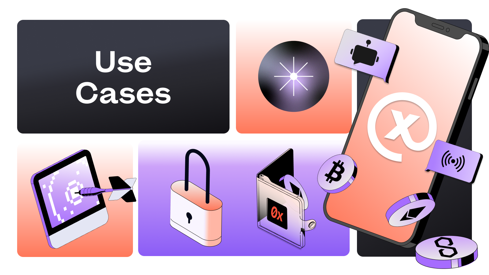

# Introducing the Refreshed XMTP Developer Documentation: A Seamless Journey to Building Chat Apps

We are incredibly excited to announce the launch of the completely revamped XMTP developer documentation! Our vision was simple - make the developer experience delightful by eliminating friction and crafting a captivating story. Let’s take a walk through what’s new and how it's going to make your developer journey not only smoother but also more engaging.

<!--truncate-->
[Introduction to XMTP](https://docs.xmtp.org/)

## Tabs for Multi-SDK Consistent Storytelling **🧩**

Our commitment to interoperability and accessibility reflects in our multi-SDK approach. We've unified our SDK documentation, making it language agnostic, while highlighting consistency in our SDKs through tabbed code sections.

## **Developer Quickstarts 🚀**

A set of quickstarts is now at your fingertips to take you from 0 to 1 in no time. Whether you're an expert or a beginner, in just 5-10 minutes, you can have a sample app up and running in your preferred language.

[https://xmtp.org/docs/developer-quickstart](https://xmtp.org/docs/developer-quickstart)

Here’s what we’ve got:

- **[NextJS](https://github.com/fabriguespe/xmtp-quickstart-nextjs)**
- **[ReactJS](https://github.com/fabriguespe/xmtp-quickstart-reactjs)**
- **[React Hooks](https://github.com/fabriguespe/xmtp-hooks-quickstart)**
- **[React Native](https://github.com/fabriguespe/xmtp-react-native-quickstart)**
- **[Firebase Functions](https://github.com/fabriguespe/xmtp-firebase-functions)**
- **[NodeJS](https://github.com/fabriguespe/xmtp-quickstart-node)**

## **Use Cases to Spark Your Imagination 💡**

We've organized XMTP around various use cases in Finance, Commerce, Marketing, Automation, Support, and more. Draw inspiration and see how XMTP can be the backbone of your creative solutions.

- **[Messaging](https://xmtp.org/docs/use-cases/messaging) 💬**: Unlock the future of Messaging with XMTP! Build secure peer-to-peer apps or team platforms with end-to-end encryption, media attachments, group chats, and more. Communication reimagined!
- **[DeSo](https://xmtp.org/docs/use-cases/deso) 🌿**: Step into the world of Decentralized Social with XMTP! Lens Protocol apps trust us for secure messaging. Discover new friends, create groups, share memes, and enjoy a world of possibilities.
- **[Marketing](https://xmtp.org/docs/use-cases/marketing) 📣**: Reinvent Marketing with XMTP! Send secure newsletters to wallet owners, reach NFT collectors & token holders. Engage and analyze with confidence!
- **[Support](https://xmtp.org/docs/use-cases/support) ☎️**: Redefine Customer Support with XMTP. Engage in finance transactions on chat, automate with AI bots, and streamline DAO operations - all through secure channels.
- **[Commerce](https://xmtp.org/docs/use-cases/commerce) 🛍️**: Enhance e-commerce with encrypted communication between buyers and sellers.
[https://xmtp.org/docs/use-cases/commerce](https://xmtp.org/docs/use-cases/commerce)
- [**DeFi](https://xmtp.org/docs/use-cases/finance) 🏦**: Empower Decentralized Finance with XMTP. Secure transaction confirmations, notifications, token transfers, NFT minting - XMTP brings security to DeFi.
- [**Automation**](https://xmtp.org/docs/use-cases/automation) 🤖: Automate like a Pro with XMTP! Employ secure messaging for web3 automation tools, including triggers, notifications, and customer service bots.

## **Culture and Brand Inspired Re-styling 🎨**

We believe in reflecting our culture and brand identity in everything we do. That's why our revamped documentation also brings with it a re-styling that is more in tune with XMTP's culture and unique branding. The new design ethos reflects our commitment to innovation, while ensuring an intuitive and immersive user experience.

## **Core Concepts for Building with XMTP 🏗**

We’ve abstracted our core concepts to help you swiftly experience building with XMTP. Think of it as your TV show guiding you on integrating secure and private chat into your application. These are the chapters you wouldn’t want to miss:

1. [Get started](https://xmtp.org/docs/build/get-started)
2. [Authenticate](https://xmtp.org/docs/build/authentication)
3. [Conversations](https://xmtp.org/docs/build/conversations)
4. [Messages](https://xmtp.org/docs/build/messages)
5. [Streams](https://xmtp.org/docs/build/streams)
6. [Attachments](https://xmtp.org/docs/build/attachments)
7. [Groups](https://xmtp.org/docs/build/group-chats)
8. [Notifications](https://xmtp.org/docs/build/notifications)

## **Tutorials: The Developer’s Arsenal 🛠**

Our tutorials are technical deep-dives that feature integration partners, highlight use cases, and educate on specific concepts. They are code-heavy, designed for rapid deployment, and perfect for developers looking to experiment and showcase possibilities.

- [Performance](https://xmtp.org/docs/tutorials/performance)
- [Optimistic sending](https://xmtp.org/docs/tutorials/optimistic-sending)
- [Identity resolution](https://xmtp.org/docs/tutorials/identity-resolution)
- [Broadcasts](https://xmtp.org/docs/tutorials/broadcast)
- [Chat bots](https://xmtp.org/docs/tutorials/bots)
- [See all tutorials](https://xmtp.org/docs/tutorials/tutorials)

## **Left Nav Centralization 📘**

We’ve centralized all documentation in a single Left Nav. It's like the chapters of a book, ensuring the lowest friction experience for learning software. A unique left nav documentation is the excellent companion tool that needs just one tab in your browser. This single tab approach ensures that you have a consistent navigation experience without the clutter.

## **Language Simplification 🗣**

We’ve streamlined our language to keep it simple and relatable. For instance, Preview, Dev Preview, and General Availability are now `Alpha`, `Beta` & `Production` ✅. Also, many of our independent docs have been merged into traditional Developer `FAQs`

## **Hackathons Hub 🏁**

Discover a hub dedicated to hackathons that we can update ad-hoc, providing a centralized space for showcasing possibilities and aligning with our priorities.

[https://xmtp.org/docs/hackathons](https://xmtp.org/docs/hackathons)