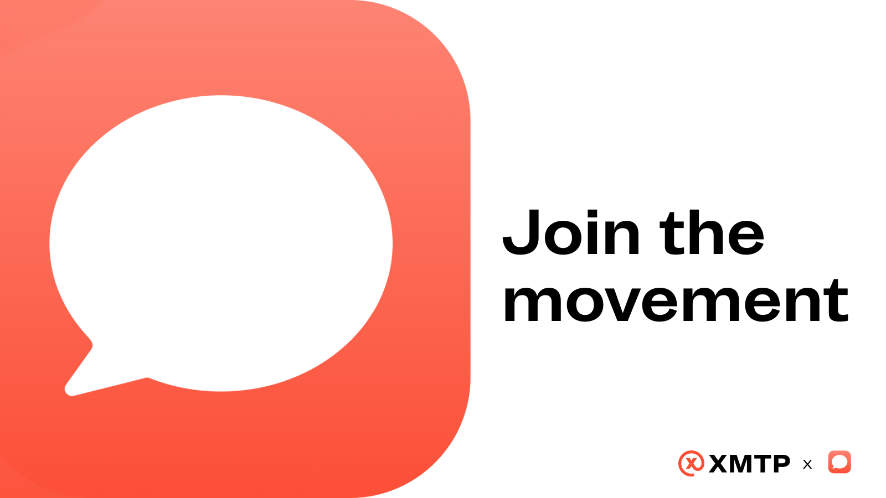

# Join the movement: own your conversations with Converse

Discover the WhatsApp for web3: end-to-end encrypted messages between wallets, that only you own and can take with you anywhere. 

<!--truncate-->

What if you could own your conversations, like you own your digital assets? Make your web3 identity the one you communicate with, leave Twitter but still take all of your followers and messages with you, and go literally anywhere you like... You’d no longer be locked into a single app, and more importantly, you’d no longer have to share your digital life with big tech. 

Web3 is all about owning our assets to enable financial freedom, but ask anyone what they care about most and they’ll bring up family, friends, and relationships in general. We care deeply about our social freedom, and yet we’re stuck with apps that own our conversations. If you leave an app, you leave all of your social life that existed on there behind. 

Converse built their new app with XMTP in order to fix for this: create the WhatsApp for web3, with end-to-end encrypted messages between wallets, that only you own and can take with you anywhere.

> “Just like assets in DeFi you can take your conversations with you and bring them to a new app with the UX that fits your needs. Even Converse — if you don’t like us anymore, that’s fine! You can leave.” ~ Pol, Co-Founder & CEO at Converse.

A portable inbox if you will, that is tied to your web3 identity. 

Converse partnered with XMTP to build their app because both of our teams believe that users should be the ones to own their conversations. We own our keys, our crypto... and now it’s time we own our digital relationships.

The XMTP protocol allows for secure and private messaging between wallets, so anyone can join the network without having to share their digital life. What’s more — [your inbox becomes interoperable](/docs/dev-concepts/interoperable-inbox), which means you can start a conversation on one app — let’s say [Lenster](https://lenster.xyz/) — and pick it back up in another — e.g. the [new Converse Messenger](https://getconverse.app/) you just downloaded. 

> “It’s clear that people want to own their communications and their identity. They want it to be private and secure, and they want to be able to take it with them and not have it in the hands of a centralized, single company. We think the shift to that reality is very powerful and puts power and ownership in the hands of the people at a level we’ve never seen on the internet. Empowering that change is why we started XMTP. ” ~ Shane Mac, Co-Founder and CEO at XMTP

With XMTP, the possibilities for building and nurturing relationships way surpass what was possible in web2. Not only can you take your conversations to any new app, but you can also control your inbox to only connect with people and brands you care about. It’s a win-win for both creators and users. 

- For example, if you’re an artist you could reach out to people who own the art that you created by [messaging wallets that own your NFT](truths-not-spoofs), and creating special relationships with those people.

- You could also receive recommendations for connecting with people you have things in common with based on your on-chain history, for instance if you went to the same concert or bought the same art you could be matched seamlessly. Once you’re connected, you can take that relationship with you to any other social media app — you don’t have to be stuck in the one you met in.

- Last but not least, you can verify the identity of the person you are talking to to make sure they’re not a scam.

## Join the movement

Picture having every major NFT marketplace, wallet, defi, and gamefi app communicating with each other, in a way that is secure and private. That’s the global network we’re building. It’s a whole movement, and you can join it today with Converse: the WhatsApp for web3. 

[Download the Converse app](https://getconverse.app/) and put in any 0x, .eth, or .lens address to start a new message!
