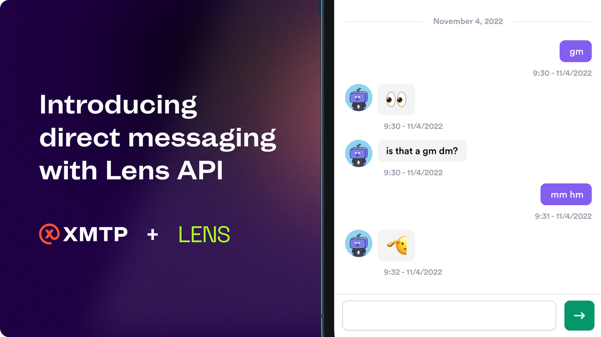
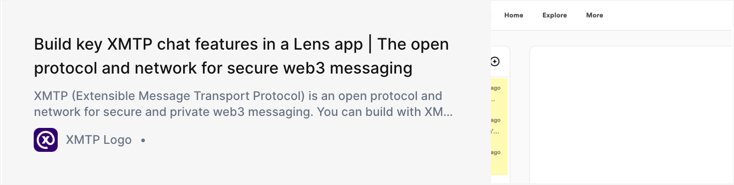

import FeedbackWidget from '/src/components/FeedbackWidget'

Today XMTP reaches a big milestone in our journey to build protocol for secure web3 messaging:

**[Lens Protocol](https://lens.xyz/) has adopted [XMTP](/docs/dev-concepts/introduction) to provide a secure and private direct messaging layer for the entire Lens ecosystem.**

<!--truncate-->

Introducing XMTP to the Lens ecosystem means profiles will be able to privately and securely send end-to-end encrypted direct messages to one another, starting in [Lenster](https://lenster.xyz/). This brings web3 social closer to feature parity with its predecessor and is a big step forward for Lens users, and anyone who cares about private, secure messaging.

We’re entering a new era for social, and a new way to think about communication within web3—one where users own their data, and can take their profile, graph, interactions, and communication wherever they want to. This shift is a logical expression of the inspiration we took from [Linkin Park’s Mike Shinoda when he talked about what it was like when Facebook cut him off from his audience and how web3 could solve this for all artists in the future](xmtp-origin-story).

In the coming months, we look forward to helping more applications in adopting DMs across the Lensverse with XMTP. As with all other features supported by the Lens API, direct messages will be available to profiles and developers in any app built on the Lens Protocol.

Lens makes data portability a first-class citizen in social, and direct messages will be no different—Lens profiles will be able to access their messages in any app that supports DMs, as well as anything else that uses XMTP.

In building with XMTP, Lens DMs offer a number of benefits for users, content creators, and developers alike:

- All DMs are end-to-end encrypted, and it’s effortless for any Lens app to provide E2EE too
- Communications aren’t siloed—a Lens profile’s messages are always available in any other front-end that supports XMTP
- Messages are sent off-chain and do not incur any gas fees
- All Lens apps will be able to build in support for DMs, where they will have control over the interface, sender filtering, and other functionality
- And importantly, Like Lens, XMTP does not make use of any wallet private keys anywhere, ensuring that communications are kept separate from assets

XMTP Labs is also fully aligned with the Lens community’s commitment to decentralization and composability. We are thrilled to see XMTP adopted as the backbone of private and secure communications within Lens, and take our introduction and responsibility to the community very seriously.

For those just now discovering XMTP (Extensible Message Transport Protocol), it’s a messaging protocol that has been thoughtfully designed and purpose-built to bring secure communication to web3. XMTP enables fully end-to-end encrypted messaging between blockchain accounts such that only the participants of a conversation would be able to decrypt and read messages. Participants in a conversation can also be guaranteed that the profiles or accounts they’re communicating with are genuine, and their messages authentic, which will also help to combat some of the scams prevalent in today’s social networks.

Learn more about the Lens DMs with XMTP [in our Discord](https://discord.gg/xmtp). If you’re a developer, you can [get started implementing DMs into your Lens app here](https://xmtp.to/lens-quickstart).

 
<FeedbackWidget />