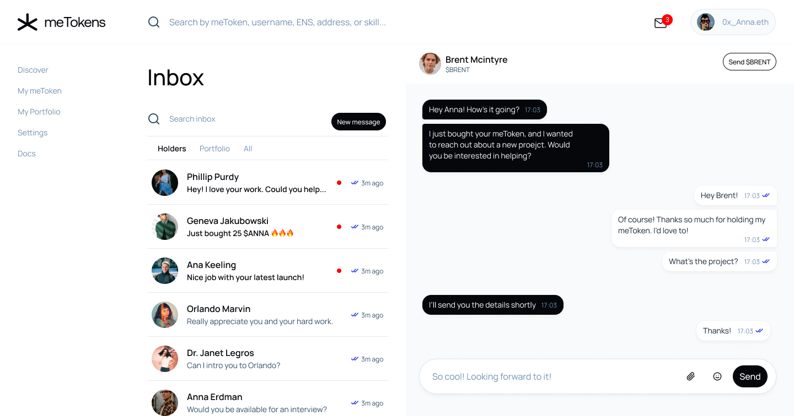

With XMTP, meTokens enables all creators to coordinate in a privacy-based manner that is simple enough to create widespread adoption.

<!--truncate-->

What if every content creator, artist, solopreneur, trade artisan or independent professional could take their work into the market and be fully, fairly compensated through a direct connection with people who value their work?

meTokens has created an alternative to government-backed currencies that is both decentralized and trustless _and XMTP is thrilled to be a part of their solution._

While other “social tokens” are intended for celebrities and influencers, meTokens is designed to ensure any human can achieve economic freedom, regardless of their social status or previous success.

All the while, creators benefit from having a community of stakeholders who have a vested interest in their success - it’s like having a DAO that focuses entirely on coordinating to help creators achieve their goals and dreams.

## meTokens introduces tokenized chat

meTokens Labs has built the bridge between creators and patrons who want to purchase future credits to their work, while also offering speculators a means of contributing to a creators’ growth through capital contributions.

To help fulfill this vision, **meTokens Labs has developed an XMTP client to enable tokenized-chat.** The meTokens XMTP chat client allows creators to filter their inbox by their stakeholders, collaborators or patrons, and have those individuals appear at the top of your inbox.

meTokens’ founder Chris Robison fills in the story this way,

>When the meTokens team began building our core protocol last summer, we strongly felt our first application ought to be tokenized-chat. We envisioned a world where every inbound message would include a payment or stake to grow your market cap. XMTP emerged later that summer and more than met our requirements. We connected with Shane, Matt, and Peter shortly after and felt both relief and excitement to know that we could finally build a future where you are delighted to see each and every message that appears in your inbox.

### What next for meTokens?

meTokens could revolutionize the Creator Economy. The mission of meTokens is to create 8 billion new free economies. Every person on the planet can now be empowered with the ability to issue their own personal currency.

- An artist can issue a token which can be redeemable for a commissioned piece.
- A designer can issue a token which can be redeemable for a new website UI.
- A journalist can issue a token which can be redeemable for an investigative article.

**meTokens and the XMTP integration are now live on Ethereum mainnet at meTokens.com.** Anyone in the XMTP community is now invited to issue their very own meToken for free. Just join the [meTokens Discord](https://discord.gg/CuXRv5Hmk4) to get the “secret code” that unlocks your gas-free transaction.

- [Mint a meToken!](http://www.metokens.com/)
- [Join meTokens Discord](https://discord.gg/eXSRUQbGKK)
