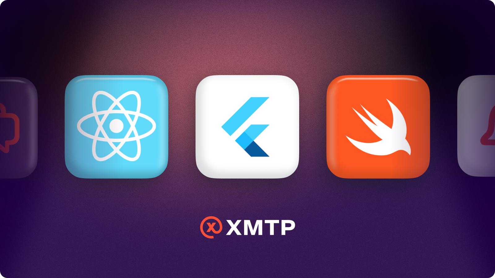

This holiday season, we have an early gift for all the web3 developers out there. Our mobile SDKs are now available in [Developer Preview](/sdks-and-tools) 🧑‍💻

<!--truncate-->

We heard the need for mobile support loud and clear. XMTP now supports a Swift SDK, Flutter SDK, and a React Native example app. This enables developers to bring end-to-end encrypted, web3 chat experiences to mobile. It also enables interoperable inboxes that transcend devices and operating systems, allowing users to take their messages wherever they go.

This is a Developer Preview release, so it’s ready for you to start building. However, we do not recommend using Developer Preview software in production apps. Software in this status may change based on feedback.

XMTP builds in the open and collaboratively with the community. Folks have been saying “but wen mobile!?” since we put the SDK in early access almost a year ago and we all know messaging IS mobile, so let’s do this…!

Your feedback on building with this release is vital! We want to hear from you and we can’t wait to see the apps y’all create, and how they unlock interoperable inboxes on mobile platforms. Seasons greetings and happy coding!

Check out the repos:

- [Swift](https://github.com/xmtp/xmtp-ios)
- [Flutter](https://github.com/xmtp/xmtp-flutter)
- [React Native](https://github.com/xmtp/example-chat-react-native)
