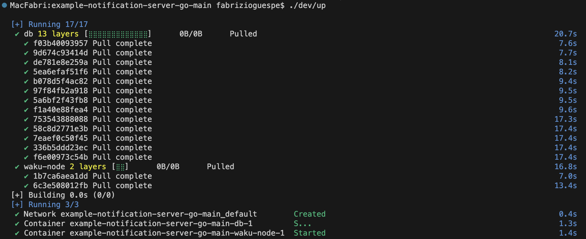
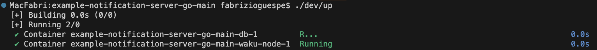
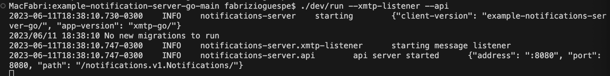
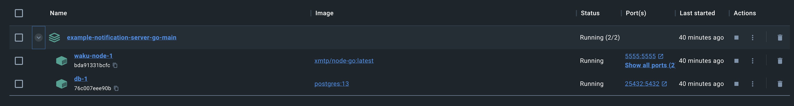

import FeedbackWidget from '/src/components/FeedbackWidget'

This guide is a supplement to [core instructions](https://github.com/xmtp/example-notification-server-go/blob/np/export-kotlin-proto-code/README.md#local-setup) provided in the `example-notification-server-go` repository and aims to address some common misconceptions and issues encountered during the setup. This guide is written for macOS users, but the steps should be similar for Linux users.


<!--truncate-->

## Install Docker

1. Install docker desktop depending on your OS:

   - [Mac](https://docs.docker.com/docker-for-mac/install/)
   - [Windows](https://docs.docker.com/docker-for-windows/install/)
   - [Linux](https://docs.docker.com/engine/install/)

:::tip
After installation, make sure Docker is running by searching for Docker in Spotlight and opening the application. You don't need to do anything with the UI from Docker. We are going to use only terminal commands.
:::

2. You need to have Docker and Docker Compose installed on your system. If you don't have Docker and Docker Compose installed, you can install them using Homebrew:

   ```bash
   brew install docker docker-compose docker-credential-desktop
   ```

3. Make sure Docker Desktop is running by searching for Docker in Spotlight and opening the application.

## Install Go

1. If you need to upgrade Go on your system, you can do it via Homebrew:

   ```bash
   brew install go
   ```

   If you encounter any errors like `Error: go 1.17.2 is already installed`, it means you already have Go installed on your system. You can check the version of Go installed on your system using:

   ```bash
   brew update
   brew upgrade go
   ```

   After these steps, you should be able to update Homebrew and upgrade Go without issues.

## Set up the server

1. To start the XMTP service and database, navigate to the project terminal and run:

   ```bash
   ./dev/up
   ```

   

   If you encounter an error like `error getting credentials - err: docker-credential-desktop resolves to executable in current directory (./docker-credential-desktop), out:`, it's likely because Docker is not running. Make sure Docker Desktop is running and try the command again.

2. Build the server using:

   ```bash
   ./dev/build
   ```

   During the build, if you encounter any Go-related errors like missing `go.sum` entries, use the suggested `go get` or `go mod download` commands in the error messages to resolve them. For example, if you see `missing go.sum entry; to add it: go mod download golang.org/x/sys`, run:

   ```bash
   go mod download golang.org/x/sys
   ```

   If you encounter errors related to Go build comments like `//go:build comment without // +build comment`, you can ignore them as they are warnings about future deprecations and won't prevent your code from running.

## Run the server

1. The server can be run using the `./dev/run` script with the `--xmtp-listener` and `--api` flags:

   ```bash
   ./dev/up
   ```

   

   ```bash
   source .env
   ./dev/run --xmtp-listener --api
   ```

   This will start both the `worker` and the `api` service. The `worker` listens for new messages on the XMTP network and sends push notifications, and the `api` service handles HTTP/GRPC requests.

   

You can now send notifications to your device using an [XMTP push notification client](https://github.com/xmtp/example-notification-server-go/blob/main/docs/notifications-client-guide.md).



## Troubleshooting

- In case Docker or Docker Compose commands are not recognized, it might mean that they are not installed or their executable paths are not included in your system's PATH variable. Make sure Docker and Docker Compose are installed and their paths are included in your system's PATH.

- If you encounter Go-related errors during the build, it's often due to missing packages or outdated versions. Always make sure your Go is up-to-date and use the `go get` or `go mod download` commands to fetch the necessary dependencies.

- If you encounter any error like `./dev/up: line 3: docker-compose: command not found`, it's because you don't have Docker Compose installed on your system. Use the above command to install it.

- If you see warnings about `//go:build comment without // +build comment`, these are warnings about future deprecations in Go. They won't prevent your code from running and can be ignored.

- If `brew update` is giving errors, it might be due to changes in Homebrew's repository. Homebrew has switched from using "master" to "main" as its default branch. The steps provided in the "Upgrading Go" section should help resolve this issue.

- If you encounter any errors during `brew update` like `fatal: couldn't find remote ref refs/heads/master`, this means Homebrew is having trouble updating its repositories. To fix this, run:
  ```bash
  cd $(brew --repository)
  git checkout main
  git reset --hard origin/main
  ```

If you have further issues or questions, don't hesitate to ask for help in the [XMTP Discord](https://discord.gg/xmtp).

<br/>
<FeedbackWidget />
