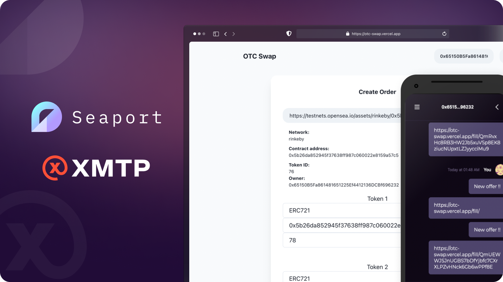
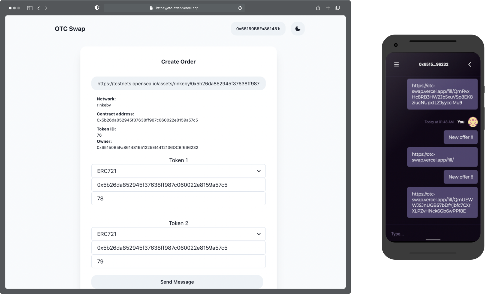
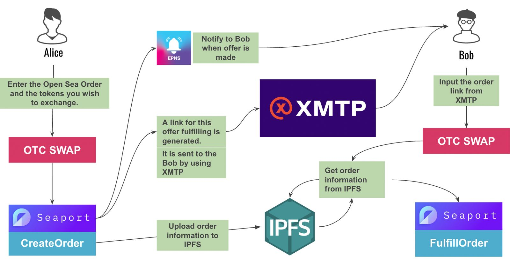

import ReactPlayer from 'react-player'
import FeedbackWidget from '/src/components/FeedbackWidget'

How developer [@0x_Yuzu](https://twitter.com/0x_Yuzu) built an application that enables buyers and sellers to barter on NFTs using OpenSea's Seaport and XMTP.

<!--truncate-->

Developers are using web3’s composability to build a wider range of user-centric experiences. [OpenSea’s Seaport protocol](https://docs.opensea.io/v2.0/reference/seaport-overview) is a good example. Seaport is an open source, decentralized NFT marketplace protocol that enables developers to build apps and tools that reinvent how and where NFT buyers and sellers can interact.

> "Current marketplaces don’t allow users to communicate back and forth in a conversational way,” said [@0x_Yuzu](https://twitter.com/0x_Yuzu). “OTC Swap allows users to fully communicate and come to a consensus, all without giving up their privacy or security."

Today, we’re focusing on how one developer built an application that enables people to buy, sell, and trade NFTs over-the-counter and peer-to-peer, not just through marketplaces.

## Introducing OTC Swap

Developer [@0x_Yuzu](https://twitter.com/0x_Yuzu) built a proof-of-concept application called [OTC Swap](https://vimeo.com/729445381) that enables buyers and sellers to barter on the price of an NFT using a chat interface. During the negotiation the seller can use UI controls to accept, reject, or counter offers. Because bartering happens in a chat interface, the buyer and seller can have a conversation about the transaction and negotiate directly. **This improves upon today’s NFT marketplaces, where communication must happen externally.**

### Messaging experience

As illustrated in the examples below, the bartering experience takes place in a secure, friendly chat interface in a web app. This makes the back-and-forth experience of negotiation more natural and familiar for the buyer and seller.

<ReactPlayer width="100%" controls url='https://vimeo.com/729445381?embedded=true&source=vimeo_logo&owner=180343266' />

Here is the demo video from ETH NYC

### How does it work?

Here is the OTC Swap bartering workflow and buyer and seller experience:

1. A buyer enters the OpenSea URL for an NFT in OTC Swap
2. A buyer then suggests a price
3. OTC Swap then uses Seaport to create the order and generate a link for their bid
4. The order information is then uploaded to IPFS
5. The link and order information are sent in a message to the NFT owner with XMTP.
6. Upon receiving an offer, the NFT owner can privately and securely negotiate the offer with the buyer through an end-to-end encrypted chat built with XMTP
7. When the buyer and seller reach an agreement on the offer, the seller can execute the Seaport-powered transaction directly within OTC Swap.

Here is a visualization of the OTC Swap user flow:

### E2EE and privacy

Messages sent with XMTP are end-to-end encrypted by default, making OTC Swap negotiations secure and private. As long as you have an Ethereum wallet, you can negotiate and transact NFT sales or swaps peer-to-peer securely without compromising on privacy.

### Seaport’s decentralized marketplace

OTC Swap uses the Seaport Protocol, built by OpenSea, for the transaction. Beyond typical NFT sales, Seaport also enables more complex transactions such as NFT swaps, and trading an NFT for a combination of other assets including ERC-20, ERC-721, and ERC-1155 tokens.

### Storage and notifications

OTC Swap uses [IPFS](https://ipfs.io/) to store order information and [EPNS](https://epns.io/) to send offer notifications to the potential seller.

## How did this come together?

As part of the [ETH NYC hackathon](https://ethglobal.com/), XMTP Labs sponsored a prize for developers who demonstrated the most innovative uses of XMTP.

Using XMTP’s [SDK](https://github.com/xmtp) and the [Seaport Protocol](https://opensea.io/blog/announcements/introducing-seaport-protocol/), [@0x_Yuzu](https://twitter.com/0x_Yuzu) created a new way for buyers and sellers to negotiate prices on NFTs. Bartering and transactions can now take place outside of marketplaces and in a chat interface conducive to the negotiation process, and allow buyers and sellers to engage anywhere across web3.

### Relevant repos

- Check out [@0x_Yuzu](https://twitter.com/0x_Yuzu)’s repo: [https://github.com/Aqrare/eth-nyc](https://github.com/Aqrare/eth-nyc)

- **XMTP-JS**, a client implementation for JavaScript applications: [https://github.com/xmtp/xmtp-js](https://github.com/xmtp/xmtp-js)

- **Relay**, a chat UI built with XMTP messaging: [https://relay.cc](https://relay.cc/)

 
<FeedbackWidget />
