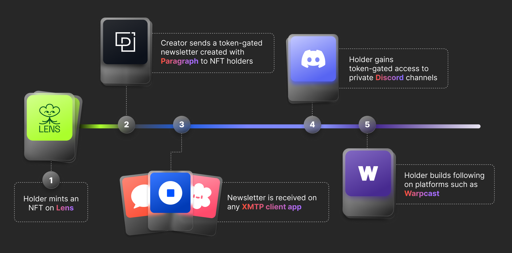
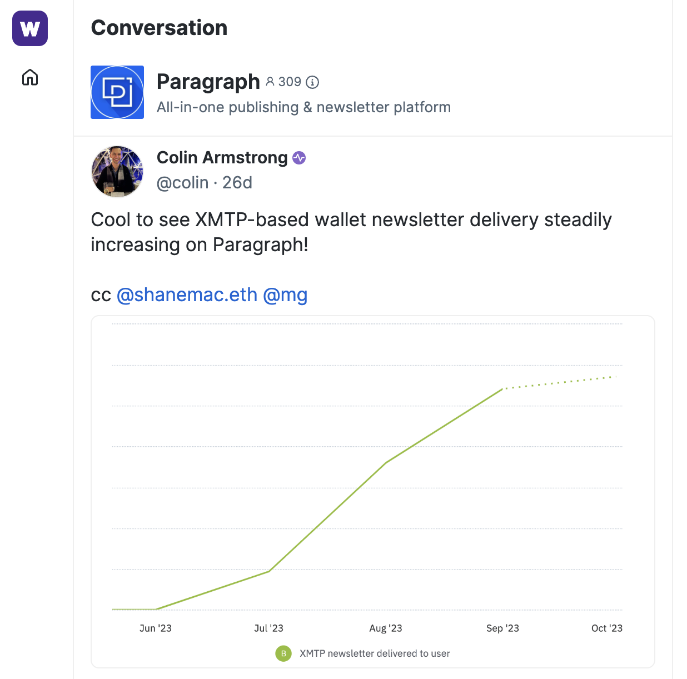

import FeedbackWidget from '/src/components/FeedbackWidget'

### Paragraph enables content creators to build, grow, & reward their audience across apps, while protecting user data.

***“What I wish to see from web3 is a completely uninhibited, direct relationship to my community, and the means with which I can seamlessly distribute my monetized creative content to them, where(ever) they are and want to be.” ~***[Mrwildenfree](https://twitter.com/mrwildenfree).

<!--truncate-->

I spoke with several content creators who use [Paragraph](https://paragraph.xyz/) to understand how and why they were using the platform instead of a regular web2 solution like Substack to send out their newsletter.

Turns out combining NFTs with portable wallet messaging unlocks so much more than just an edgy web3 way to receive content. 

Because Paragraph is part of the XMTP network, using it allows content creators to offer integrated experiences that reward readers for their attention, across any app within the network. 

For example, someone could mint your content on Lens, and you could use Paragraph to create a token-gated newsletter that gets sent to their Coinbase Wallet. You could even use the same NFT to offer exclusive access to a private Discord channel, or build your following on Farcaster.

***Which means that your audience is no longer limited to one platform; and the rewards you offer can also be delivered across apps.*** 

### The breakdown of how this works:

1. **Tokenize your content.**
    1. Paragraph makes it super easy for anyone to collect your posts in the form of NFTs, or to create NFT-backed subscriptions. This creates a new and easy way for publishers to [monetize their content](https://docs.paragraph.xyz/docs/advanced/referral-program#optimism-and-base). 
    2. The NFT is the immutable on-chain proof that someone collected your content or became a member of your community. Because it is tied to a wallet address, it can be taken across apps to securely prove membership. 
2. **Use Paragraph to reach NFT holders on any app within the XMTP network, without collecting user data.** 
    1. Paragraph uses XMTP to send newsletters to wallet addresses, which means that a message sent from Paragraph can reach audiences across any app within the XMTP network, including any Lens app, Coinbase Wallet, Converse, Unstoppable Domains, etc. [See app showcase](https://xmtp.org/built-with-xmtp). 
    2. This allows you to avoid email and become the only newsletter that people receive on web3 social apps like [Hey](https://hey.xyz/), for example. 
3. **Offer integrated experiences that unlock rewards across apps.**
    1. Since NFTs are an open standard, creators can build a community by providing exclusive access, discounts, prizes, and more - across any app in the web3 ecosystem. Mrwildenfree for example is building his audience across Lens, Paragraph, and Sound.xyz.
    2. Web3Academy offers discounts to their courses and to their on-chain gift shop for anyone who mints their content. People then receive the XMTP notification on the app they prefer to use. 
4. **Grow your audience beyond the app you use to hit send.** 
    1. This is the main reason people choose to use Paragraph instead of Substack: to no longer be stuck with what one app has to offer. You’re now free to reach (& own) your audience, wherever they may be.

 

These user experiences are still in their very early stages, but adoption is steadily growing: from articles being collected on Paragraph every month, which enable creators to foster a closer relationship with collectors through shared ownership; to thousands of readers organically subscribing to creators; and thousands of newsletters being sent to wallets using XMTP. 

Content creators are very aware of the struggle of having to distribute their content across a growing number of siloed platforms, while at the same time knowing that everyone is bombarding readers. 

Web3 enables an alternative solution: make messaging portable across apps, and create an interoperable and secure network every developer can benefit from. Meanwhile users can stick to the app they prefer, to receive the information they find valuable.