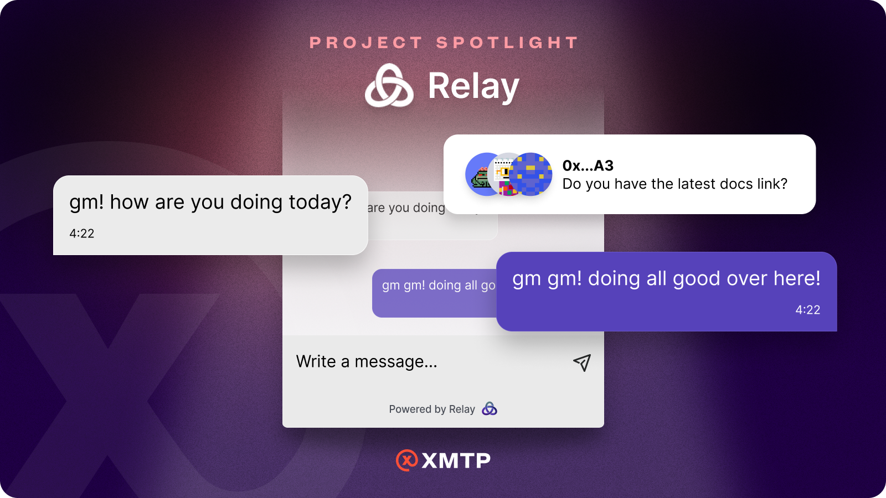
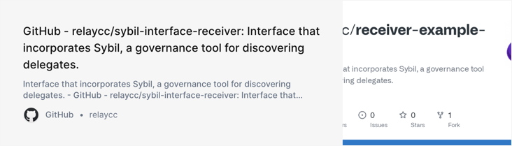
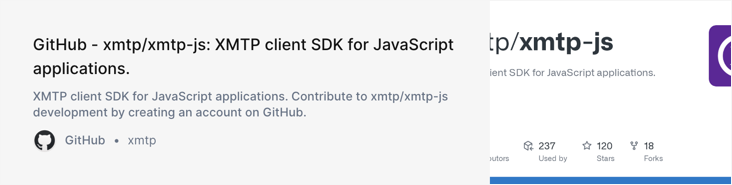

import FeedbackWidget from '/src/components/FeedbackWidget'

Facilitating user communication and overcoming one of web3’s biggest challenges. NFT sales, POAP events, DAO activities, etc all have very meaningful reasons why users would want to message each other, but sometimes the website has no chat function and there’s no way to find the user elsewhere.

<!--truncate-->

XMTP Labs is focused on helping developers build incredible messaging experiences. This includes enabling and supporting an ecosystem of projects and dapps that foster the wide-scale adoption of secure, decentralized, web3 messaging.

The pace of change is intense, though, and it’s hard to keep up with all the new products and innovation. As a way to help raise awareness of the good work, we’re introducing **Project Spotlight**, an initiative to highlight and get to know the dapps building with XMTP.

### There is a big problem in web3

Facilitating user communication and overcoming one of web3’s biggest challenges. NFT sales, POAP events, DAO activities, etc all have very meaningful reasons why users would want to message each other, but sometimes the website has no chat function and there’s no way to find the user elsewhere. The absence of messaging has been one of the biggest challenges for web3 as users need the ability to reach other users.

### **Meet Relay**

[Relay](https://try.relay.cc/) is a 8-person company building communication tools that integrate web3 chat and messaging. Relay was founded with the purpose of solving problems in DAO membership and debate. They identified this problem from seeing first-hand the issues of coordinating web3 while relying on centralized web2 messengers and identity.

Relay’s first product is called [Relay Receiver](https://mirror.xyz/relaycc.eth/3ciz14Fs5Tw61zbh5Lr-WCPvpuuOB5NRCdwq6wEM7bY): a no-code, drop-in chatbox to let any user connect their wallet and chat with other users. The app is built completely on top of web3, no database is required and no login code is needed, so users can connect using Ethereum wallets and start chatting.

Relay Receiver allows any web2 and web3 project to enable web3-native, secure, and decentralized chat. This means any company, in just a few hours and with the addition of a single widget, can solve one of the biggest problems users face and because Relay is using [XMTP’s messaging protocol](https://github.com/xmtp/xmtp-js), user messages are encrypted by default so their chat data is secure.

You can see a screenshot of the Relay Receiver widget in action below.

It’s still early days, and already you can see three common use-cases for Receiver:

- Lets web3 sites enable their users to easily chat, connect, and conduct business without having to build their own chat and database.
- Lets web2 sites become web3 integrated and offer features to wallet users, saving a lot of work with sign-in flow to their UI.
- Has Intercom-like functionality with Receiver Pro, establishing support agent workflows for interacting with web3 users (with chat bot support coming soon!)

### How it works (technically) with XMTP

Relay is using [XMTP’s Javascript-based SDK](https://github.com/xmtp/xmtp-js) to encrypt and send messages between two wallets.

When users load the Relay Receiver widget, they are prompted to initialize a session with XMTP, which creates an identity on the XMTP network. This creates a keypair, which is then used to encrypt and decrypt the messages sent across the XMTP network.

Once the XMTP client is initialized, Receiver begins loading message data. The XMTP Client SDK supports two modes for message loading: once-off loading of preexisting conversations and messages streaming. Receiver uses this message streaming functionality along with a custom message content type to provide real-time conversations with not only other users of the site and the site’s customer support team, but also any wallet with which the user has already entered into a conversation.

Given the interoperability of messages on the XMTP network, users can then access these messages from any site or dapp using XMTP. This gives users complete control over their messages, as well as makes it more likely a user will see their messages as they visit different sites across web3.

---

### Check out the Relay and XMTP SDKs

### Learn more about Relay

- Relay Website: [https://try.relay.cc/](https://try.relay.cc/)

- Twitter: [https://twitter.com/relay_eth](https://twitter.com/relay_eth)

- Discord: [https://discord.gg/pyg6ATzB](https://discord.gg/pyg6ATzB)

- Message them through Relay at [relay.cc/seanwbren.eth](https://relay.cc/seanwbren.eth).

You can read more about the [launch of Relay Receiver here](https://mirror.xyz/relaycc.eth/3ciz14Fs5Tw61zbh5Lr-WCPvpuuOB5NRCdwq6wEM7bY).

 
<FeedbackWidget />
