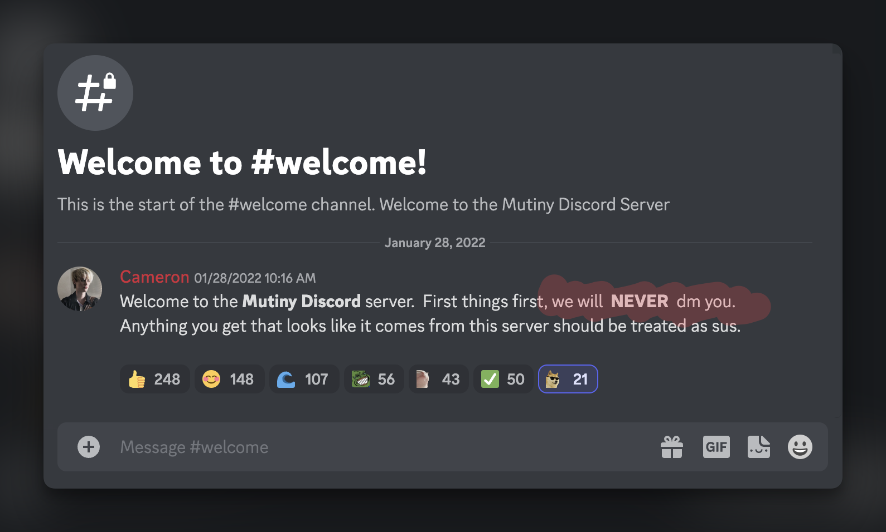
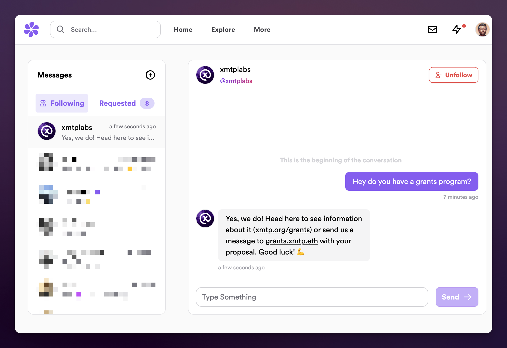
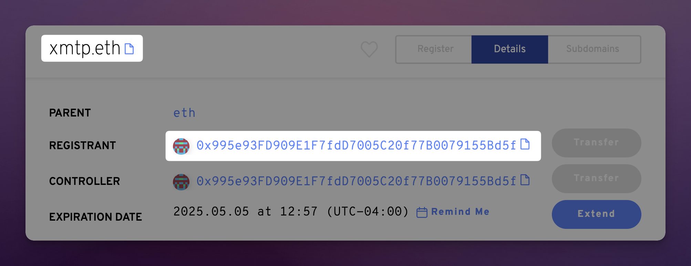
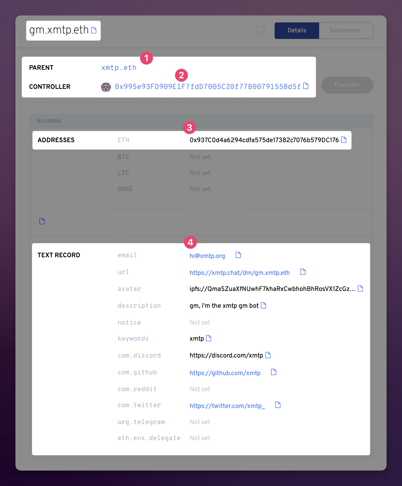
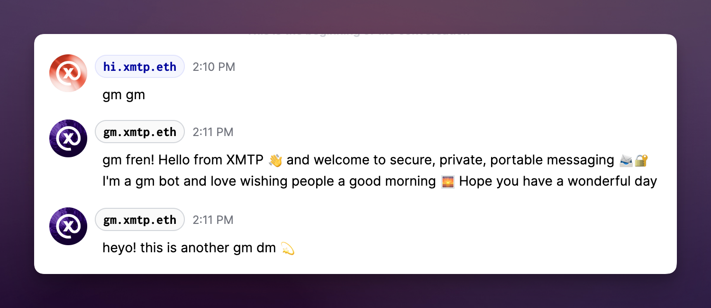
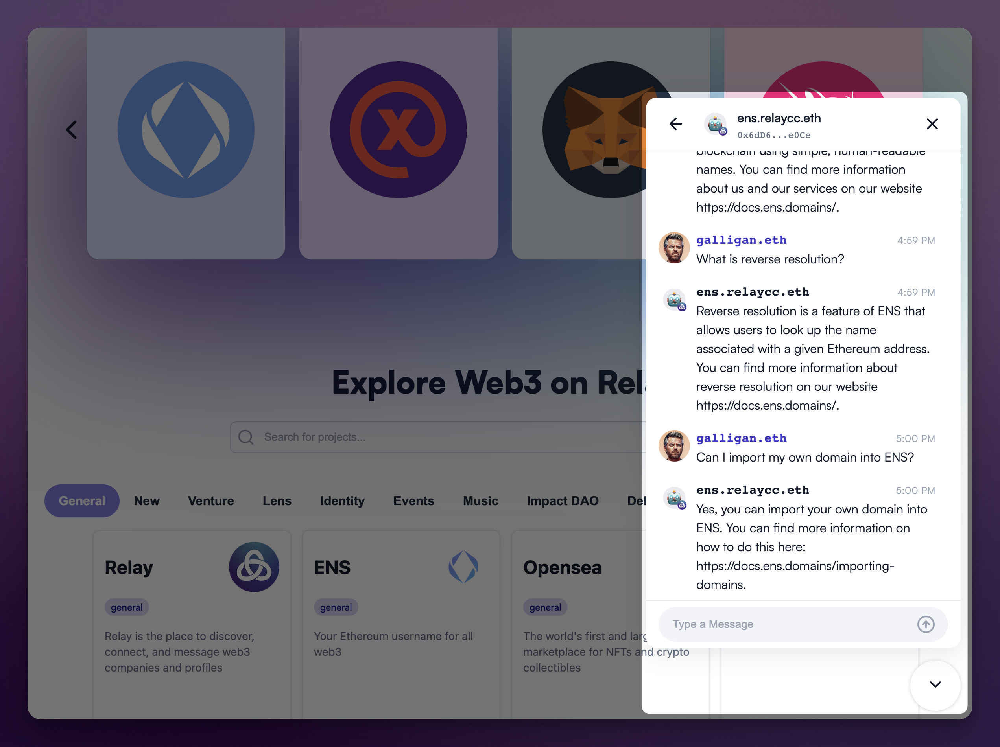
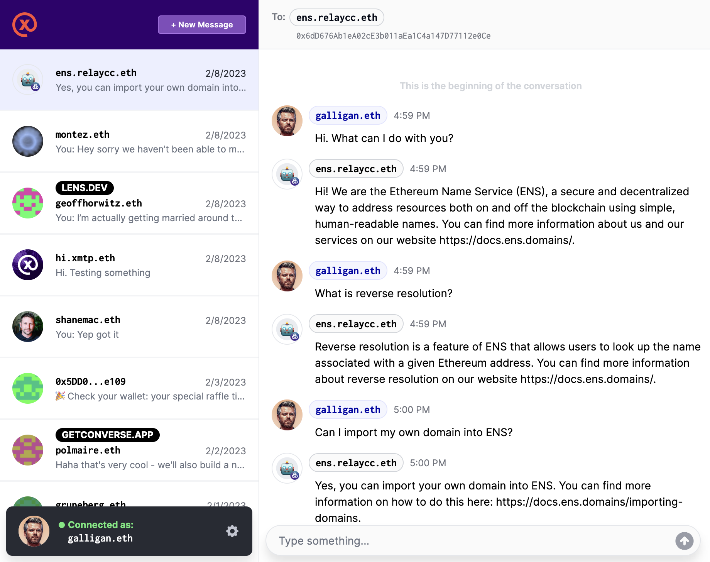

import DocusaurusImageUrl from './media/messages-ens-relaycc-eth.png';

If you’ve been in the web3/crypto community for longer than an hour, you’ve probably seen a strange message that seems to accompany every Discord server. Something that looks like this:

## We will never DM you 🫣

<!--truncate-->

**“We will never DM you”** is blazoned across the welcome flow of so many companies in the space. It’s a not so subtle reminder of the challenges of communications in the space. Once outside of the blockchain world, with wallets, keys, and cryptographic signatures, where authenticity and verification are built in, scammers and other malicious actors are ready to pounce on every unsuspecting victim.

Closing DMs on channels like Discord might help to reduce a project’s fans and supporters from getting phished, but it also shuts those same people off from direct contact with the project. This has even more downstream implications fraught with challenges for the user too. Without the ability to privately communicate in a secure way, many post their questions in a public fashion back in the channel or on social media, where the same scammers are ready to pounce while posing like a trustworthy representative.

All of this is no doubt harmful to web3 in general, as it makes it hard for any newcomers to seek the support they need, or get their questions asked, without being met with an inbound barrage of malicious spam.

And while this sad state of affairs may be the status quo today, **thankfully there’s a solution** our collective woes—one that makes it possible to communicate with end-to-end encrypted messaging, and where conversation participants can be independently verified as authentic:

## Bringing secure customer service and support to web3

By default, messages sent with XMTP are end-to-end encrypted and use blockchain accounts, as opposed to usernames and passwords. This makes secure direct communication possible between blockchain accounts, where message and sender authenticity can be easily verified and deemed trustworthy. Message recipients who are skeptical about a message or sender’s authenticity can look up the public information associated with the account, and see for themselves if they can trust what’s going on.

Associating ENS names to messaging accounts makes these interactions even more seamless and trustworthy, as then it’s also possible to verify the associated domain. So what does all this look like in practice? Let’s consider our own `gm.xmtp.eth` address where we set up a bot that sends and receives messages over XMTP as a demonstration for new users. To break it down:

### How ENS enables a more trustworthy identity for communication

As a decentralized identity protocol built on Ethereum, names registered with ENS enable us to have a high degree of certainty about their owners, and any history they may carry. In the aforementioned example, the `gm` subdomain is a part of the ENS name  `xmtp.eth`, which can be checked to see the account that currently owns it. In the [ENS app](https://app.ens.domains/name/xmtp.eth/details) we see the following:

This is telling us that the domain `xmtp.eth` is currently controlled by the account `0x995e93FD909E1F7fdD7005C20f77B0079155Bd5f` which upon further inspection has a long history and does seem to back up its authenticity.

With that in mind, we can have a look at the `gm` subdomain and look for similar information:

The #1 dot depicts the parent as `xmtp.eth` which gives the subdomain credibility.

The second shows the controller as the same address as `xmtp.eth` which means that subdomain essentially inherits the security of the root domain, so we can continue to trust the subdomain. By default, ENS subdomains can also be revoked by the parent domain’s controller. This matters in the case where a malicious actor got ahold of a subdomain’s private key, in that the parent domain’s controller can delete the subdomain or change the associated address to an uncompromised one.

Dot #3 shows the address that the subdomain is currently registered to, and in the case of XMTP this would correspond with the blockchain account being used for messaging purposes.

The last example #4 shows some of the additional metadata that can be included which may be helpful for brands to promote things, or for further verification.

## Say gm to dms

So what does this look like in practice? Let’s try it out with the new chatbot at `gm.xmtp.eth`. In the example below you’ll see a conversation where the bot is sending messages back that happen to be associated with the `xmtp.eth` domain. Seeing this affiliation can instill the trust that a recipient may need, or at the very least provide the means to verify and obtain trust independent of other factors.

After establishing these domains we can treat them as akin to email addresses that might be shared externally. Just as websites may set up contact forms or share an email address that can receive messages, say `contact@website.com`, we can start to use our ENS names to the same effect.

As web3 progresses users will demand (and let’s be honest, they also deserve) a secure means of communication with companies or projects they use and support. With XMTP we get a method of communication that’s secure, private, and by its very nature harder to exploit by the same means as its predecessors. It’s win-wins and wagmis all around.

## From contact address to in-site support to a universal inbox

Now that we’re familiar with the benefit of using branded on-chain identifiers and blockchain accounts for messaging via XMTP, we can start to dig into the implementation.

### Set up `contact.yourproject.eth` to receive messages

The easiest thing to get your project set up with is to simply fire up a fresh wallet address and set up an [ENS subdomain](https://docs.ens.domains/dapp-developer-guide/managing-names) to point to it. From there you’ll want to set up [reverse resolution](https://docs.ens.domains/dapp-developer-guide/managing-names#configuring-reverse-resolution) on the name, so that when someone tries to message your `0x…` address it turns into your `contact.yourproject.eth` address.

Then it’s as easy as firing up [any XMTP-compatible client](https://github.com/xmtp/awesome-xmtp) and start sending.

The last step here is telling the world about your new way of being contacted! Put it up on your website, share it in your Discord (goodbye no dms, hello dmsopen), drop it on your Twitter. Whatever you do, just let people know they can reach you there.

### Add a chat widget to your website

Another awesome project that helps projects looking to connect with their community is [Relay Receiver](https://github.com/relaycc/receiver), by the [Relay.cc](http://relay.cc). As you can see in the above image, it’s just a little contact widget like you might have seen or interacted with elsewhere on the web. The obvious difference here being that it’s actually secure web3 messaging with XMTP using blockchain accounts and on-chain identifiers.

Like our bot at `gm.xmtp.eth`, the Relay team recently launched a series of AI bots that were trained on the documentation and websites of various other projects in web3. This is just one interesting expression of so many that could help new and experienced users alike get along in web3.

And one other awesome thing to realize here is that messages sent via XMTP are accessible through any other client that also supports the protocol. So in the above example where you see my `galligan.eth` account interacting with Relay’s chatbot for ENS, `ens.relaycc.eth`, I can actually see the same conversation if I use another app.

## Keep the conversation going and reach users wherever they go

One of the best aspects of sending and receiving messages with XMTP is that they’re portable and universally accessible in any client that supports as much. That means that if a user starts a support inquiry on your website, when they go back to any other client that supports XMTP the exchange can continue. This kind of reachability and re-engagement has historically been difficult to achieve in web3 but now XMTP makes it possible.

Below you can see the same exchange that we presented from the Relay website, but experienced from within two other clients that support XMTP, including one on mobile.

## How to get started

1. Set up a wallet account for your project that you’d like to use for secure customer service and support
    1. Note: this will need to be an EOA, not a smart contract wallet.
2. Set up an [ENS subdomain](https://docs.ens.domains/dapp-developer-guide/managing-names#creating-subdomains) and point it to the new blockchain account, making sure to also set the [reverse resolution](https://docs.ens.domains/dapp-developer-guide/managing-names#configuring-reverse-resolution) address
3. Open [xmtp.chat](http://xmtp.chat) and sign in with that account to establish its messaging keys
4. Tell others about your new address and start messaging!

In the near future we’ll share a few of the different code projects for serving up your own bots that will make all of this even easier.

## Test it out

If you just want to try out messaging with a brand or a bot, here are some options:

- Go to [xmtp.chat](http://xmtp.chat) and send a message to `gm.xmtp.eth` and you’ll get a message back from our friendly gmbot
- Ask bots trained on web3 projects over at [relay.cc](http://relay.cc)
- Head to [xmtp.chat](http://xmtp.chat) and message `hi.xmtp.eth` and someone from the XMTP Labs team will say hi (though the response may not be instantaneous…we aren’t robots after all 🤖)
