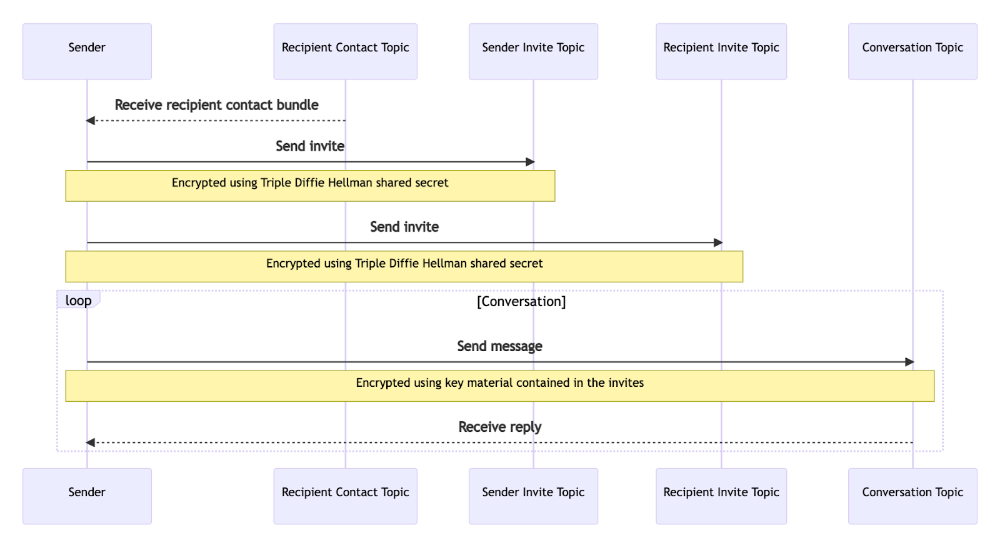

import FeedbackWidget from '/src/components/FeedbackWidget'

How XMTP enables wallets to secure conversations, not just transactions and assets.


<!--truncate-->

Today's wallet apps are the portal into web3. We use them to transact, secure assets, sign into websites with self-sovereign identities, and more, all without usernames and passwords.

And while they really do seem like a magical-do-everything-Swiss-Army-knife there's still one more trick that could be up their sleeve: securing _conversations_, not just transactions and assets.

## Bringing wallet-to-wallet messaging to... wallets

Wallet apps already securely store the keys necessary for users to transact in web3, so they're a natural fit for where encrypted messaging between blockchain accounts could take place. The demand and discussion around "wallet-to-wallet chat" has increased dramatically in recent months, but with all the complexity that goes into communication protocols, encrypting messages, and the full scope of messaging needs. it's no surprise that it has taken a while for wallets to adopt the necessary functionality. Until now, that is.

[XMTP](/docs/developer-quickstart) takes all of the challenging messy bits of supporting messaging and makes it easy to add a variety of communications use cases, like chat, announcements, and notifications to wallet apps, dapps, etc.

## Why do wallets need secure messaging?

The simple answer is that unlike Web 2.0 where we sign up for services with email addresses, our blockchain account addresses don't have the same communication capability—something that's covered in depth in our recently published [XMTP Litepaper](https://github.com/xmtp/litepaper). However, the need for a means of communication is just as, if not more, important than the web of old.

It's hard to imagine an Internet before email, online communities before chat, or mobile apps without notifications, but that's where we are with web3.

Wallets do make life super easy when it comes to signing into services by providing a "portable" identity, and not requiring a username and password. But what happens when that service or dapp wants to get back in touch with you? Maybe for something critically important. Well…you're probably out of luck.

That's where XMTP comes in: the same wallets we use to transact and sign in can be used to send and receive messages. Messages in XMTP are encoded with an [open content format](/docs/concepts/content-types), which opens the doors to many different presentation styles and use cases.

All XMTP messages are end-to-end encrypted and are stored and delivered off-chain for scalability and to preserve privacy. They can be:

- Direct messages such as a proposed negotiation for an NFT you own, or a simple chat between owners of ENS domains, e.g. `alice.eth` talking to `bob.eth`, all cryptographically verifiable
- User support, where a project can chat privately with its users, in a way that can't be forged, spoofed, or snooped on, and using verifiable and recognizable identities to improve trust and reduce phishing, e.g. `support.xmtp.eth`
- Notifications, alerting an account to something timely and important, such as an impending domain renewal, or DeFi loan position liquidation
- Group chat (soon), enabling discussions with communities formed around on-chain activity or ownership

Whatever the use case, adding XMTP adds extensive benefits for wallet users, and helps the web3 ecosystem as a whole by removing today's communication barrier.

## Wallets powering dapp re-engagement

Without email-based logins, dapps are finding it really challenging to re-engage with people who come along and use their offerings. At XMTP Labs, we talk to more and more developers every day who are desperate to find ways to more deeply engage with users. And it's not about marketing: just imagine a social product where there are no notifications and no emails to notify you that someone has replied to your post.

Notifications and emails are the lifeblood of so many products on the web—and as users, we often depend on them for core functionality. Enabling developers to connect with their users is a critical use case for XMTP, and what better interface for them to receive those alerts on than the one that they signed in to a dapp, to begin with?

As dapps, platforms, and protocols adopt secure web3 messaging to re-engage their users, wallet apps can become an even more critical hub in a user's journey—all through a simple integration with XMTP.

We’ve spent the past year building with the [developer community](https://discord.gg/xmtp) and the tools to drive re-engagement, which will bring tons of value to wallet apps and dapp developers from day one.

## Wallet connections made easy and flexible

XMTP is straightforward for wallet apps and dapps to support—users just need to be able to create a cryptographic signature, attesting to control of their blockchain account, to start sending or receiving messages.

Note: Currently the XMTP SDK uses <code>[ethers.js](https://ethers.org/)</code> for signatures, which is compatible with most popular EVM wallets. This process is covered in the [XMTP Litepaper](https://github.com/xmtp/litepaper). Support for non-EVM signing algorithms, such as those used in Solana or Cosmos, is on the XMTP Labs roadmap but could be alternatively submitted by the community as a [pull request](https://github.com/xmtp/xmtp-js).

XMTP only needs signatures to sign and send, which means it can be used in many wallet injection contexts—straight from a browser extension, a mobile app, a hardware wallet, and more.

Once the wallet creates a signature to initiate their blockchain account with XMTP, enabling the user to send their first message couldn't be easier:

```javascript
const conversation = await xmtp.conversations.newConversation(
  "0x2b0d29ffa81fa6bf35d31db7c3bc11a5913b45ef",
);
await conversation.send("Hello world");
```

Everything else to send the message is seamlessly handled by the XMTP SDK, including content encoding and encryption, relay to the XMTP network, and storage for later retrieval by the recipient. It's also worth noting just how much happens behind the scenes for message encryption, an otherwise complex, multi-step process.

## Encryption made easy

One area where XMTP makes things ridiculously simple for wallet app and dapp developers is in how the message encryption workflow is handled. While PGP-style encryption is easier to implement, more complex Signal-style end-to-end encryption has become table stakes for modern messaging experiences. But have you ever given much thought to what's going on behind the scenes to make it possible? If the thought of diving deep into Double Ratchet key exchange algorithms, key ratcheting, or message ordering, breaks you into a cold sweat, don't worry—you're not alone.

The XMTP SDK handles all of the complex bits of establishing a secure connection between senders and recipients—built with [components of Signal's X3DH key agreement protocol](https://github.com/xmtp/litepaper/blob/main/README.md#421-securing-messages-between-participants). Wallet apps just need to use `conversation.send` and here's the rest of what gets taken care of by the SDK:


Encryption made easy

The best part of this is that for wallets looking to add web3 messaging to their set of features, securing messages with XMTP means they can offer best-in-class encryption.

## Messages wherever web3 takes you...

Data ownership and portability are core web3 principles. It's how we can go from site-to-site and dapp-to-dapp in web3 without having to sign up through central authorities or services, and otherwise be locked into silos and walled gardens. Wallets enable us to bring our data and assets (transaction history, NFTs, etc.) along with, wherever we go in web3.

In Web 2.0 we're used to a wildly fragmented environment for our communications, with messages trapped in whatever siloed app they originated in. But it doesn't have to be this way. Just as wallets can aid in a portable identity, XMTP makes it possible to take messages with us along for the ride.

Whenever a user signs into a dapp, website, wallet, or service with XMTP, their inbox, and the messages they've sent or received before, are already there too. XMTP’s [portable inbox](https://github.com/xmtp/litepaper/blob/main/README.md#5-portable-inbox) makes it possible to see the same set of conversations from anywhere the user connects—even if they're using a browser extension on their laptop, and a mobile app on their phone.

The XMTP SDK handles the secure retrieval and storage of a user's messages, and the XMTP network is incentivized to care of the rest. This ensures that users don’t see their messages siloed, or have inconsistent experiences when switching between devices or dapps.

Altogether, XMTP gives wallet apps the means to provide a streamlined, consistent messaging experience, meets users wherever they go, and unlocks new possibilities across web3.

## How to get started with XMTP...

Here's a handful of helpful links to check out if you're keen to explore adding secure web3 messaging to your wallet app:

- Come chat with the XMTP Labs team, and other developers building with XMTP in the project [Discord Server](https://discord.gg/xmtp)
- Check out the [XMTP documentation](/docs/developer-quickstart) for everything you need to get started
- The [project's GitHub](https://github.com/xmtp) is home to the XMTP SDK, example chat app, and more…
- Read the [XMTP Litepaper](https://github.com/xmtp/litepaper) to understand the motivation behind the project more deeply, as well as future plans
- Follow [@xmtp\_ on 𝕏](https://x.com/xmtp_)
- Feel free to send me a message personally, [@mg on 𝕏](https://x.com/mg)
- Come join the XMTP Labs team and mission, [check out our jobs page](https://blog.xmtp.com/careers/)

<br/>
<FeedbackWidget />
