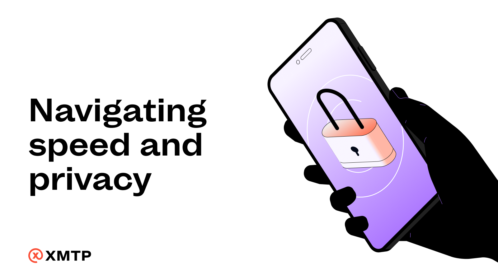

import FeedbackWidget from '/src/components/FeedbackWidget'

### When building apps using XMTP, a common question is how to fetch conversations by the most recent message.

<!--truncate-->

**People are often surprised to learn that this isn’t possible with XMTP! Instead, an app must fetch all conversations up front.**

This might initially seem confusing and inefficient. The operation is costly and could potentially create performance bottlenecks for accounts with thousands of conversations. However, this is actually a design choice that stems from XMTP’s deep commitment to privacy.

XMTP utilizes what's known as an ["invite topic"](https://docs.xmtp.org/protocol/v2/architectural-overview#invite-topic-v2) to initiate conversations between participants, and a "conversation topic" for storing the ongoing exchange of messages. Importantly, XMTP avoids any linkage between the messages in the invite topic and those in the conversation topic. Linking these topics would risk de-anonymizing the conversations, something the protocol avoids to protect user privacy. As a result, the sorting and organizing of conversations happens on the client side, after decrypting the conversation topic. This ensures no sensitive information is processed or stored on the backend.

To counter the initial performance impact, apps built with XMTP should **[adopt a local-first cache architecture](/docs/build/local-first)**. This approach significantly speeds up subsequent app loads, turning the initial delay into a one-time occurrence and enhancing the overall user experience.

While the first load may take a bit longer, this tradeoff highlights XMTP’s commitment to preserving privacy. The system is designed so that XMTP doesn't know who you're communicating with or when.

Looking ahead, the XMTP Labs engineering team is actively exploring solutions to further optimize this process while ensuring that any future enhancements will continue to uphold these stringent privacy standards.

Have any ideas or feedback? Post to the [XMTP Community Forums](https://community.xmtp.org/).
