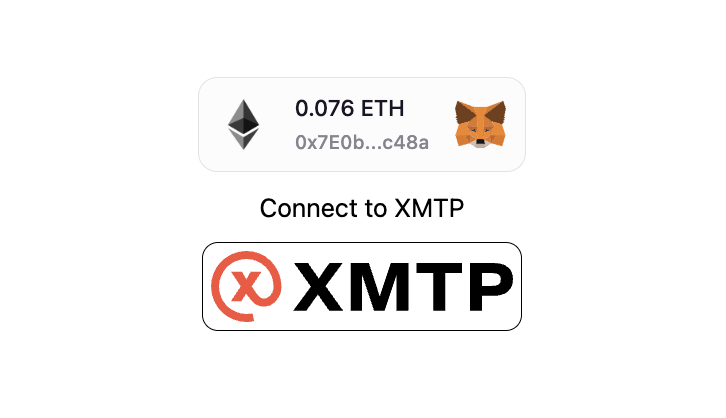

Creating an effective 'Connect Wallet' flow is a challenging aspect of web3 development. Thankfully, the team at Thirdweb has developed an excellent SDK, simplifying this process and enabling a superior wallet experience for your users.

<!--do we want to request a blog card visual from Nad?-->

<!--truncate-->

## Concepts

### Thirdweb WalletSDK
The WalletSDK is a development kit that grants developers access to a comprehensive selection of wallets, ranging from custodial to MPC to smart contracts.
[Read more](https://twitter.com/thirdweb/status/1654191962751389697)

### XMTP content types
Content types are a way to describe the *type* of *content* a message contains on XMTP. Out of the box, XMTP's SDKs support one content type: `text`. 

[Read more](/docs/dev-concepts/content-types)

### Thirdweb storage
Save development time. We handling the complexities of decentralized file management for you. No need to worry about fetching from multiple IPFS gateways, handling file and metadata upload formats, etc.

[Read more](https://thirdweb.com/storage)

## Demo app

This repository demonstrates the implementation of these concepts within a simple chat app.

[GitHub repo](https://github.com/fabriguespe/xmtp-thirdweb-js) 

## Learning objectives
- Set up the ConnectWallet button
- Sign in with XMTP
- Load a conversation
- Send a message
- Send a remote attachment
- Receive attachments

## Get started
The first step involves creating and configuring the Next.js application.

To generate a new Next.js app, execute the following command in your terminal:

```tsx
npx create-next-app xmtp-thirdweb

✔ Would you like to use TypeScript with this project? Yes
✔ Would you like to use ESLint with this project? Yes
✔ Would you like to use Tailwind CSS with this project?  Yes
✔ Would you like to use `src/` directory with this project? No
✔ Use App Router (recommended)? Yes
✔ Would you like to customize the default import alias? No
```

Next, navigate into the newly created directory and install the necessary dependencies for using XMTP and Thirdweb:

```tsx
npm install @thirdweb-dev/react @thirdweb-dev/sdk @xmtp/xmtp-js xmtp-content-type-remote-attachment 
```

### Set up the ConnectWallet button

<!--ADD IMAGE -->

Begin by wrapping the app with `ThirdwebProvider`, then use the `ConnectWallet` component to establish wallet connectivity.


```tsx
<ThirdwebProvider activeChain="goerli">
        <Home/>
</ThirdwebProvider>
```
```tsx
//Just one line of code to connect to wallet
<ConnectWallet theme="light" />
```
```tsx
//After logging in, we can use thirweb hooks to see the wallet
const address = useAddress();
const signer = useSigner();
```

That's it! Next, proceed with signing in to XMTP.

### Sign in with XMTP
Create a new XMTP instance and register the content types your chat app will utilize.

```tsx
// Function to initialize the XMTP client
const initXmtp = async function () {
  // Create the XMTP client
  const xmtp = await Client.create(signer, { env: "production" });
  // Register the codecs. AttachmentCodec is for local attachments (<1MB)
  xmtp.registerCodec(new AttachmentCodec());
  //RemoteAttachmentCodec is for remote attachments (>1MB) using thirdweb storage
  xmtp.registerCodec(new RemoteAttachmentCodec());
  //Create or load conversation with Gm bot
  newConversation(xmtp,PEER_ADDRESS);
  // Set the XMTP client in state for later use
  setXmtpConnected(!!xmtp.address);
}
```

### Load a conversation

In this case we are going to use our GM Bot and we are going to use the XMTP instance for creating the conversation and in case it exists it will bring its message history.

```tsx
const newConversation = async function (xmtp,addressTo) {
  const conversation = await xmtp.conversations.newConversation(addressTo);
  convRef.current = conversation;
  const messages = await conversation.messages();
  setMessages(messages);
};
  ```


### Send a message

Text messages require neither codec nor encryption. They can be sent as they are.

```tsx
const onSendMessage = async (value) => {
  return convRef.send(value);
};
```
Small attachments below 1MB can be sent using the AttachmentCodec. The codec will automatically encrypt the attachment and upload it to the XMTP network.

```tsx
// Function to handle sending a small file attachment
const handleSmallFile = async () => {
  const blob = new Blob([image], { type: "image/png" });
  let imgArray = new Uint8Array(await blob.arrayBuffer());

  const attachment = {
    filename: image.name,
    mimeType: 'image/png',
    data: imgArray
  };
  await convRef.send(attachment, { contentType: ContentTypeAttachment });
};
```

### Send a remote attachment
For large attachments above 1MB, use the `RemoteAttachmentCodec`. The codec will automatically encrypt the attachment and upload it to the Thirdweb network.

Thirdweb's SDK will upload the image file to IPFS and return the file's URL.

```tsx
  const uploadUrl = await upload({
    data: [file],
    options: { uploadWithGatewayUrl: true, uploadWithoutDirectory: true },
  });
```

```tsx
// Function to handle sending a large file attachment
const handleLargeFile = async (file) => {
  setIsLoading(true);

  setLoadingText("Uploading to ThirdWeb Storage...");
  //Image is uploaded to IPFS and returns the file's URL in `uploadUrl[0]`
  const uploadUrl = await upload({
    data: [file],
    options: { uploadWithGatewayUrl: true, uploadWithoutDirectory: true },
  });
  setLoadingText(uploadUrl[0]);

  const attachment = {
    filename: file.name,
    mimeType: 'image/png',
    data: new TextEncoder().encode(file.name)
  };
  
  const encryptedAttachment = await RemoteAttachmentCodec.encodeEncrypted(
    attachment, 
    new AttachmentCodec()
  );

  const remoteAttachment = {
    url: uploadUrl[0],
    contentDigest: encryptedAttachment.digest,
    salt: encryptedAttachment.salt,
    nonce: encryptedAttachment.nonce,
    secret: encryptedAttachment.secret,
    scheme: "https://",
    filename: attachment.filename,
    contentLength: attachment.data.byteLength,
  };

  setLoadingText("Sending...");
  await convRef.send(remoteAttachment, {
    contentType: ContentTypeRemoteAttachment,
    contentFallback: file.name
  });
};
```


### Receive attachments

In the parent component, add a listener that will fetch new messages from a stream.

```tsx
// Function to stream new messages in the conversation
const streamMessages = async () => {
  const newStream = await convRef.current.streamMessages();
  for await (const msg of newStream) {
    const exists = messages.find(m => m.id === msg.id);
    if (!exists) {
      setMessages(prevMessages => {
        const msgsnew = [...prevMessages, msg];
        return msgsnew;
      });
    }
  }
};
streamMessages();
```

Render these messages in the child component using a `Blob` for attachments.

```tsx
if (message.contentType.sameAs(ContentTypeAttachment)) {
  // Handle ContentTypeAttachment
  return objectURL(message.content);
}
// Function to render a local attachment as an image
const objectURL = (attachment) => {
  const blob = new Blob([attachment.data], { type: attachment.mimeType });
  return ;
};
```
With remote storage, simply point the URL in your HTML.

```tsx
if (message.contentType.sameAs(ContentTypeRemoteAttachment)) {
  // Handle ContentTypeRemoteAttachment
  return remoteURL(message.content);
}
// Function to render a remote attachment URL as an image
const remoteURL = (attachment) => {
  return ;
};
```
