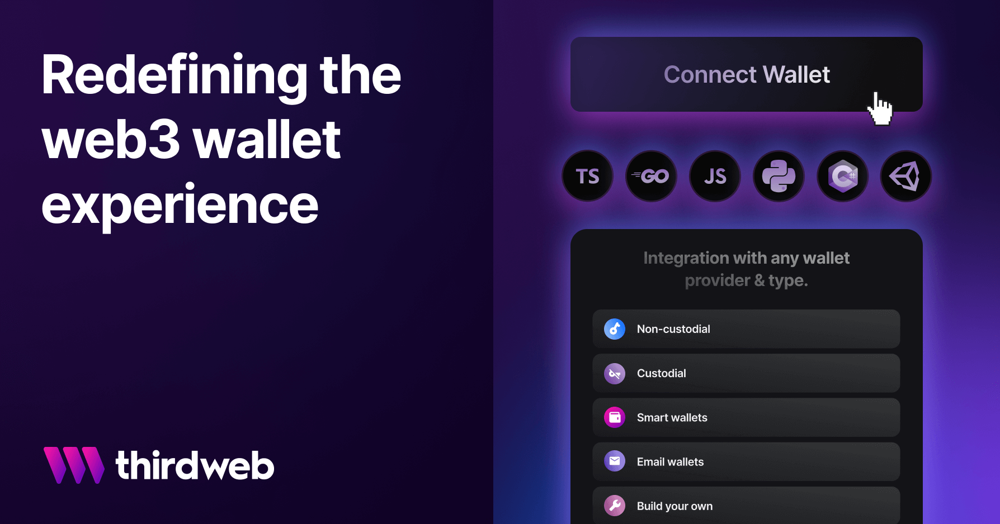

import FeedbackWidget from '/src/components/FeedbackWidget'



Follow these steps to start sending image attachments to wallets within your chat app. Our sample app includes everything you need to connect to wallets with thirdweb's WalletSDK, use XMTP's remote attachments, and upload larger files to thirdweb's storage.

<!--truncate-->

### Concepts

### Thirdweb WalletSDK

The WalletSDK is a development kit that grants developers access to a comprehensive selection of wallets, ranging from custodial to MPC to smart contracts.
[Read more](https://portal.thirdweb.com/wallet)

### XMTP Content-Types

Content types are a way to describe the _type_ of _content_ a message contains on XMTP. Out of the box, XMTP's SDKs support one content type: `text`.
[Read more](https://xmtp.org/docs/dev-concepts/content-types)

### Thirdweb storage

StorageSDK handles the complexities of decentralized file management for you. No need to worry about fetching from multiple IPFS gateways, handling file and metadata upload formats, etc.
[Read more](https://portal.thirdweb.com/storage)

### Demo App

This repository demonstrates the implementation of these concepts within a simple chat app.

[GitHub repo](https://github.com/fabriguespe/xmtp-thirdweb-js)

```tsx
git clone git@github.com:fabriguespe/xmtp-thirdweb-js.git
cd xmtp-thirdweb-js
npm install
npm run dev
```

### Learning Objectives:

- Setting up the ConnectWallet button
- Signing in with XMTP
- Loading a conversation
- Sending a message
- Sending a remote attachment
- Receiving attachments

### Getting Started

The first step involves creating and configuring the Next.js application.

To generate a new Next.js app, execute the following command in your terminal:

```tsx
npx create-next-app xmtp-thirdweb

✔ Would you like to use TypeScript with this project? Yes
✔ Would you like to use ESLint with this project? Yes
✔ Would you like to use Tailwind CSS with this project?  Yes
✔ Would you like to use `src/` directory with this project? No
✔ Use App Router (recommended)? Yes
✔ Would you like to customize the default import alias? No
```

Next, navigate into the newly created directory and install the necessary dependencies for using XMTP and Thirdweb:

```tsx
npm install @thirdweb-dev/react @thirdweb-dev/sdk @xmtp/xmtp-js xmtp-content-type-remote-attachment
```

### Setting up the ConnectWallet button


Begin by wrapping the app with `ThirdwebProvider`, then use the `ConnectWallet` component to establish wallet connectivity.

```tsx
<ThirdwebProvider activeChain="goerli">
  <Home />
</ThirdwebProvider>
```

```tsx
//Just one line of code to connect to wallet
<ConnectWallet theme="light" />
```

```tsx
//After logging in, we can use thirweb hooks to see the wallet
const address = useAddress()
const signer = useSigner()
```

That’s it! Next, proceed with signing in to XMTP.

### Signing in with XMTP


Create a new XMTP instance and register the content types your chat app will utilize.

```tsx
// Function to initialize the XMTP client
const initXmtp = async function () {
  // Create the XMTP client
  const xmtp = await Client.create(signer, { env: 'production' })
  // Register the codecs. AttachmentCodec is for local attachments (<1MB)
  xmtp.registerCodec(new AttachmentCodec())
  //RemoteAttachmentCodec is for remote attachments (>1MB) using thirdweb storage
  xmtp.registerCodec(new RemoteAttachmentCodec())
  //Create or load conversation with Gm bot
  newConversation(xmtp, PEER_ADDRESS)
  // Set the XMTP client in state for later use
  setXmtpConnected(!!xmtp.address)
  //Set the client in the ref
  clientRef.current = xmtp
}
```

### Loading a conversation

In this case, we will use our GM Bot and the XMTP instance to create the conversation. If the conversation already exists, it will retrieve its message history.

```tsx
const newConversation = async function (xmtp_client, addressTo) {
  //Checks if the address is on the network
  if (xmtp_client.canMessage(addressTo)) {
    //Creates a new conversation with the address
    const conversation = await xmtp_client.conversations.newConversation(
      addressTo
    )
    convRef.current = conversation
    //Loads the messages of the conversation
    const messages = await conversation.messages()
    setMessages(messages)
  } else {
    console.log('cant message because is not on the network.')
    //cant message because is not on the network.
  }
}
```

### Sending a message

Text messages require neither codec nor encryption. They can be sent as they are.

```tsx
const onSendMessage = async (value) => {
  return convRef.send(value)
}
```

Small attachments below 1MB can be sent using the AttachmentCodec. The codec will automatically encrypt the attachment and upload it to the XMTP network.

```tsx
// Function to handle sending a small file attachment
const handleSmallFile = async (file) => {
  // Convert the file to a Uint8Array
  const blob = new Blob([file], { type: file.type })
  let imgArray = new Uint8Array(await blob.arrayBuffer())

  const attachment = {
    filename: file.name,
    mimeType: file.type,
    data: imgArray,
  }
  await conversation.send(attachment, { contentType: ContentTypeAttachment })
}
```

### Send a remote attachment

For large attachments above 1MB, use the `RemoteAttachmentCodec`. The codec will automatically encrypt the attachment and upload it to the Thirdweb network. For uploading bigger files we are going to first encrypt them and then upload them to the IPFS network via the Thirdweb SDK.

1. Encrypt the file

```tsx
//Loadfile is a helper function to convert the file to a Uint8Array
const imgData = await loadFile(file)

const attachment = {
  filename: file.name,
  mimeType: file.type,
  data: imgData,
}

const attachmentCodec = new AttachmentCodec()
const encryptedAttachment = await RemoteAttachmentCodec.encodeEncrypted(
  attachment,
  attachmentCodec
)
```
2. Next we are going to upload the file to the IPFS network via the Thirdweb SDK.

```tsx
const uploadUrl = await upload({
  //encryptedAttachment.payload.buffer is a Uint8Array
  //We need to convert it to a File to upload it to the IPFS network
  data: [new File([encryptedAttachment.payload.buffer], file.name)],
  options: { uploadWithGatewayUrl: true, uploadWithoutDirectory: true },
})

//uploadUrl[0] is the IPFS hash of the encrypted file
uploadUrl[0]
```

3. Finally we will use the encrypted file's URL to send it to the XMTP network using XMTP ContentTypeRemoteAttachment.

```tsx
const remoteAttachment = {
  url: uploadUrl[0],
  contentDigest: encryptedAttachment.digest,
  salt: encryptedAttachment.salt,
  nonce: encryptedAttachment.nonce,
  secret: encryptedAttachment.secret,
  scheme: 'https://',
  filename: attachment.filename,
  contentLength: attachment.data.byteLength,
}

const message = await conversation.send(remoteAttachment, {
  contentType: ContentTypeRemoteAttachment,
  contentFallback: 'a screenshot of over 1MB',
})
```

### Receiving attachments

In the parent component, add a listener that will fetch new messages from a stream.

```tsx
// Function to stream new messages in the conversation
const streamMessages = async () => {
  const newStream = await convRef.current.streamMessages()
  for await (const msg of newStream) {
    const exists = messages.find((m) => m.id === msg.id)
    if (!exists) {
      setMessages((prevMessages) => {
        const msgsnew = [...prevMessages, msg]
        return msgsnew
      })
    }
  }
}
streamMessages()
```

Render these messages in the child component using a `Blob` for attachments.

```tsx
if (message.contentType.sameAs(ContentTypeAttachment)) {
  // Handle ContentTypeAttachment
  return objectURL(message.content)
}
// Function to render a local attachment as an image
const objectURL = (attachment) => {
  const blob = new Blob([attachment.data], { type: attachment.mimeType })
  return (
    
  )
}
```

With remote storage is s different story because uploading and decrypting the file is resource consuming. We need to use the `RemoteAttachmentCodec` to decrypt the file and then render it. In the future we will dive into performance improvements.

```tsx
// This method receives the message.content as attachment, the xmtp client and the RemoteAttachmentCodec
export const deloadFile = async (attachment, client, RemoteAttachmentCodec) => {
  return RemoteAttachmentCodec.load(attachment, client)
    .then((decryptedAttachment) => {
      // Create a blob URL from the decrypted attachment data
      const blob = new Blob([decryptedAttachment.data], {
        type: decryptedAttachment.mimeType,
      })
      return URL.createObjectURL(blob)
    })
    .catch((error) => {
      console.error('Failed to load and decrypt remote attachment:', error)
    })
}
```

That was easy! Now you can send and receive messages with attachments using XMTP and Thirdweb.

### Join us on Discord

We're excited to be partnering with Thirdweb to bring you better solutions for serving and reaching your end-users. [Stay tuned](https://discord.com/invite/xmtp) for more guides coming soon!

<br/>
<FeedbackWidget />
