# How I got over 100 crypto wallets to play Trivia

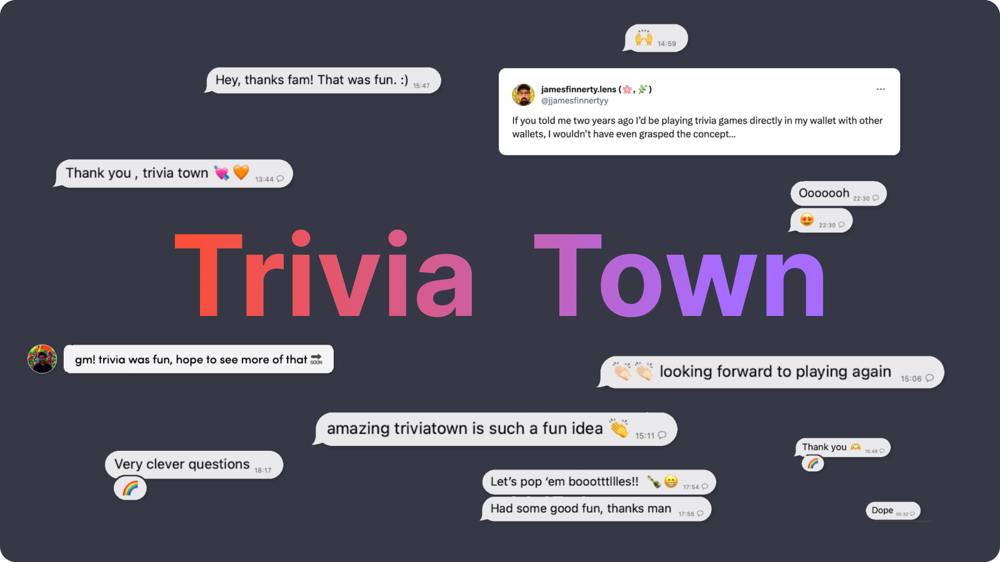

<!--truncate-->

### TL;DR: I made onboarding and participating dead simple: just DM triviatown.eth.

At ETH NYC, we hosted a happy hour for the XMTP ecosystem using only XMTP.

No email. No text. No phone number. No Luma. No Eventbrite. No Partiful.

Everything from RSVP to check in and POAP distribution took place on XMTP.

import { TwitterTweetEmbed } from "react-twitter-embed";

:::tip

### Steps to running an event using XMTP

1. **Onboarding:** We bought an ENS that anyone could then send a message to join the waitlist.
2. **Automatic registration:** Every wallet address was then automatically registered for the event, and approved or not by our team.
3. **Direct line of communication without collecting personal information:** The approved list then received updates about the event, like the location, by text on whatever client app they preferred to use.
4. **POAP delivery:** Once someone checks in, the bot automatically drops a unique POAP mint link into the chat for them to claim.

:::

This worked so well that we thought — why not run a whole conference using only XMTP?

We spoke to an A-list conference. They thought running official communications via XMTP would be cool, but wanted to take it one step further: what if we ran trivia games to engage attendees, and make the experience more fun and interactive.

They had the idea, but they didn’t think it would be easy to do.

By using ChainJet and XMTP I was able to ship it in just a few minutes*.* I just had to buy the ENS, set up the automatic reply message in ChainJet, and ship.

### Within 48 hours, Trivia Town had over 110 players.

  <TwitterTweetEmbed tweetId={"1717366305987207310"} />

This player above said it best — playing a game in your crypto wallet was unimaginable until now. It’s like saying play it from your bank account.

Once you grasp the concept, connecting wallets with messaging means you can use bots to onboard people at scale, with a security that does not exist with email or phone numbers.

I sent the winner the NFT and USDC using Coinbase Wallet in just 2 clicks. [Frictionless payment rails for crypto let's go](https://hey.xyz/posts/0x016b0f-0x014e-DA-bd07996a).

What struck me the most was the excitement and engagement this game received in so little time… sharing some highlights below!

### If I’m a web3 project, why should I care about creating a game?

1. **To ensure simple onboarding and great UX.** Focusing on creating experiences that are fun is the best way to ensure that onboarding is as simple as it gets. No one will think something is fun if it was hard to engage with.
2. **To create stronger communities that grow organically.** I launched the game, but before I knew it, other people were promoting it themselves, by challenging their friends.

### How to set up Trivia Town in ChainJet

By combining bots and wallet messaging, a simple text can automatically onboard anyone to any project, game or app. And because users are directly messaging from their wallet address, they can also receive a prize like crypto or an NFT.

Many projects like ENS, Polygon, BASE, Lens and Linea [have used this combination before](https://twitter.com/xmtp_/status/1709244436377747556) to automatically deliver testnet funds, NFTs and/or POAPs at scale.

Trivia Town was a way of showcasing how you can take this a step further, to create a fun and engaging experience that users want to come back to.

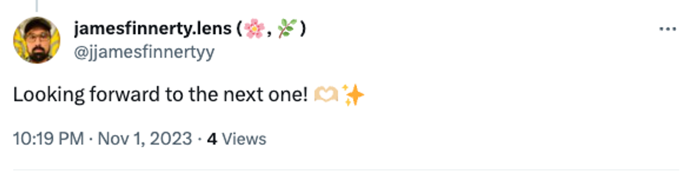
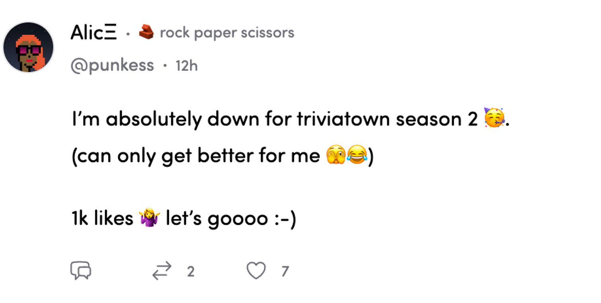
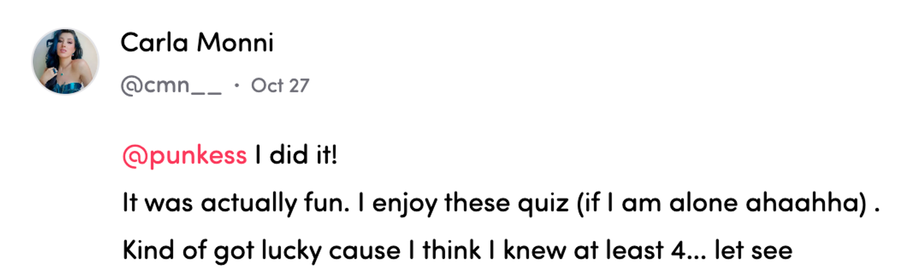
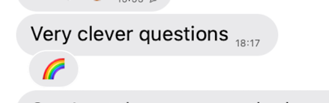
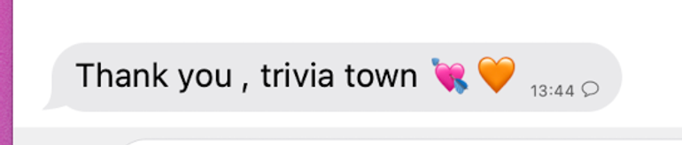
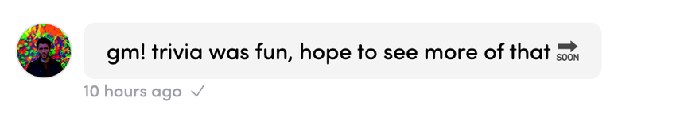
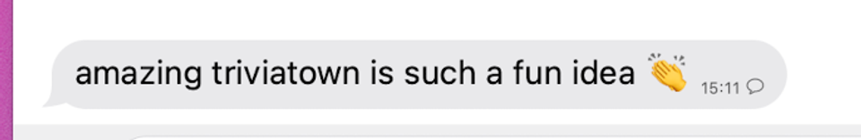
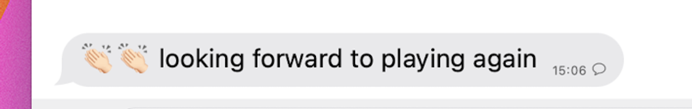
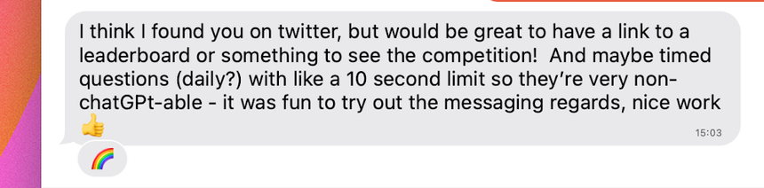

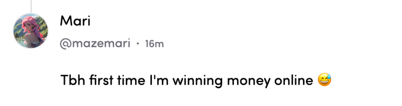
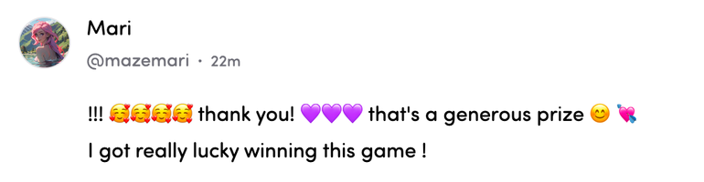
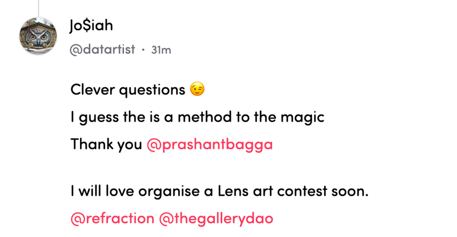
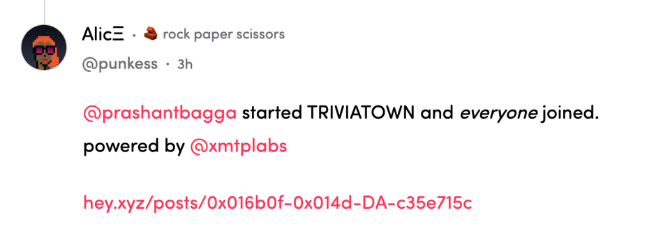
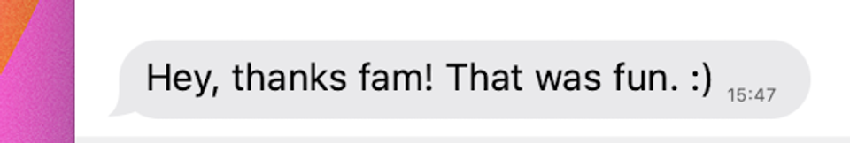
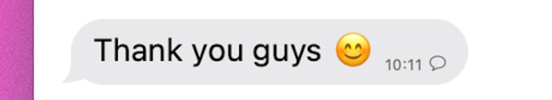

