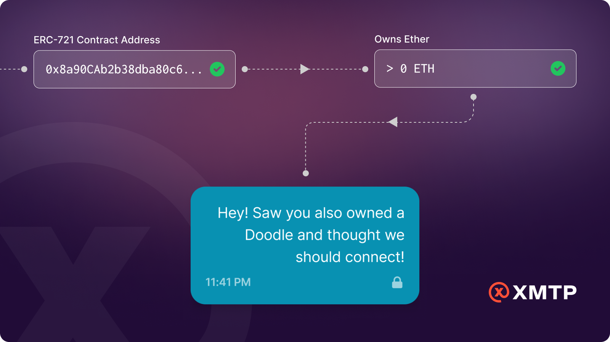
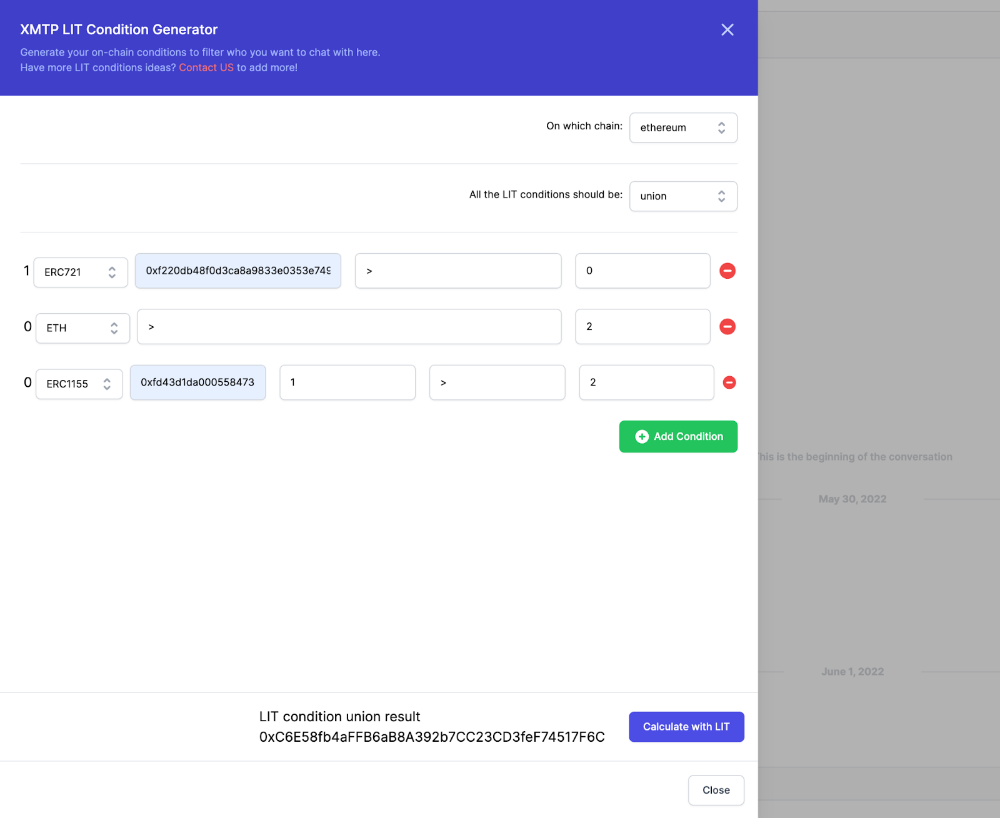
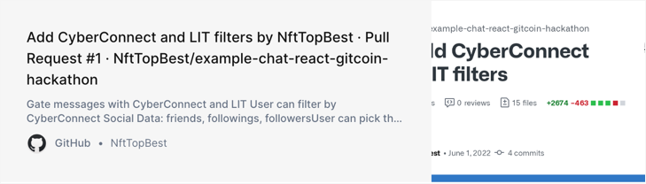

In web3, token-gated messaging opens up a world where you can see verifiable transactions and facts about the sender that help you vet who you want to interact with.

_Token gating flow with an app on XMTP_

<!--truncate-->

**@NftTopBest demonstrates one future for trustless messaging**

## Challenge

Let’s take a look at the world of communications today.

332 billion emails are sent every day. No permission is required, spoofing is enabled out-of-the-box, there’s no way to prove if the sender's claims are true, and there are massive databases with a treasure trove of PII for sale on the open market that aid in socially engineering fraud. This is our status quo: people can email you and you have no way of being certain who they are, or if they are relevant to you.

Email providers like Gmail trade users _some_ protection by reading emails and packaging preferences and identity for advertisers, which is then resold a thousand times.

Walled-garden messaging apps are no better. Users can create fake identities, populate fake profiles, and easily impersonate real users with little to no friction.

### Token-gated chat in web3 tackles these problems head-on

In web3, token-gated messaging opens up a world where you can see verifiable transactions and facts about the sender that help you vet who you want to interact with. Web3-native messaging platforms are introducing new forms of spam and phishing, though. Spammers are becoming more sophisticated about using blockchain data to socially engineer scams targeting wallet owners. Check out [@cifelse](https://twitter.com/cifelse)’s [thread](https://twitter.com/cifelse/status/1531587121752195072?s=20&t=BFN75Rmgb5ebiJ8O7PCJIQ) (“...file under phishing sites, terrible, and pathetic.”)

Applications can protect users with rules-based message acceptance and train consumers on truths not spoofs. In the end, this is better for consumers and, fortunately, there are ways developers can address this problem directly in their apps.

As part of the ETH Shanghai hackathon, XMTP Labs [sponsored a bounty](https://gitcoin.co/issue/xmtp-labs/ethshanghai-2022/2/100028892) to demonstrate how a token-gated inbox can mitigate the problem of spam. We also encouraged developers to use other open source protocols alongside XMTP to build solutions that leverage the composability of web3.

## Solution

Developer [@NftTopBest](https://github.com/NftTopBest)’s [proof-of-concept application](https://chat.web3nft.social/) ([repo](https://github.com/NftTopBest/example-chat-react-gitcoin-hackathon/pull/1)) allows users to create custom rulesets that determine which messages display in their inbox based on blockchain data, including what tokens are owned by the sender. For instance, a user could specify only wanting their inbox to display messages from a wallet that “owns a Moonbird”, or “has at least 1 ETH”, or even combine these to curate which cohorts can reach them. _(You can see an example in the following screenshot.)_

@NftTopBest showed how these rules could be exposed to let users precisely control how they receive web3 messages.

The same solution could also be applied at the **application** level by developers who want to curate messaging experiences unique to their use case.

Here are a few ideas that show how developers can use this approach:

* A social dapp could stand up token-gated, direct messaging for members of any NFT community.
* An NFT marketplace could restrict messages to only users who have listed or purchased NFTs on their marketplace.
* A standalone wallet-to-wallet messaging application could give its users simple controls to define who they want to receive messages from. They could even let users create multiple sets of rules for different sets of recipients they are interested in receiving messages from.
* A web3 conference organizer could enable post-event messaging between attendees using a proof of attendance protocol (POAP) as a gating mechanism.

## Results

By using XMTP’s [messaging SDK](https://github.com/xmtp) and [Lit Protocol](https://github.com/LIT-Protocol/lit-js-sdk), @NftTopBest built an open source solution to allow spam-resistant messaging in a native web3 manner. Developers can [use this code](https://github.com/NftTopBest/example-chat-react-gitcoin-hackathon) to protect their users from sophisticated socially engineered spam.

This proof-of-concept enables any web3 developer to:

* Build spam-resistant native web3 messaging into their application in a few hours.
* Allow their users to set custom rules controlling what messages appear in their inboxes.
* Allow their applications to set global rules controlling which messages to display to users.

See for yourself at @NftTopBest’s project [repo](https://github.com/NftTopBest/example-chat-react-gitcoin-hackathon/pull/1):

