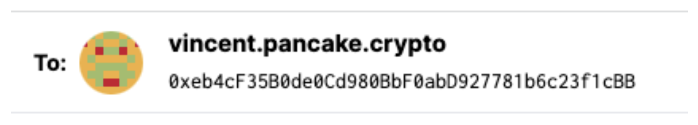

# Add Unstoppable Resolution to your XMTP application

Creating seamless user experiences in decentralized applications (dApps) is vital for the growth and widespread adoption of Web3. Unstoppable Domains is one such solution that greatly improves the user experience by offering blockchain-based domains. These domains simplify cryptocurrency transactions, enable easy user logins for dApps, games, and metaverses, and even offer a way to create and host censorship-resistant websites.

Best of all, once an Unstoppable Domain is minted on the blockchain, it belongs to the user forever without any renewal fees. Today, we'll walk you through the process of adding Unstoppable Domain support into your XMTP application.

## **Prerequisites[](https://xmtp.org/docs/client-sdk/javascript/tutorials/build-key-xmtp-chat-features-in-a-lens-app#prerequisites)**

This tutorial requires that you have the following prerequisites in place:

- An XMTP empowered app built with the [XMTP client SDK for JavaScript](https://github.com/xmtp/xmtp-js)
- Add the Unstoppable Domains SDK

```jsx
npm i --save @unstoppabledomains/resolution
```

Instantiate the library using your own RPC, such as Infura. Create a `resolution` variable that we are going to use many times across the application.

```jsx
// Importing the Resolution library from @unstoppabledomains/resolution
// This library allows you to interact with blockchain domains
import Resolution from "@unstoppabledomains/resolution";

// Create a new instance of the Resolution class
// It is configured to work with two Ethereum networks: Mainnet and Polygon Mainnet.
// The URLs for connecting to these networks are provided by Infura and are secured using the infuraKey.
const resolution = new Resolution({
  sourceConfig: {
    uns: {
      locations: {
        Layer1: {
          url: `https://mainnet.infura.io/v3/${infuraKey}`,
          network: "mainnet",
        },
        Layer2: {
          url: `https://polygon-mainnet.infura.io/v3/${infuraKey}`,
          network: "polygon-mainnet",
        },
      },
    },
  },
});
```

## **Resolve User Inputs[](https://xmtp.org/docs/client-sdk/javascript/tutorials/build-key-xmtp-chat-features-in-a-lens-app#filter-for-lens-conversations-and-display-message-previews)**

When building with XMTP, you must provide a way to start a conversation between the user and the wallet address they want to message. As suggested above, an Enter a Wallet Address field. We’ll want to check the user input to see if its a valid Unstoppable Domain and, if it is, resolve it.

To check if the input is a Valid Unstoppable Domain, we can use the `.isSupportedDomain` function within the library.

```jsx
const valid = await resolution.isSupportedDomain(name);
```

If an async call is not possible in the current implementation, hardcoded values can be used but must be kept updated. Using the supported Unstoppable Domains at the time of writing, an example could look like this:

```jsx
// This is a list of allowed Unstoppable Domains (UNS) domain suffixes.
// A domain is only considered valid if it ends with one of these suffixes.
export const ALLOWED_UNS_SUFFIXES = [
  ".crypto",
  ".bitcoin",
  ".blockchain",
  ".dao",
  ".nft",
  ".888",
  ".wallet",
  ".x",
  ".klever",
  ".zil",
  ".hi",
  ".kresus",
  ".polygon",
  ".anime",
  ".manga",
  ".binanceus",
];

// Function to check if a given address is a valid Unstoppable Domain (UNS) address.
// A valid UNS address must contain a dot and must end with one of the allowed suffixes.
export const isUnsAddress = (address: string): boolean => {
  // If the address is an empty string or does not contain any dots, return false immediately.
  if (!address || !address.includes(".")) {
    return false;
  }
  // Check if the address ends with any of the allowed suffixes.
  // If it does, return true; otherwise, return false.
  return ALLOWED_UNS_SUFFIXes.some((suffix) => address.endsWith(suffix));
};
```

If the input is valid, we can resolve the name for the associated ETH address using the example `fetchUnsAddress` function below.

```jsx
const domain = await resolution.addr(name, "ETH");
//If there is no address associated with the domain or the domain is not valid, the above functions will return null or false respectively.
```



### Reverse Resolve Wallet Addresses

To complete the Unstoppable Domains integration, it’s important to convert the wallet addresses on the page into their respective domains. Using the [XMTP.chat](https://xmtp.chat/inbox) inbox as an example, we’ll want to reverse resolve the connected wallet address as well as the message previews.


To do this, we’ll want to implement a function similar to the below which will attempt to resolve the wallet address to a domain. We’ll display the wallet address if the function returns null, otherwise display the domain.

```jsx
const domain = await resolution.reverse(address);
```

To achieve this for the message previews, we can iterate through the existing list of conversations and resolve each one individually.

### Performance

An optional step to limit calls to your RPC is to cache the above results into local storage. To do this, we’ll want to implement a function similar to the below hook which will both set and get a storage item based on their respective key. On error, it will fallback to the default value we set during the function call.

An example of tying everything together for a **react app** message preview could look like the below.

```jsx
// Importing hooks from React
import { useEffect, useState } from "react";

// This is a custom React hook that wraps around LocalStorage functionalities
// It allows you to store, retrieve and manipulate a piece of data in LocalStorage
// in a react way (i.e., using state and effects)
export const useLocalStorage = (
  key: string | undefined, // The key of the item to be saved in the LocalStorage
  defaultValue: string | null // The default value to be used when the value of the given key is not found
) => {
  // Initializing the state with the value from LocalStorage or the default value
  const [value, setValue] = useState(() => {
    let currentValue;

    try {
      // Trying to parse the JSON value of the item in the LocalStorage
      currentValue = JSON.parse(
        localStorage.getItem(key || "") || String(defaultValue)
      );
    } catch (error) {
      // If an error occurred (probably due to invalid JSON), the default value is used
      currentValue = defaultValue;
    }

    return currentValue;
  });

  // This useEffect hook saves the current value to LocalStorage every time it changes
  useEffect(() => {
    localStorage.setItem(key || "", JSON.stringify(value));
  }, [value, key]);

  // The state and the setter function are returned so they can be used by the caller
  return [value, setValue];
};

// Using the custom hook to manage the username preview
// The key is the peer address and the default value is an empty string
const [previewUnsName, setPreviewUnsName] = useLocalStorage(
  convo?.peerAddress,
  ""
);

// This effect hook checks whether the peer address is valid and the username preview is empty
// If both conditions are met, it fetches the username from the UNS and sets it
useEffect(() => {
  const getUns = async () => {
    if (isValidWalletAddress(convo?.peerAddress) && previewUnsName === "") {
      const name = await fetchUnsName(convo?.peerAddress);
      // If a name was fetched successfully, it is used; otherwise, null is set
      name ? setPreviewUnsName(name) : setPreviewUnsName(null);
    }
  };

  // The function is called immediately
  getUns();
}, [convo?.peerAddress]); // This effect runs every time the peer address changes
```

**Learn more**

To learn more about Building with Unstoppable Domains, see the Developer Portal on the Unstoppable Domains website.
