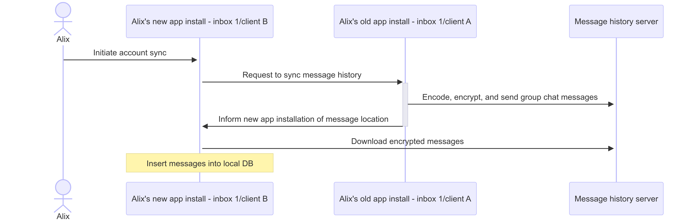

import Tabs from "@theme/Tabs";
import TabItem from "@theme/TabItem";

# Enable message history for group chat with XMTP

Each app installation generates unique group chat keys. This means that group chat messages sent from one app installation can only be decrypted by that same app installation.

To enable users to access their group chat messages using all of their app installations, enable the message history feature. Enabling message history is necessary for a seamless multi-app installation experience.

To learn more about the user experience without the message history feature, see [⚠️ Important: Manage actions that make a local database inaccessible](/docs/build/group-chat/#️-important-manage-actions-that-make-a-local-database-inaccessible).

## Run a message history server

To enable the message history feature, you must run your own [**xmtp-message-history-server**](https://github.com/xmtp/xmtp-message-history-server). When you do, it will provide a message history sync URL to use in the next step.

## Set message history sync URL

When your app creates a new client, specify the location where the client should sync message history. Whether you support the message history feature in your app or not, we recommend setting this value to allow other apps to pull in your app's message history. The message history starts at the point you set this value.

<Tabs groupId="sdk-langs">
<TabItem value="rn" label="React Native" attributes={{className: "rn_tab"}}>

```jsx
  const clientOptions = {
    env: 'production' as const,
    enableV3: true,
    appVersion: 'YourApp/1.0.0',
    dbEncryptionKey: encryptionKey, // Replace with actual Array encryption key
    // Add the history sync URL option
    historySyncUrl: 'SYNC_URL'
  }
```

</TabItem>
<TabItem value="kotlin" label="Kotlin" attributes={{className: "kotlin_tab"}}>

```kotlin
Client().create(
    account = alixWallet,
    options = ClientOptions(
        ClientOptions.Api(XMTPEnvironment.PRODUCTION, true),
        enableV3 = true,
        dbEncryptionKey: encryptionKey, // Replace with actual ByteArray encryption key
        appContext = context
        historySyncUrl = "SYNC_URL"
    )
)
```

</TabItem>
<TabItem value="swift" label="Swift"  attributes={{className: "swift_tab"}}>

```swift
let options = ClientOptions(
    api: ClientOptions.Api(
        env: .production,
        isSecure: true
    ),
    enableV3: true,
    dbEncryptionKey: encryptionKey, // Replace with actual String encryption key
    historySyncUrl: "SYNC_URL"
)
```

</TabItem>
<TabItem value="node" label="Node"  attributes={{className: "node_tab"}}>

```tsx
// this API is experimental and may change in the future

const client = await Client.create('0x1234...', {
  apiUrl: 'SYNC_URL'
});
```

</TabItem>
</Tabs>

## Request message history sync

Code your app to request a message history sync anytime a user accesses a conversation view. 

This sync is especially important if a user backgrounds (switches away from) your app, then reopens the app and accesses a conversation view. When the user reopens the app, it may be using an old epoch (snapshot) of data. This is even more likely to be true if there were many group membership changes during the time the app was backgrounded. A message history sync bumps the app to the latest epoch, helping to ensure that your user always sees the current group chat.

When a new client is created, it will look for other clients registered with the same inbox ID. If there are none, there is no message history to be synced. If there are clients registered with the same inbox ID, it will request a message history sync with the clients.

For example, let’s say that inbox ID 1/client B requests a message history sync with inbox ID 1/client A.

The request encodes, encrypts, and sends inbox ID 1/client A’s group chat messages to the message history server indicated by inbox ID 1/client A’s `historySyncUrl`. 

The request then downloads the encrypted messages from the message history server to inbox ID 1/client B’s local database. Inbox ID 1/client B can then decrypt, decode, and display the messages.

The request performs this sync for every client registered with inbox ID 1.



:::caution
Downloading message history may involve a large amount of data. To help users avoid potential mobile data charges, consider prompting users to initiate the download only when connected to Wi-Fi.
:::

<Tabs groupId="sdk-langs">
<TabItem value="rn" label="React Native" attributes={{className: "rn_tab"}}>

```jsx
await client.requestMessageHistorySync()
```

</TabItem>
<TabItem value="kotlin" label="Kotlin" attributes={{className: "kotlin_tab"}}>

```kotlin
client.requestMessageHistorySync()
```

</TabItem>
<TabItem value="swift" label="Swift"  attributes={{className: "swift_tab"}}>

```swift
try await client.requestMessageHistorySync()
```

</TabItem>
<TabItem value="node" label="Node"  attributes={{className: "node_tab"}}>

```tsx
// this API is experimental and may change in the future

await client.requestHistorySync();
```

</TabItem>
</Tabs>
