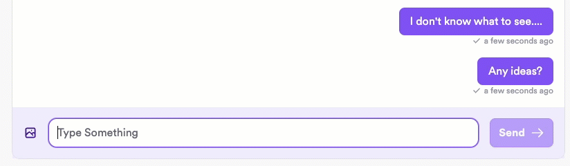

import Tabs from "@theme/Tabs";
import TabItem from "@theme/TabItem";

# Send and list messages

Messages are addressed using wallet addresses.

The message payload can be a plain string, but you can configure custom content types. To learn more, see [Content types](/docs/concepts/content-types).

## Send messages

To send a message, the recipient must have already started their client at least once and consequently advertised their key bundle on the network.

You might want to consider [optimistically sending messages](#optimistically-send-messages).

<Tabs groupId="sdk-langs">
<TabItem value="js" label="JavaScript" default>

```ts
const conversation = await xmtp.conversations.newConversation(
  "0x3F11b27F323b62B159D2642964fa27C46C841897"
);
await conversation.send("Hello world");
```

</TabItem>
<TabItem value="swift" label="Swift" default>

```swift
let conversation = try await client.conversations.newConversation(
  with: "0x3F11b27F323b62B159D2642964fa27C46C841897")
try await conversation.send(content: "Hello world")
```

</TabItem>
<TabItem value="dart" label="Dart" default>

```dart
var convo = await client.newConversation("0x...");
await client.sendMessage(convo, 'gm');
```

</TabItem>
<TabItem value="kotlin" label="Kotlin - beta" default>

```kotlin
val conversation =
    client.conversations.newConversation("0x3F11b27F323b62B159D2642964fa27C46C841897")

conversation.send(text = "Hello world")
```

</TabItem>
<TabItem value="react" label="React - beta" default>

```tsx
import { useSendMessage } from "@xmtp/react-sdk";

const sendMessage = useSendMessage(conversation);

await sendMessage(message);
```

</TabItem>
</Tabs>

## Optimistically send messages

When a user sends a message with XMTP, they might experience a slight delay between sending the message and seeing their sent message display in their app UI.

This is because when a user sends a message, they typically have to wait for the XMTP network to finish processing the message before the app can display it in the UI.

Messaging without optimistic sending:


Note the slight delay after clicking **Send**.

Implement optimistic sending to immediately display the sent message in the sender’s UI while processing the message in the background. This provides the user with immediate feedback and enables them to continue messaging without having to wait for their previous message to finish processing.

Messaging with optimistic sending:



The message displays immediately for the sender, with a checkmark indicator displaying once the message has been successfully sent.

### Preserve message order

It’s important to preserve order when sending messages optimistically so that the messages appear on the network in the order that they are sent. If a message is being processed when a user attempts to send another message, the new message should wait for the current message to be processed before being sent.

### Handle send statuses

- After an optimistic message is initially sent, present the user with an indicator that the message is still being processed.
- After an optimistic message is successfully sent, present the user with a success indicator.

### Handle messages that fail to send

In the unexpected event that an optimistic message fails to send, present the user with an option to retry sending the message or to cancel sending. Use a try/catch block to intercept errors and allow the user to retry or cancel.

### Prepare message before sending

Use an XMTP SDK to prepare a message before sending it. This will encrypt and package up the message in the proper format for the XMTP network. After preparing the message, it’s ready to be sent optimistically.

<Tabs groupId="sdk-langs">
<TabItem value="js" label="JavaScript" default>

```tsx
// standard (string) message
const preparedTextMessage = await conversation.prepareMessage(messageText);

// custom content type
const preparedCustomContentMessage = await conversation.prepareMessage(
  customContent,
  {
    contentType,
    contentFallback: "This content can't be displayed on this client.",
  }
);
```

</TabItem>
</Tabs>

### Send prepared message

After preparing an optimistic message, use its `send` method to send it.

<Tabs groupId="sdk-langs">
<TabItem value="js" label="JavaScript" default>

```tsx
try {
  preparedMessage.send();
} catch (e) {
  // handle error, enable canceling and retries (see below)
}
```

</TabItem>
</Tabs>

## List messages in a conversation

You can receive the complete message history in a conversation.

<Tabs groupId="sdk-langs">
<TabItem value="js" label="JavaScript" default>

```ts
for (const conversation of await xmtp.conversations.list()) {
  // All parameters are optional and can be omitted
  const opts = {
    // Only show messages from last 24 hours
    startTime: new Date(new Date().setDate(new Date().getDate() - 1)),
    endTime: new Date(),
  };
  const messagesInConversation = await conversation.messages(opts);
}
```

</TabItem>
<TabItem value="swift" label="Swift" default>

```swift
for conversation in client.conversations.list() {
  let messagesInConversation = try await conversation.messages()
}
```

</TabItem>
<TabItem value="dart" label="Dart" default>

```dart
// Only show messages from the last 24 hours.
var messages = await alice.listMessages(convo,
    start: DateTime.now().subtract(const Duration(hours: 24)));
```

</TabItem>
<TabItem value="kotlin" label="Kotlin - beta" default>

```kotlin
for (conversation in client.conversations.list()) {
    val messagesInConversation = conversation.messages()
}
```

</TabItem>
<TabItem value="react" label="React - beta" default>

```tsx
import { useMessages } from "@xmtp/react-sdk";

const [conversation, setConversation] = useState(null);
const { messages } = useMessages(conversation);

useEffect(() => {
  if (messages) {
    console.log("Loaded message history:", messages.length);
  }
}, [messages]);
```

</TabItem>
</Tabs>

## List messages in a conversation with pagination

If a conversation has a lot of messages, it's more performant to retrieve and process the messages page by page instead of handling all of the messages at once.

<Tabs groupId="sdk-langs">
<TabItem value="js" label="JavaScript" default>

Call `conversation.messagesPaginated()`, which will return an [AsyncGenerator](https://developer.mozilla.org/en-US/docs/Web/JavaScript/Reference/Global_Objects/AsyncGenerator) yielding one page of results at a time. `conversation.messages()` uses this under the hood internally to gather all messages.

```ts
const conversation = await xmtp.conversations.newConversation(
  "0x3F11b27F323b62B159D2642964fa27C46C841897"
);

for await (const page of conversation.messagesPaginated({ pageSize: 25 })) {
  for (const msg of page) {
    // Breaking from the outer loop will stop the client from requesting any further pages
    if (msg.content === "gm") {
      return;
    }
    console.log(msg.content);
  }
}
```

</TabItem>
<TabItem value="swift" label="Swift" default>

Call `conversation.messages(limit: Int, before: Date)`, which will return the specified number of messages sent before that time.

```swift
let conversation = try await client.conversations.newConversation(
  with: "0x3F11b27F323b62B159D2642964fa27C46C841897")

let messages = try await conversation.messages(limit: 25)
let nextPage = try await conversation.messages(limit: 25, before: messages[0].sent)
```

</TabItem>
<TabItem value="dart" label="Dart" default>

Specify `limit` and `end`, which will return the specified number
of messages sent before that time.

```dart
var messages = await alice.listMessages(convo, limit: 10);
var nextPage = await alice.listMessages(
    convo, limit: 10, end: messages.last.sentAt);
```

</TabItem>
<TabItem value="kotlin" label="Kotlin - beta" default>

Call `conversation.messages(limit: Int, before: Date)`, which will return the specified number of messages sent before that time.

```kotlin
val conversation =
    client.conversations.newConversation("0x3F11b27F323b62B159D2642964fa27C46C841897")

val messages = conversation.messages(limit = 25)
val nextPage = conversation.messages(limit = 25, before = messages[0].sent)
```

</TabItem>
<TabItem value="react" label="React - beta" default>

```tsx
import { useMessages } from "@xmtp/react-sdk";

const { error, isLoading, messages, next } = useMessages(
  conversation,
  options: {
    limit: 20,
  },
);
const handleClick = useCallback(() => {
  // fetch next page of messages
  next();
}, [next]);


return (

    <button type="button" onClick={handleClick}>
      Load more messages
    </button>

);
```

</TabItem>
</Tabs>

## Decode a single message

You can decode a single `Envelope` from XMTP using the `decode` method:

<Tabs groupId="sdk-langs">
<TabItem value="swift" label="Swift" default>

```swift
let conversation = try await client.conversations.newConversation(
  with: "0x3F11b27F323b62B159D2642964fa27C46C841897")

// Assume this function returns an Envelope that contains a message for the above conversation
let envelope = getEnvelopeFromXMTP()

let decodedMessage = try conversation.decode(envelope)
```

</TabItem>
<TabItem value="kotlin" label="Kotlin -beta" default>

```kotlin
val conversation =
    client.conversations.newConversation("0x3F11b27F323b62B159D2642964fa27C46C841897")

// Assume this function returns an Envelope that contains a message for the above conversation
val envelope = getEnvelopeFromXMTP()

val decodedMessage = conversation.decode(envelope)
```

</TabItem>
</Tabs>
