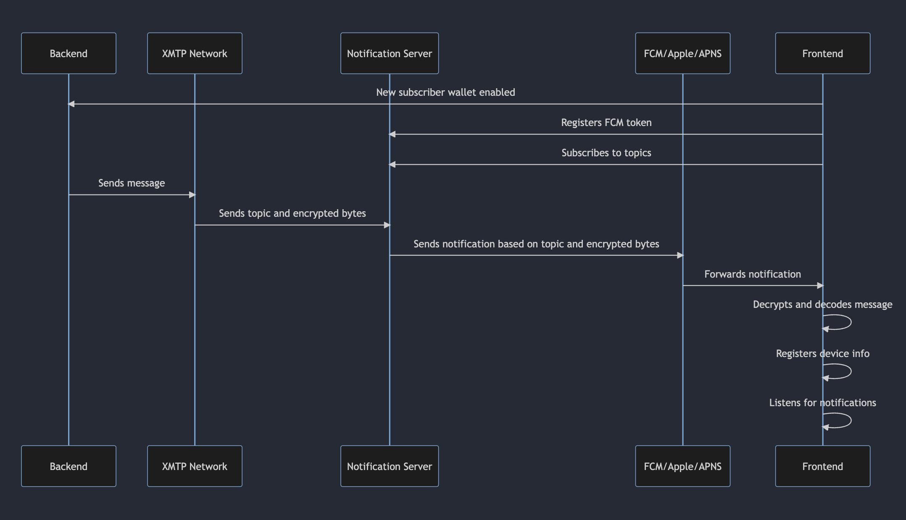

# Notification architecture overview

The notification architecture may appear complex initially, but we've simplified it into manageable concepts and steps. This overview will walk you through the notification handling and delivery process in XMTP, using practical examples to illustrate each step.



To describe the process with an example, consider a message being sent from Alice to Bob using a mobile messaging app. This app is built with React Native for iOS devices and uses Firebase for notifications. Here is a detailed explanation of each step, along with code examples.

### 1. Initializing XMTP client

Alice opens the Frontend on her iOS device and initializes her new wallet with XMTP.

```javascript
import { Client } from "@XMTP"; // XMTP JavaScript client

// Alice initializes her wallet on the Frontend
const XMTPClient = await Client.create(aliceSigner, { env: "dev" });
```

### 2. Registering device with Firebase

When Alice launches the Frontend on her device for the first time, the app registers with Firebase to receive notifications.

```javascript
// Get token from Firebase
const deviceToken = await messaging().getToken();
// Get unique ID for the device
const installationId = await installations().getId();
// Assume this function sets up your notification client
const client = createNotificationClient();

await client.registerInstallation({
  installationId,
  deliveryMechanism: {
    deliveryMechanismType: {
      value: deviceToken,
      case: "FirebaseDeviceToken",
    },
  },
});
```

### 3. Subscribing to topics

The notification server adds Alice's `installationId` to certain topics. The list of `subscriptionDetails` includes all information needed to join topics, such as user permission and HMAC keys for safely checking messages.

- `consentState`: Notifications are only subscribed to if the `consentState` of a conversation is "allowed". This ensures that users receive notifications only for conversations they have consented to. [Learn more](../user-consent)

- `Invite` topic V2: Clients use invite topics to initiate conversations between weallets. [Learn more](https://github.com/xmtp/proto/blob/main/PROTOCOL.md#invitations)

- `Intro` topic V1: Clients use intro topics to store the first message sent between two wallets

```javascript
let subscriptionDetails = [];

// Filter conversations to only include those with user consent, to respect privacy and avoid SPAM.
const consentedConversations = conversations.filter(
  (conversation) => conversation.consentState === "allowed",
);

// Compile the subscription info, attaching the HMAC key when available.
consentedConversations.forEach((conversation) => {
  subscriptionDetails.push({
    topic: conversation.topic,
    hmacKey: conversation.hmacKey || null,
  });
});

// Special topics without HMAC keys
subscriptionDetails.push({
  topic: buildUserInviteTopic(userAddress),
  hmacKey: null,
});
subscriptionDetails.push({
  topic: buildUserIntroTopic(userAddress),
  hmacKey: null,
});

// This operation sends the subscription details to the notification service.
await notificationClient.subscribeWithMetadata({
  installationId,
  subscriptions: subscriptionDetails,
});
```

### 4. Listening for notifications

Alice's Frontend is now listening for incoming notifications.

```javascript
// Listener for incoming Firebase notifications
messaging().onMessage(async (remoteMessage) => {
  console.log("A new message arrived!", remoteMessage);
});
```

### 5. Sending a message

Bob sends a message to Alice using his instance of the Frontend.

```javascript
const bobClient = await Client.create(bobSigner, { env: "dev" });
const conversation = await bobClient.conversations.newConversation(aliceWallet);
await conversation.send("Hello Alice!");
```

### 6. XMTP Network dispatch

The XMTP Network sends the encrypted message and topic to the notification server.

```javascript
// Pseudo-code for XMTP network sending encrypted message
const messageTopic = "XMTP/0/dm-alice-XMTP-topic-id";
sendToNotificationServer(encryptedMessage, messageTopic);
```

### 7. Triggering push notifications

The Notification Server triggers a push notification to Firebase.

```javascript
const message = {
  data: {
    topic: messageTopic,
    message: encryptedMessage,
  },
  topic: messageTopic,
};
firebase_admin.messaging().send(message);
```

### 8. Firebase notification forwarding

Firebase forwards the notification to Alice's device.

### 9. Decrypting the message

Alice's Frontend receives the notification and decrypts the message.

```javascript
// Decrypting the message when a notification is received from Firebase
Firebase.messaging().onMessage((payload) => {
  const decryptedMessage = decryptMessage(payload.data.message, encryptionKey);
  console.log("Decrypted message:", decryptedMessage);
});
```

The XMTP framework's notification architecture, in conjunction with Firebase Cloud Messaging, offers a secure and reliable approach to notification management and delivery. This comprehensive guide outlines the essential steps, from device registration to message decryption, to streamline the process and improve developers' notification implementation experience.

- For specific details go to [setting up notification client](https://github.com/XMTP/example-notification-server-go/blob/main/docs/notifications-client-guide.md?plain=1)
