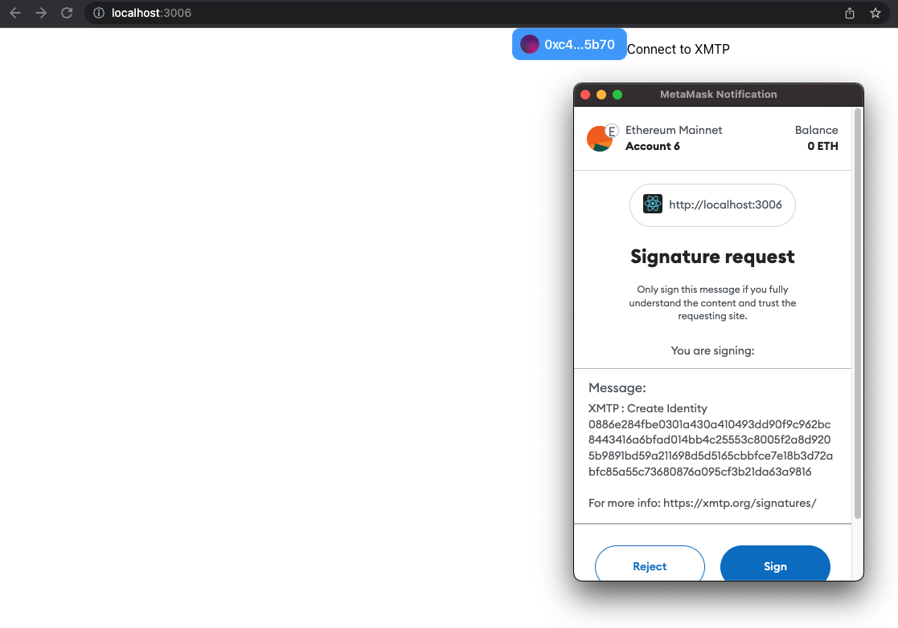
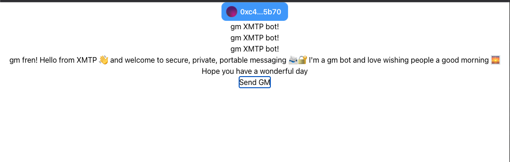
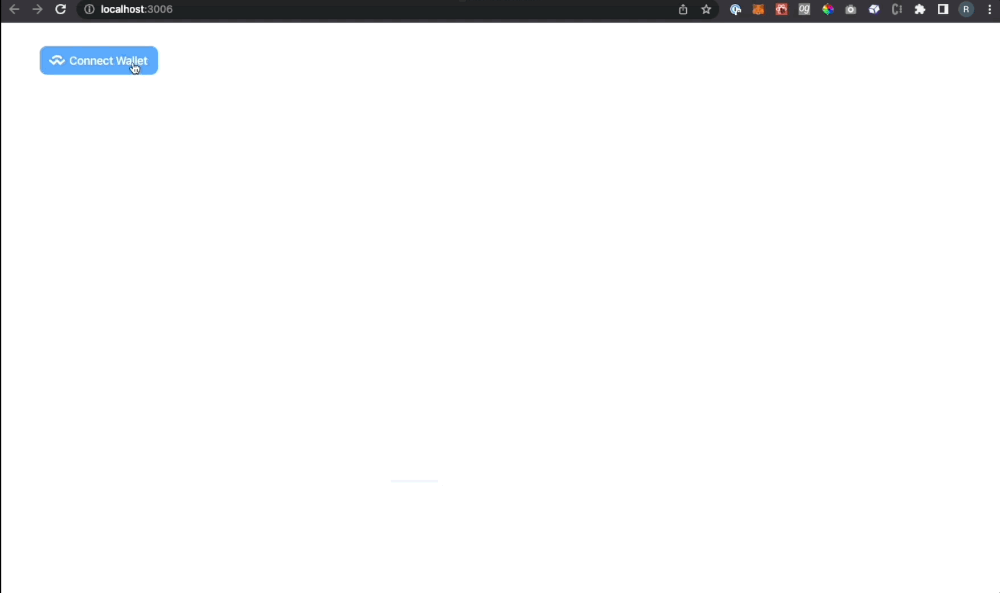

# Build an XMTP "GM!" app
XMTP (Extensible Message Transport Protocol) is an open protocol and network for secure and private web3 messaging. For example, you can build an app with XMTP to send messages between blockchain accounts, including chat/DMs, alerts, announcements, and more.

Use this tutorial to build an XMTP "GM([Good Morning](https://nftska.com/gm-it-means-more-than-you-think-nft-terminology/))" messaging app. Building this app can help you learn some of the fundamental concepts involved in building with XMTP.

As its name implies, the XMTP "GM" app is intentionally barebones. Here's what the app enables you to do:

1. Connect your wallet( using [modal3web](https://web3modal.com/)) app to the "GM!" app.
2. Connect your blockchain account to the XMTP network using your wallet app.
3. Send a preconfigured "gm" message to an XMTP message bot and receive a reply from the bot.

The app includes only the code required to accomplish these steps and little else. This helps keep the codebase relatively bite-sized so that developers of all skill levels can ease into learning the basics of building a messaging app with XMTP.

Completing this tutorial doesn't cost you any Ether. At this time, all messaging with XMTP is free. To learn more, see [Will XMTP charge messaging fees](https://c293c1b1.website-9re.pages.dev/docs/dev-concepts/faq/#will-xmtp-charge-messaging-fees)?
   

## Prerequisites
Be sure to have these prerequisites in place before you start the tutorial:

* Node (LTS version) and npm to install app requirements and dependencies

* Access to Chrome, Firefox, or Brave. The "GM!" app is designed to work with these browsers.

* A wallet app browser extension installed, such as MetaMask or Coinbase Wallet, and an Ethereum account. For example, you can install the MetaMask wallet app browser extension and use it to create an Ethereum account you can use to send and receive XMTP messages. To learn more, see [How to create a MetaMask Wallet](https://myterablock.medium.com/how-to-create-or-import-a-metamask-wallet-a551fc2f5a6b).
    * Beyond the purposes of this "GM!" app tutorial, XMTP can be used with more than just Ethereum accounts and Metamask or Coinbase Wallet. To learn more, see Wallet apps and blockchains supported by XMTP.

* A code editor of your choice that you can use to build the app

## Step 1. Create a React + Typescript + Tailwind app

To create the React app + Typescript, run:

```
npx create-react-app my-app --template typescript
```

Let's go into our new React app and install Tailwind.css

```bash
cd my-app
npm install -D tailwindcss
```

Next we need to create the config files which can be done via the following command:

```bash
npx tailwindcss init -p
```

Next open up the created `tailwind.config.js` file and add the following to `content`:

```js title="tailwind.config.js"
content: [
    './src/**/*.{js,jsx,ts,tsx}',
],
```

Next we need to add the Tailwind directives to the `src/index.css` file, add the following to the top of the file:

```css title="src/index.css"
@tailwind base;
@tailwind components;
@tailwind utilities;
```

Finally, let's run our app and see it come to life
```bash
npm run start
```

The app opens at localhost:3000 in your default browser.

## Step 2. Build Connect wallet button

Your "GM!" app needs a **Connect wallet** button that enables you to connect a wallet app, such as MetaMask.

This app uses [Web3Modal](https://web3modal.com/), [Ethers](https://docs.ethers.io/v5/single-page/), and [WAGMI](https://wagmi.sh/) to connect to commonly used wallet apps.

:::important

Before starting this task, be sure to have a wallet app browser extension installed, such as MetaMask or Coinbase Wallet, and an Ethereum account. To learn more, see [Prerequisites](#prerequisites).

:::

### Install Web3Modal.

In the `my-app` directory, run:

```bash
npm install @web3modal/ethereum @web3modal/react wagmi ethers
```
This adds the Web3Modal, wagmi, and ethers dependencies to your `package.json`.

### Create Web3Modal button

All our code changes will be made in one file: `my-app/src/App.tsx`.

For now, strip everything that is in the file and replace with: 

```tsx title="App.tsx" showLineNumbers
import React from 'react';
import './App.css';
import {
  EthereumClient,
  modalConnectors,
  walletConnectProvider,
} from "@web3modal/ethereum";
import { Web3Modal, Web3Button } from "@web3modal/react";
import { configureChains, createClient,} from "wagmi";
import { mainnet, polygon } from "wagmi/chains";

const chains = [ mainnet, polygon];
// Wagmi client
const { provider } = configureChains(chains, [
  walletConnectProvider({ projectId: "<YOUR_PROJECT_ID>" }),
]);
const wagmiClient = createClient({
  autoConnect: true,
  connectors: modalConnectors({ appName: "web3Modal", chains }),
  provider,
});
// Web3Modal Ethereum Client
const ethereumClient = new EthereumClient(wagmiClient, chains);

function App() {
  return (
    <div className="App">
      <Web3Button/>
      <Web3Modal
        projectId="<YOUR_PROJECT_ID>"
        ethereumClient={ethereumClient}
      />
    </div>
  );
}

export default App;
```

:::important
Because we are using Web3Modal, we are required to pass in a `<YOUR_PROJECT_ID>` value.

Head over to [WalletConnect Cloud](https://cloud.walletconnect.com/sign-in) to sign in or sign up. Create (or use an existing) project and copy its associated Project ID. In your `App.tsx` code, replace both instances of `<YOUR_PROJECT_ID>` with this value. You will need this to use Web3Modal v2.
:::

Awesome! So we just added a **Connect Wallet** button to our app. 

Let's move to the next step!

## Step 3. Build a XMTP connect button

To send and receive XMTP messages, you must create an XMTP identity associated with your blockchain account. An app built with XMTP must give the user a way to create this identity and use it to connect to the XMTP network. Specifically, the user must:

1. Sign to create an XMTP identity the first time they use an app built with XMTP (like creating an account).

2. Sign to enable their XMTP identity the first and any subsequent time they start a new messaging session (like providing an account password).

To learn more about creating and enabling an XMTP identity, see [Sign to send and receive messages using apps built with XMTP](https://xmtp.org/docs/dev-concepts/account-signatures).


**Build the Connect to XMTP button:**


1. Install the [XMTP client SDK for JavaScript](https://github.com/xmtp/xmtp-js).

   The SDK provides an XMTP message API client that enables your "GM!" app to communicate with the XMTP network. In the `my-app` directory, run:

   ```bash
   npm i --save @xmtp/xmtp-js
   ```

   This command adds the `@xmtp/xmtp-js` dependency to your `package.json`.


2. Before we connect XMTP with our button, let's first create some conditions that ensure that the app shows the  **Connect to XMTP** button only if a wallet is connected.
   ```tsx title="App.tsx" showLineNumbers
   import React from 'react';
   import './App.css';
   import {
     EthereumClient,
     modalConnectors,
     walletConnectProvider,
   } from "@web3modal/ethereum";
   import { Web3Modal, Web3Button } from "@web3modal/react";
   import { configureChains, createClient,} from "wagmi";
   import { mainnet, polygon } from "wagmi/chains";

   const chains = [ mainnet, polygon];
   // Wagmi client
   const { provider } = configureChains(chains, [
     walletConnectProvider({ projectId: "<YOUR_PROJECT_ID>" }),
   ]);
   const wagmiClient = createClient({
     autoConnect: true,
     connectors: modalConnectors({ appName: "web3Modal", chains }),
     provider,
   });
   // Web3Modal Ethereum Client
   const ethereumClient = new EthereumClient(wagmiClient, chains);

   function App() {
     // highlight-next-line
     const { isConnected } = useAccount()

     return (
       <div className="App">
         <Web3Button/>
         <Web3Modal
           projectId="<YOUR_PROJECT_ID>"
           ethereumClient={ethereumClient}
         />
         // highlight-next-line
        {isConnected && <button onClick={initXmtp}>Connect to XMTP</button>}
       </div>
     );
   }

   export default App;
   ```
   So now, the **Connect to XMTP** button should only show when your wallet is connected.
   
3. Now, let's add an onClick handler when users click the button. This will initialize XMTP with your app.
   ```tsx title="App.tsx" showLineNumbers
   import React from 'react';
   import './App.css';
   import {
     EthereumClient,
     modalConnectors,
     walletConnectProvider,
   } from "@web3modal/ethereum";
   import { Web3Modal, Web3Button } from "@web3modal/react";
   import { configureChains, createClient,} from "wagmi";
   import { mainnet, polygon } from "wagmi/chains";
   // highlight-start
   import { fetchSigner } from '@wagmi/core';
   import { Client } from '@xmtp/xmtp-js';
   // highlight-end
   
   const chains = [ mainnet, polygon];
   // Wagmi client
   const { provider } = configureChains(chains, [
     walletConnectProvider({ projectId: "<YOUR_PROJECT_ID>" }),
   ]);
   const wagmiClient = createClient({
     autoConnect: true,
     connectors: modalConnectors({ appName: "web3Modal", chains }),
     provider,
   });
   // Web3Modal Ethereum Client
   const ethereumClient = new EthereumClient(wagmiClient, chains);

   function App() {
     const { isConnected } = useAccount()
     // highlight-start
     const initXmtp = async function() {
       const signer = await fetchSigner()
       const xmtp = await Client.create(signer, { env: "production" })
     }
     // highlight-end
     return (
       <div className="App">
         <Web3Button/>
         <Web3Modal
           projectId="<YOUR_PROJECT_ID>"
           ethereumClient={ethereumClient}
         />
        {isConnected && <button onClick={initXmtp}>Connect to XMTP</button>}
       </div>
     );
   }

   export default App;
   ```
   At this point, clicking the **Connect to XMTP** button will ask your wallet for a signature request. Below is an example of a MetaMask Signature request screen for signing to enable an XMTP identity.
   

   So now that we created the **Connect Wallet** and **Connect to XMTP** button, let's put it all together and display and send messages next!

## Step 4. Send GM to the bot, display messages, and stream new messages
Now that the XMTP identity associated with your blockchain account is connected to the XMTP network, you can send and receive messages with XMTP.

For simplicity, your "GM!" app enables you to send a preconfigured "gm" message (GM Bot) to an XMTP message bot that is programmed to automatically reply to an address it receives a message from. This makes it easy for you to immediately see the outcome of sending a message.


The code snippets below do a few things:
1. Creates a `MessageList` component.
2. Retrieves and stores message in `messages` array. 
3. Streams new messages exchanged between you and the message bot and displays them.
   ```tsx title="App.tsx" showLineNumbers
   // highlight-next-line
   import React, { useEffect, useState } from "react";
   import "./App.css";
   import {
     EthereumClient,
     modalConnectors,
     walletConnectProvider,
   } from "@web3modal/ethereum";
   import { Web3Modal, Web3Button } from "@web3modal/react";
   // highlight-next-line
   import { configureChains, createClient, useAccount } from "wagmi";
   import { mainnet, polygon } from "wagmi/chains";
   import { fetchSigner } from "@wagmi/core";
   // highlight-next-line
   import { Client, DecodedMessage, SortDirection } from "@xmtp/xmtp-js";

   // highlight-next-line
   const PEER_ADDRESS = "0x937C0d4a6294cdfa575de17382c7076b579DC176"; //bot address

   const chains = [mainnet, polygon];
   // Wagmi client
   const { provider } = configureChains(chains, [
     walletConnectProvider({ projectId: "<YOUR_PROJECT_ID>" }),
   ]);
   const wagmiClient = createClient({
     autoConnect: true,
     connectors: modalConnectors({ appName: "web3Modal", chains }),
     provider,
   });
   // Web3Modal Ethereum Client
   const ethereumClient = new EthereumClient(wagmiClient, chains);
   // highlight-start
   type MessageListProps = {
     msg: DecodedMessage[];
   };
   // highlight-end

   function App() {
     const { isConnected } = useAccount();
     // highlight-start
     const [messages, setMessages] = useState<DecodedMessage[]>([]);
     const [client, setClient] = useState<any>();
     const [xmtpClientAddress, setXmtpClientAddress] = useState<any>();
     // highlight-end

     // highlight-start
     const initXmtp = async function () {
       const signer = await fetchSigner();
       const xmtp = await Client.create(signer, { env: "production" });
       const conversation = await xmtp.conversations.newConversation(PEER_ADDRESS);
       const messages = await conversation.messages({
         direction: SortDirection.SORT_DIRECTION_DESCENDING,
       });

       setClient(conversation);
       setMessages(messages);
       setXmtpClientAddress(xmtp.address);
       // highlight-end
     };
     // highlight-start
     useEffect(() => {
       if (xmtpClientAddress) {
         const streamMessages = async () => {
           const newStream = await client.streamMessages();
           for await (const msg of newStream) {
             setMessages((prevMessages) => {
               const messages = [...prevMessages];
               messages.unshift(msg);
               return messages;
             });
           }
         };
         streamMessages();
       }
     }, [client, xmtpClientAddress]);
     // highlight-end

     // highlight-start
     const onSendMessage = async () => {
       const message = "gm XMTP bot!";
       await client.send(message);
     };
    // highlight-end

     // highlight-start
     const MessageList: React.FC<MessageListProps> = ({ msg }) => {
       return (
         <ul>
           {msg.map((message, index) => (
             <li key={index}>{message.content}</li>
           ))}
         </ul>
       );
     };
     // highlight-end

     return (
       <div className="App">
         <Web3Button />
         <Web3Modal
           projectId="<YOUR_PROJECT_ID>"
           ethereumClient={ethereumClient}
         />
         // highlight-start
         {isConnected && xmtpClientAddress && (
           <>
             <MessageList msg={messages} />
             <button onClick={onSendMessage}>Send GM</button>
           </>
         )}
         {isConnected && !xmtpClientAddress && (
           <button onClick={initXmtp}>Connect to XMTP</button>
         )}
         // highlight-end
       </div>
     );
   }

   export default App;

   ```
   When you run the code above, it should give you a blank skeleton like the picture below:
   


   ## Step 5. Let's add some styles and make it look pretty!
   Okay, so now that we have all the functionality working, we are going to use Tailwind to pretty it up.

   :::note
   Please remember to switch out `<YOUR_PROJECT_ID>` with a real `YOUR_PROJECT_ID` number that you created on [WalletConnect Cloud](https://cloud.walletconnect.com/sign-in).  
   :::


   Below is the final code that you can copy and add to `App.tsx`

   ```js title="App.tsx" showLineNumbers
   import React, { useEffect, useState } from 'react';
   import './App.css';
   import {
     EthereumClient,
     modalConnectors,
     walletConnectProvider,
   } from "@web3modal/ethereum";
   import { Web3Modal, Web3Button } from "@web3modal/react";
   import { configureChains, createClient, useAccount } from "wagmi";
   import { mainnet, polygon } from "wagmi/chains";
   import { fetchSigner } from '@wagmi/core'
   import { Client, DecodedMessage, SortDirection} from '@xmtp/xmtp-js'

   const PEER_ADDRESS = "0x937C0d4a6294cdfa575de17382c7076b579DC176"
   const chains = [ mainnet, polygon];
   // Wagmi client
   const { provider } = configureChains(chains, [
     walletConnectProvider({ projectId: "<YOUR_PROJECT_ID>" }),
   ]);
   const wagmiClient = createClient({
     autoConnect: true,
     connectors: modalConnectors({ appName: "web3Modal", chains }),
     provider,
   });
   // Web3Modal Ethereum Client
   const ethereumClient = new EthereumClient(wagmiClient, chains);

   type MessageListProps = {
     msg: DecodedMessage[];
   };

   function App() {
     const { isConnected } = useAccount()
     const [messages, setMessages] = useState<DecodedMessage[]>([]); 
     const [client, setClient] = useState<any>();
     const [xmtpClientAddress, setXmtpClientAddress] = useState<any>();

     const initXmtp = async function() {
       const signer = await fetchSigner()
       const xmtp = await Client.create(signer, { env: "production" })
     
       const conversation = await xmtp.conversations.newConversation(
         PEER_ADDRESS
       )
       const messages = await conversation.messages({
         direction: SortDirection.SORT_DIRECTION_DESCENDING
       })
       
       setClient(conversation)
       setMessages(messages)
       setXmtpClientAddress(xmtp.address)
     }

     useEffect(() => {
       if (xmtpClientAddress) {
         const streamMessages = async () => {
           const newStream = await client.streamMessages();
           for await (const msg of newStream) {
             setMessages(prevMessages => {
               const messages = [...prevMessages];
               messages.unshift(msg);
               return messages;
             });
           }
         };
         streamMessages();
       }
     }, [client, xmtpClientAddress]);

     const onSendMessage = async () => {
       const message = "gm XMTP bot!";
       await client.send(message)
     }
     
     const MessageList: React.FC<MessageListProps> = ({ msg }) => {    
       return (
           <ul className="list-none overflow-y-auto h-96 flex flex-col-reverse border-2 border-sky-500 p-3 mt-8">
             {msg.map((message, index) => (
               <>
                 <li key={index}>
                   {message.senderAddress === PEER_ADDRESS ? 
                     <span className="font-semibold underline text-red-600">BOT:</span>
                   :
                   <span className="font-semibold underline text-green-600">Me: </span>
                   }
                   {message.content}
                 </li>
               </>
             ))}
             
           </ul>
       )
     };

     return (
       <div className="container flex flex-col mt-8">
         <Web3Button/>
         <Web3Modal
           projectId="<YOUR_PROJECT_ID>"
           ethereumClient={ethereumClient}
         />

         {isConnected && xmtpClientAddress &&
           <>
             <MessageList msg={messages} />
             <button className="rounded-full bg-green-500 mt-4 p-2" onClick={onSendMessage}>Send GM</button>
           </>
         }

         {isConnected && !xmtpClientAddress && 
           <button onClick={initXmtp}>Connect to XMTP</button>}
       </div>
     );
   }

   export default App;


   
   ```

If all goes well, you should have an app that looks like this:



Congratulations on building your own XMTP app and sending and receiving your first message with it!


## Learn more

Now that you've had a "GM!" introduction to building with XMTP, here are some resources to help you continue building with XMTP:

* Learn more about the [XMTP client SDK for JavaScript](https://github.com/xmtp/xmtp-js), including more details about the XMTP functions used in the code samples in this tutorial. <!--XMTP functions? Hmmm... I'm talking about creating a client, listing convos, listing messages in convos, and streaming messages. What would you call these things as expressed in the code?-->

* Explore XMTP chat apps with more features than the XMTP "GM!" app:

  * [XMTP Quickstart Chat app repo](https://github.com/xmtp/xmtp-quickstart-react)

    An example React chat app you can use as a developer tool to learn how to build a basic 1:1 chat app using the XMTP client SDK. The app is intentionally streamlined and unopinionated, making it a good quickstart launching point for building with XMTP.

  * [XMTP Inbox chat app repo](https://github.com/xmtp-labs/xmtp-inbox-web)

    An example React chat app that demonstrates both basic and advanced capabilities of the XMTP client SDK, showcasing innovative ways of building with XMTP.

* Learn about [XMTP development concepts](/docs/dev-concepts/introduction)

