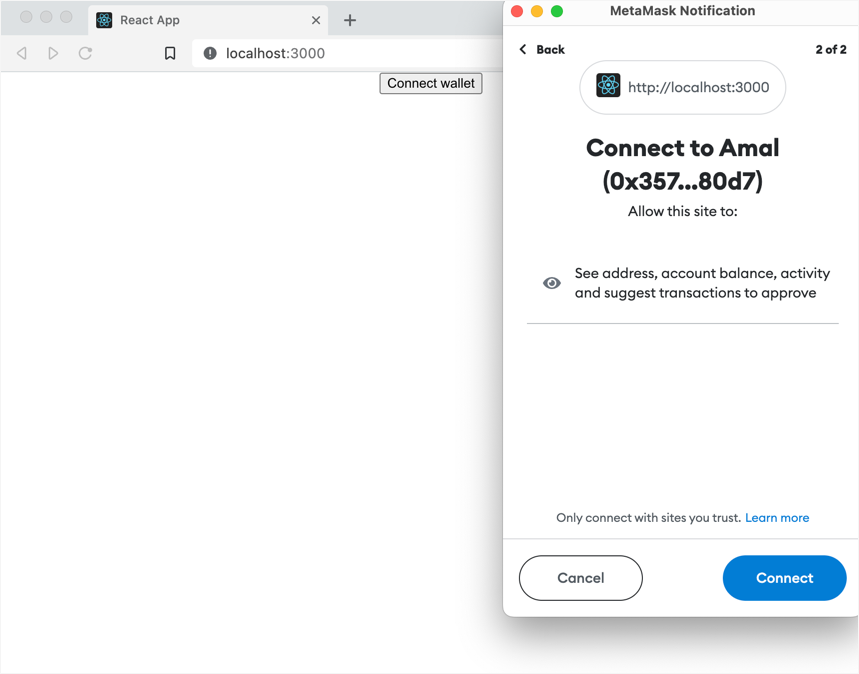
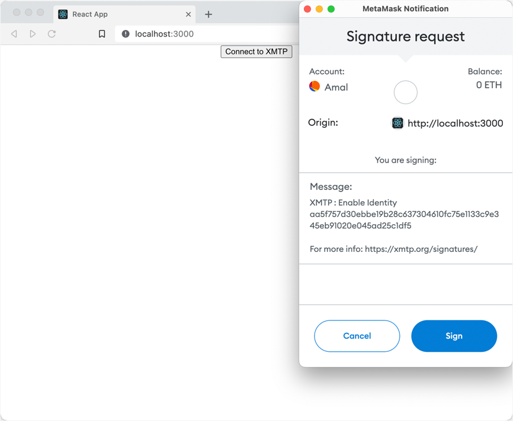
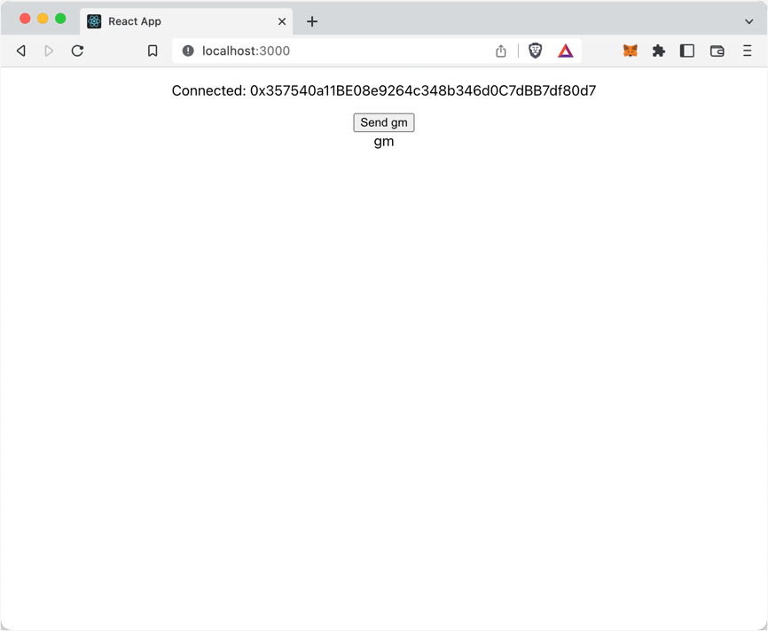
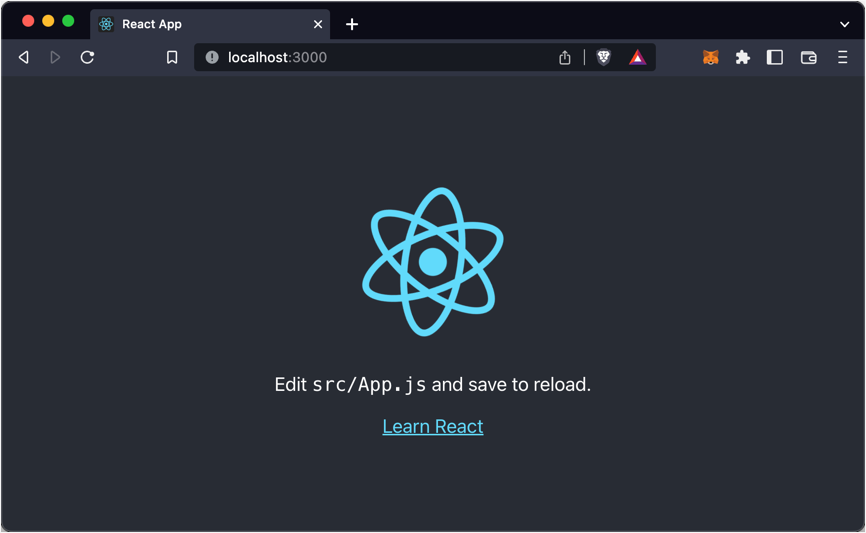
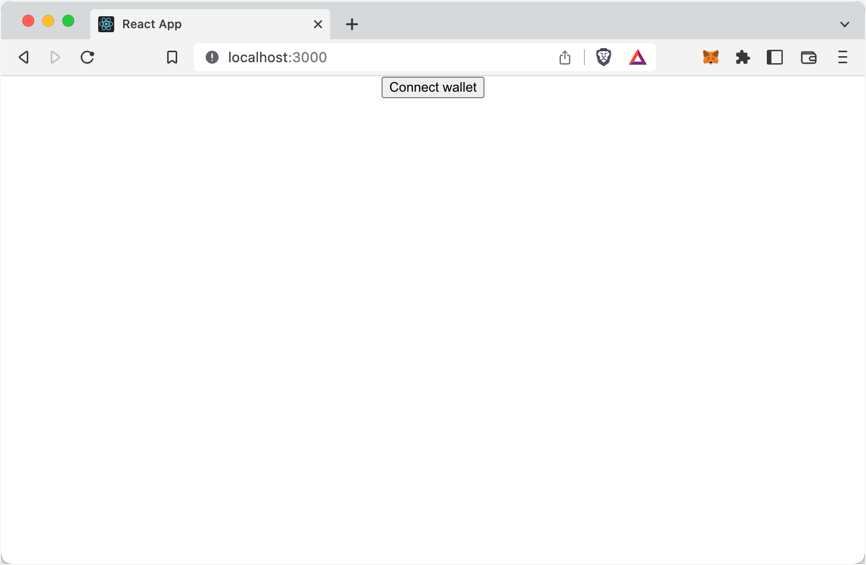
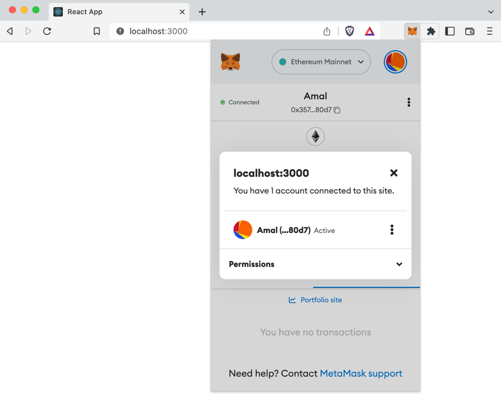
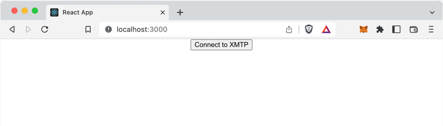
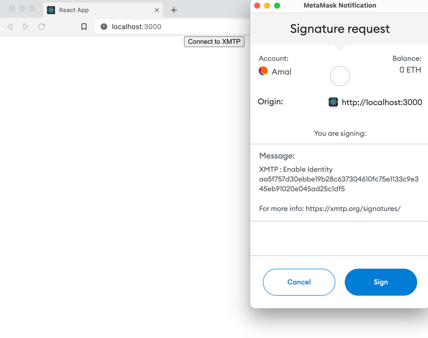
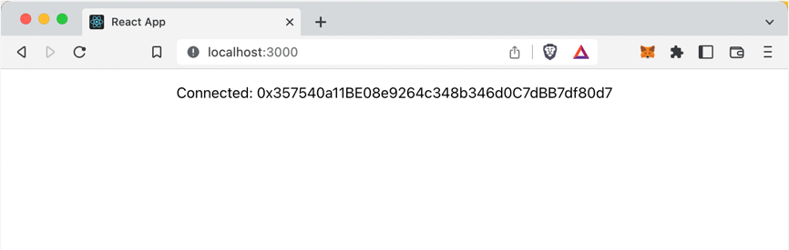
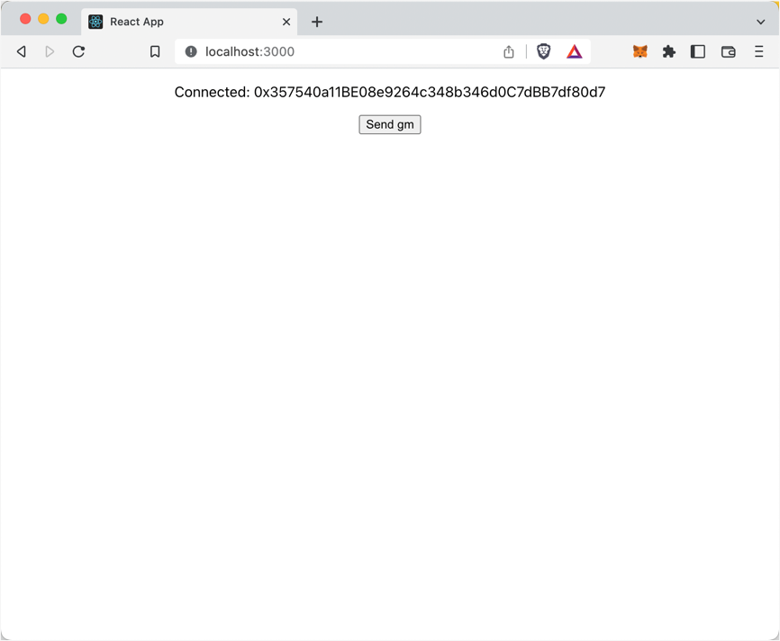

# Build an XMTP "hello world" app

XMTP (Extensible Message Transport Protocol) is an open protocol and network for secure and private web3 messaging. For example, you can build an app with XMTP to send messages between blockchain accounts, including chat/DMs, alerts, announcements, and more.

Use this tutorial to build an XMTP "hello world" messaging app based on resources available in the [vehidtr/xmtp-chat-tutorial repo](https://github.com/vehidtr/xmtp-chat-tutorial). Building this app can help you learn some of the fundamental concepts behind building with XMTP.

As its name implies, the XMTP "hello world" app is intentionally barebones. Here's what the app enables you to do:

1. Connect your wallet app to the "hello world" app:

   

2. Connect your blockchain account to the XMTP network using your wallet app.

   <!--I think this is a dupe screenshot-->

3. Send a preconfigured "gm" message to your connected blockchain account address.

   

The app includes only the code required to accomplish these steps and little else. This helps keep the codebase relatively bite-sized so that developers of all skill levels can ease into learning the basics of building a messaging app with XMTP.

Completing this tutorial doesn't cost you any Ether. At this time, all messaging with XMTP is free. To learn more, see [Will XMTP charge messaging fees?](/docs/dev-concepts/faq#will-xmtp-charge-messaging-fees)


## Prerequisites

This tutorial has these prerequisites:

* [Node](https://nodejs.org/en/download/) (LTS version) and npm to install app requirements and dependencies

* An Ethereum blockchain account accessible in a wallet app browser extension, such as MetaMask or Coinbase Wallet.  

  For example, you can install the [MetaMask](https://metamask.io/) cryptocurrency wallet app browser extension and use it to create an Ethereum account you can use to send and receive XMTP messages. To learn more, see [How to create a MetaMask Wallet](https://myterablock.medium.com/how-to-create-or-import-a-metamask-wallet-a551fc2f5a6b).

  Beyond the purposes of this "hello world" tutorial, XMTP can be used with more than just Ethereum accounts and Metamask or Coinbase Wallets. To learn more, see [Wallet apps and blockchains supported by XMTP](/docs/dev-concepts/wallets).

* A code editor of your choice that you can use to build the app.


## Step 1. Create a vanilla React app

In this step, you create a React app using the Create React App tool to easily set up your developer environment and provide the foundation of your "hello world" app.

The command you run generates all of the directories and files you need to create a vanilla React application and run it in your browser.

In subsequent steps, you add code to this vanilla React app to build each feature of your "hello world" app.

**To create and run a vanilla React app:**

1. To create the React app, run:

   ```bash
   npx create-react-app my-app --scripts-version 4.0.2
   ```

   This creates the React app in a `my-app` directory.

2. To run the vanilla React app, in the newly created `my-app` directory, run:

   ```bash
	 npm start
   ```

   The app opens at `localhost:3000` in your default browser.

   


## Step 2. Build a **Connect wallet** button

Your "hello world" app needs a **Connect wallet** button that enables you to connect a wallet app, such as MetaMask.

This app uses [Web3Modal](https://web3modal.com/) and [Ethers](https://docs.ethers.io/v5/single-page/) to connect to commonly used wallet apps.

1. Install Web3Modal. In the `my-app` directory, run:

   ```bash
   npm i web3modal
   ```

   This adds the Web3Modal dependency to your `package.json`.

2. Install Ethers. In the `my-app` directory, run:

   ```bash
   npm i ethers
   ```

   This adds the Ethers dependency to your `package.json`.

3. In the existing `my-app/src` directory, create a `contexts` directory. In the `contexts` directory, create a file named `WalletContext.js`. This code provides the Web3Modal and Ethers functionality your "hello world" app needs to enable you to connect your wallet app.

   Copy this code block and paste it into the file:

    ```javascript showLineNumbers
    import { createContext, useState } from "react";
    import Web3Modal from "web3modal";
    import { ethers } from "ethers";

    export const WalletContext = createContext();

    export const WalletContextProvider = ({ children }) => {
    const [walletAddress, setWalletAddress] = useState(null);
    const [signer, setSigner] = useState(null);

    const connectWallet = async () => {
     const instance = await web3Modal.connect();
     const web3Provider = new ethers.providers.Web3Provider(instance, "any");
     const newSigner = await web3Provider.getSigner();

     setSigner(newSigner);
     setWalletAddress(await newSigner.getAddress());
     instance.on("accountsChanged", () => {
       disconnectWallet();
     });

     instance.on("connect", () => {
       connectWallet();
     });

     instance.on("disconnect", () => {
       disconnectWallet();
     });
    };

    const disconnectWallet = () => {
     setWalletAddress(null);
     setSigner(null);
    };

    const providerOptions = {};

    // Redirect User to Install MetaMask if not already installed
    if (!window.ethereum || !window.ethereum.isMetaMask) {
     providerOptions["custom-metamask"] = {
       display: {},
       package: {},
       connector: async () => {
         window.open("https://metamask.io");
       },
     };
    }

    const web3Modal = new Web3Modal({
     cacheProvider: true, // optional
     providerOptions, // required
    });

    return (
       <WalletContext.Provider
         value={{
           connectWallet,
           disconnectWallet,
           walletAddress,
           signer,
         }}
       >
         {children}
       </WalletContext.Provider>
      );
    };
    ```

   To learn more about Context in React, see [Context](https://reactjs.org/docs/context.html).

   <!--saul: line 14: not sure if "await" in is needed in: `const newSigner = await web3Provider.getSigner();`-->

   <!--Deleted lines 38-47 here https://github.com/vehidtr/xmtp-chat-tutorial/blob/main/src/contexts/WalletContext.js#L38 - starting with `// Redirect User to Install MetaMask if not already installed` because a prereq of this tutorial is that users have a wallet app installed. I don't think we need to include this code in the hw app, especially because it implies that only MetaMask is supported.-->

4. In the `my-app/src` directory, update the existing `App.js` file to use the `WalletContext` you just created, add the **Connect wallet** button UI element, and remove elements of the vanilla React app, as shown in the highlighted code.

   Copy this code block and paste it into the file, replacing all existing code:<!--diff: https://github.com/vehidtr/xmtp-chat-tutorial/commit/e81d4b36b87c63c94cc33801cfbb0f91970b8940-->

    ```javascript {1,3,6,9} showLineNumbers
    import { useContext } from 'react';
    import './App.css';
    import { WalletContext } from './contexts/WalletContext';

    function App() {
      const { connectWallet } = useContext(WalletContext);
      return (
        <div className="App">
          <button onClick={connectWallet}>Connect wallet</button>
        </div>
      );
    }

    export default App;
    ```

5. In the `my-app/src` directory, update the existing `index.js` file to import the `WalletContextProvider` you created in a previous step and wrap it around your `<App />`, as shown in the highlighted code. This enables your app to access information provided by the wallet app context. <!--information? functionality? both?--> Also, import and use `Buffer` to help support message streaming, which you build in a subsequent step. <!--super light, but accurate statement about Buffer? A great writeup on Buffer for newbies: https://www.freecodecamp.org/news/do-you-want-a-better-understanding-of-buffer-in-node-js-check-this-out-2e29de2968e8/-->

   Copy this code block and paste it into the file, replacing all existing code.<!--diff: https://github.com/vehidtr/xmtp-chat-tutorial/commit/e81d4b36b87c63c94cc33801cfbb0f91970b8940#diff-bfe9874d239014961b1ae4e89875a6155667db834a410aaaa2ebe3cf89820556-->

    ```javascript {3,7,9,14,16} showLineNumbers
    import React from "react";
    import ReactDOM from "react-dom/client";
    import { Buffer } from "buffer";
    import "./index.css";
    import App from "./App";
    import reportWebVitals from "./reportWebVitals";
    import { WalletContextProvider } from "./contexts/WalletContext";

    window.Buffer = Buffer;

    const root = ReactDOM.createRoot(document.getElementById("root"));
    root.render(
      <React.StrictMode>
        <WalletContextProvider>
          <App />
        </WalletContextProvider>
      </React.StrictMode>
    );

    // If you want to start measuring performance in your app, pass a function
    // to log results (for example: reportWebVitals(console.log))
    // or send to an analytics endpoint. Learn more: https://bit.ly/CRA-vitals
    reportWebVitals();
    ```

6. In the `my-app` directory, run `npm start` to start your "hello world" app. A **Connect wallet** button replaces the vanilla **Learn React** UI.

   

7. Click the **Connect wallet** button to open your wallet app browser extension and connect a blockchain account to the app. Your "hello world" app UI doesn't change. However, in your wallet app you can see that your account is now connected to your "hello world" app running at `localhost:3000`:

   


## Step 3. Build the **Connect to XMTP** button

To send and receive XMTP messages, you must create an XMTP identity associated with your blockchain account. An app built with XMTP must give the user a way to create this identity and use it to connect to the XMTP network. Specifically, the user must:

1. Sign to create an XMTP identity the first time they use an app built with XMTP (like creating an account).

2. Sign to enable their XMTP identity the first and any subsequent time they start a new messaging session (like providing an account password).

To learn more about creating and enabling an XMTP identity, see [Sign to send and receive messages using apps built with XMTP](https://xmtp.org/docs/dev-concepts/signatures).

Your "hello world" app uses a **Connect to XMTP** button to enable you to provide these account signatures and connect to the XMTP network.

**To build the Connect to XMTP button:**

1. Install the [XMTP client SDK for JavaScript](https://github.com/xmtp/xmtp-js). The SDK provides an XMTP message API client that enables your "hello world" app to communicate with the XMTP network. In the `my-app` directory, run:

    ```bash
    npm i --save @xmtp/xmtp-js
    ```

    This command adds the `@xmtp/xmtp-js` dependency to your `package.json`.

2. In the existing `my-app/src/contexts` directory, create a file named `XmtpContext.js`. This code provides the XMTP functionality your "hello world" app needs to initiate the XMTP messaging API client and use it to communicate with the XMTP network to send and retrieve messages.

   :::important

   In this code block, `env: "dev"` connects your "hello world" app to the XMTP `dev` network. This means that the "gm" messages you send with the app are accessible using only apps that are connected to the XMTP `dev` network. To learn more about working with XMTP network environments, see [XMTP production and dev network environments](https://github.com/xmtp/xmtp-js#xmtp-production-and-dev-network-environments).

   :::

   Copy this code block and paste it into the file:<!--diff: https://github.com/vehidtr/xmtp-chat-tutorial/commit/35c8cded3d20816cd06248f2d05c62d79a82c2f3--> <!--Removed lines 59 and 68 here `if (convo.peerAddress !== walletAddress) {` and `}` instead of including a wonky step later to remove it. It just shouldn't be in this app to begin w/ b/c this app is all about an address sending a message to itself--><!--removed extra blank line before `        listConversations();` - it was breaking the code block formatting-->

    ```javascript showLineNumbers
    import React, { useState, createContext, useEffect, useContext } from "react";
    import { Client } from "@xmtp/xmtp-js";
    import { WalletContext } from "./WalletContext";

    export const XmtpContext = createContext();

    export const XmtpContextProvider = ({ children }) => {
      const { signer, walletAddress } = useContext(WalletContext);
      const [providerState, setProviderState] = useState({
        client: null,
        initClient: () => {},
        loadingConversations: true,
        conversations: new Map(),
        convoMessages: new Map(),
      });

      const initClient = async (wallet) => {
        if (wallet && !providerState.client) {
          try {
            const client = await Client.create(wallet, { env: "dev" });
            setProviderState({
              ...providerState,
              client,
            });
          } catch (e) {
            console.error(e);
            setProviderState({
              ...providerState,
              client: null,
            });
          }
        }
      };

      const disconnect = () => {
        setProviderState({
          ...providerState,
          client: null,
          conversations: new Map(),
          convoMessages: new Map(),
        });
      };

      useEffect(() => {
        signer ? setProviderState({ ...providerState, initClient }) : disconnect();
        // eslint-disable-next-line
      }, [signer]);

      useEffect(() => {
        if (!providerState.client) return;

        const listConversations = async () => {
          console.log("Listing conversations");
          setProviderState({ ...providerState, loadingConversations: true });
          const { client, convoMessages, conversations } = providerState;
          const convos = await client.conversations.list();
          Promise.all(
            convos.map(async (convo) => {
              if (convo.peerAddress === walletAddress) {
                let messages = convoMessages.get(convo.peerAddress);
                if (!messages) {
                  messages = await convo.messages();
                  convoMessages.set(convo.peerAddress, messages);
                  setProviderState({
                    ...providerState,
                    convoMessages,
                  });
                }
                conversations.set(convo.peerAddress, convo);
                setProviderState({
                  ...providerState,
                  conversations,
                });
              }
            })
          ).then(() => {
            setProviderState({ ...providerState, loadingConversations: false });
          });
        };

        listConversations();
        // eslint-disable-next-line
      }, [providerState.client]);

      return (
        <XmtpContext.Provider value={[providerState, setProviderState]}>
          {children}
        </XmtpContext.Provider>
      );
    };
    ```

3. In the `my-app/src` directory, update the existing `App.js` file to use the `XmtpContext` you just created and add the **Connect to XMTP** button UI element, as shown in the highlighted code.

   Copy this code block and paste it into the file, replacing all existing code. <!--diff: https://github.com/vehidtr/xmtp-chat-tutorial/commit/35c8cded3d20816cd06248f2d05c62d79a82c2f3-->

    ```javascript {4,7,8,12-25,27} showLineNumbers
    import { useContext } from "react";
    import "./App.css";
    import { WalletContext } from "./contexts/WalletContext";
    import { XmtpContext } from "./contexts/XmtpContext";

    function App() {
      const { connectWallet, walletAddress, signer } = useContext(WalletContext);
      const [providerState] = useContext(XmtpContext);

      return (
        <div className="App">
          {walletAddress ? (
            <div className="wrapper">
              {!providerState.client ? (
                <button
                  className="btn"
                  onClick={() => providerState.initClient(signer)}
                >
                  Connect to XMTP
                </button>
              ) : (
                <p>Connected: {walletAddress}</p>
              )}
            </div>
          ) : (
            <button onClick={connectWallet}>Connect wallet</button>
          )}
        </div>
      );
    }

    export default App;
    ```

<!--removed extra blank line before `      return (` - it was breaking the code block formatting-->

4. In the `my-app/src` directory, update the existing `index.js` file to import the `XmtpContextProvider` you created in a previous step and wrap it around your app, as shown in the highlighted code. This enables your app to access information provided by the XMTP context.

   Note that `XmtpContextProvider` is nested in `WalletContextProvider` because it needs access to the information provided by the wallet app context.

   Copy this code block and paste it into the file, replacing all existing code. <!--diff: https://github.com/vehidtr/xmtp-chat-tutorial/commit/35c8cded3d20816cd06248f2d05c62d79a82c2f3#diff-bfe9874d239014961b1ae4e89875a6155667db834a410aaaa2ebe3cf89820556-->

    ```javascript {8,16,18} showLineNumbers
    import React from "react";
    import ReactDOM from "react-dom/client";
    import { Buffer } from "buffer";
    import "./index.css";
    import App from "./App";
    import reportWebVitals from "./reportWebVitals";
    import { WalletContextProvider } from "./contexts/WalletContext";
    import { XmtpContextProvider } from "./contexts/XmtpContext";

    window.Buffer = Buffer;

    const root = ReactDOM.createRoot(document.getElementById("root"));
    root.render(
      <React.StrictMode>
        <WalletContextProvider>
          <XmtpContextProvider>
            <App />
          </XmtpContextProvider>
        </WalletContextProvider>
      </React.StrictMode>
    );

    // If you want to start measuring performance in your app, pass a function
    // to log results (for example: reportWebVitals(console.log))
    // or send to an analytics endpoint. Learn more: https://bit.ly/CRA-vitals
    reportWebVitals();
    ```

5. In the `my-app` directory, run `npm start` to start your "hello world" app. Click **Connect wallet** to connect your wallet app. The following UI appears:

   

6. Click **Connect to XMTP** to use your desired wallet app to create an XMTP identity (if you don't already have one) and enable your XMTP identity. For example, here is the MetaMask Signature request screen for signing to enable an XMTP identity.

   

7. Your "hello world" app now shows your blockchain account connected to the XMTP network:

   


## Step 4. Build the **Send gm** button, display messages, and stream new messages

Now that the XMTP identity associated with your blockchain account is connected to the XMTP network, you can send and receive messages with XMTP.

For simplicity, your "hello world" app enables you to send a preconfigured "gm" message (hello world) to your own already connected account. This makes it easy for you to immediately see the outcome of sending a message.

1. In the `my-app/src` directory, update the existing `App.js` file to add a `sendMessage` constant, which sends the **gm** message to the connected account. Then create the **Send gm** button UI element that, when clicked, uses `sendMessage` to send the **gm** message. You can see these changes in the highlighted code.

   Copy this code block and paste it into the file, replacing all existing code. <!--what is `sendMessage`? I called it a constant - but is there something more accurate? And does the button "use" `sendMessage` - is the wording correct?--> <!--diff: https://github.com/vehidtr/xmtp-chat-tutorial/commit/7e2ea197d9516fa93f75b5e866734cd06bf51cdc-->

    ```javascript showLineNumbers {9-22,35,37-40}
    import { useContext } from "react";
    import "./App.css";
    import { WalletContext } from "./contexts/WalletContext";
    import { XmtpContext } from "./contexts/XmtpContext";

    function App() {
      const { connectWallet, walletAddress, signer } = useContext(WalletContext);
      const [providerState] = useContext(XmtpContext);
      const { client } = providerState;

      const sendMessage = async () => {
        const message = "gm";
        if (!client || !walletAddress) {
          return;
        }
        const conversation = await client.conversations.newConversation(
          walletAddress
        );
        if (!conversation) return;
        await conversation.send(message);
      };

      return (
        <div className="App">
          {walletAddress ? (
            <div className="wrapper">
              {!providerState.client ? (
                <button
                  className="btn"
                  onClick={() => providerState.initClient(signer)}
                >
                  Connect to XMTP
                </button>
              ) : (
                <>
                  <p>Connected: {walletAddress}</p>
                  <button className="btn" onClick={sendMessage}>
                    Send gm
                  </button>
                </>
              )}
            </div>
          ) : (
            <button onClick={connectWallet}>Connect wallet</button>
          )}
        </div>
      );
    }

    export default App;
    ```

2. In the `my-app/src` directory, create a `hooks` directory. In the `hooks` directory, create a file named `useStreamMessages.js`. The purpose of the `useStreamMessages` hook is to enable your "hello world" app to listen for and display (stream) new messages as they become available.

   Copy this code block and paste it into the file: <!--diff: https://github.com/vehidtr/xmtp-chat-tutorial/commit/cf9f028b18aa2ac825aeeb0b8877bbb6bbcbbdc5-->

    ```javascript showLineNumbers
    import { useContext, useEffect, useState } from "react";
    import { WalletContext } from "../contexts/WalletContext";
    import { XmtpContext } from "../contexts/XmtpContext";

    const useStreamMessages = (peerAddress) => {
      const { walletAddress } = useContext(WalletContext);
      const [providerState, setProviderState] = useContext(XmtpContext);
      const { client, convoMessages } = providerState;
      const [stream, setStream] = useState("");
      const [conversation, setConversation] = useState(null);

      useEffect(() => {
        const getConvo = async () => {
          if (!client || !peerAddress) {
            return;
          }
          setConversation(await client.conversations.newConversation(peerAddress));
        };
        getConvo();
      }, [client, peerAddress]);

      useEffect(() => {
        if (!conversation) return;

        const streamMessages = async () => {
          const newStream = await conversation.streamMessages();
          setStream(newStream);
          for await (const msg of newStream) {
            if (setProviderState) {
              const newMessages = convoMessages.get(conversation.peerAddress) ?? [];
              newMessages.push(msg);
              const uniqueMessages = [
                ...Array.from(
                  new Map(newMessages.map((item) => [item["id"], item])).values()
                ),
              ];
              convoMessages.set(conversation.peerAddress, uniqueMessages);
              setProviderState({
                ...providerState,
                convoMessages: new Map(convoMessages),
              });
            }
          }
        };
        streamMessages();

        return () => {
          const closeStream = async () => {
            if (!stream) return;
            await stream.return();
          };
          closeStream();
        };
        // eslint-disable-next-line
      }, [convoMessages, walletAddress, conversation]);
    };

    export default useStreamMessages;
    ```

3. In the `my-app/src` directory, update the existing `App.js` file to enable the app to display existing messages and stream new messages using the `useStreamMessages` hook you just created, as shown in the highlighted code.

   Copy this code block and paste it into the file, replacing all existing code. <!--diff: https://github.com/vehidtr/xmtp-chat-tutorial/commit/cf9f028b18aa2ac825aeeb0b8877bbb6bbcbbdc5#diff-3d74dddefb6e35fbffe3c76ec0712d5c416352d9449e2fcc8210a9dee57dff67--><!--Correct descr of what this step is doing? For example, the addition of line 5 enables message streaming, but the rest of the changes are about providing a way to display messages in the conversation, yes?-->

    ```js {5,10-11,42-51} showLineNumbers
    import { useContext } from "react";
    import "./App.css";
    import { WalletContext } from "./contexts/WalletContext";
    import { XmtpContext } from "./contexts/XmtpContext";
    import useStreamMessages from "./hooks/useStreamMessages";

    function App() {
      const { connectWallet, walletAddress, signer } = useContext(WalletContext);
      const [providerState] = useContext(XmtpContext);
      const { convoMessages,client } = providerState;
      useStreamMessages(walletAddress);

      const sendMessage = async () => {
        const message = "gm";
        if (!client || !walletAddress) {
          return;
        }
        const conversation = await client.conversations.newConversation(
          walletAddress
        );
        if (!conversation) return;
        await conversation.send(message);
      };

      return (
        <div className="App">
          {walletAddress ? (
            <div className="wrapper">
              {!providerState.client ? (
                <button
                  className="btn"
                  onClick={() => providerState.initClient(signer)}
                >
                  Connect to XMTP
                </button>
              ) : (
                <>
                  <p>Connected: {walletAddress}</p>
                  <button className="btn" onClick={sendMessage}>
                    Send gm
                  </button>
                  <div className="msg-container">
                    {convoMessages &&
                      convoMessages.get(walletAddress)?.map((msg) => {
                        return (
                          <div className="msg" key={msg.id}>
                            {msg.content}
                          </div>
                        );
                      })}
                  </div>
                </>
              )}
            </div>
          ) : (
            <button onClick={connectWallet}>Connect wallet</button>
          )}
        </div>
      );
    }

    export default App;
    ```

4. In the `my-app` directory, run `npm start` to start your "hello world" app. Click **Connect wallet** to connect your wallet app. Click** Connect to XMTP** and sign to enable your XMTP identity. The following UI appears:

   :::important

   If you've used your connected account to send XMTP messages to itself on the XMTP `dev` network in the past, the messages appear in your "hello world" app.

   :::

   

<!--Saul: So I get some messages flickering in and out. I think there might be some conflict in how the state is being updated.-->

<!--Rich: Seeing a "Test" message then sent using the XMTP Chat app on dev display and then disappear.-->

<!--jha: not seeing any messages display and then disappear.-->

6. Click **Send gm**. The **gm** message appears.

   

Congratulations on building your own XMTP "hello world" app and sending and receiving your first message with it!


## Learn more

Now that you've had a "hello world" introduction to building with XMTP, here are some resources to help you continue building with XMTP:

* Learn more about the [XMTP client SDK for JavaScript](https://github.com/xmtp/xmtp-js), including more details about the XMTP functions used in the code samples in this tutorial. <!--XMTP functions? Hmmm... I'm talking about creating a client, listing convos, listing messages in convos, and streaming messages. What would you call these things as expressed in the code?-->

* Explore XMTP chat apps with more features than the XMTP "hello world" app:

  * [XMTP Quickstart Chat app repo](https://github.com/xmtp/xmtp-quickstart-react)

    An example React chat app you can use as a developer tool to learn how to build a basic 1:1 chat app using the XMTP client SDK. The app is intentionally streamlined and unopinionated, making it a good quickstart launching point for building with XMTP.

  * [XMTP Chat app repo](https://github.com/xmtp/example-chat-react)

    An example React chat app that demonstrates both basic and advanced features of the XMTP client SDK.

* Learn about [XMTP development concepts](/docs/dev-concepts/introduction)

<!--Link to step 4 of the vehidtr repo where you can add CSS, create an Enter a wallet address field, and create a Write a message field-->
