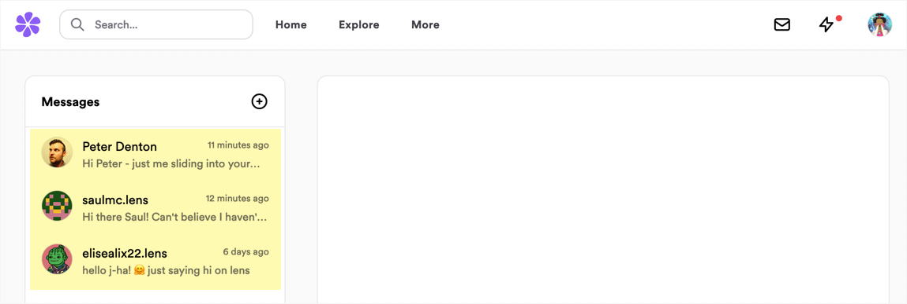
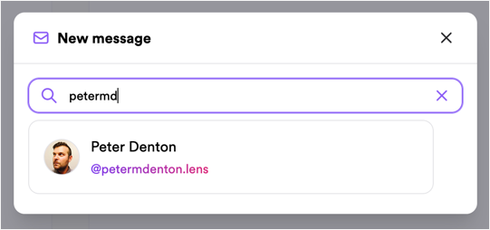

# Build key XMTP chat features in a Lens app

XMTP (Extensible Message Transport Protocol) is an open protocol and network for secure and private web3 messaging. You can build with XMTP to send messages between blockchain accounts, including chat/DMs, alerts, announcements, and more.

For example, you can use XMTP to build messaging into your Lens app with the flexibility to provide a variety of user experiences.

In this tutorial, we focus on how to build the following key XMTP chat features in a Lens app:

- Build the Lens DM conversation ID
- Filter for Lens conversations
- Start a conversation with a Lens profile
- Stream new Lens DM conversations

## Overview of building with XMTP

Here's an overview of the steps typically required to build a basic chat app with XMTP. While this tutorial doesn't cover all the following steps, we surface them to show how the Lens-specific steps we do cover fit into the overall XMTP development flow:

1. Enable a wallet app to connect to your app.  
   For example, provide a Connect wallet button.
2. Enable a user to create an XMTP account and connect your app to the XMTP network.  
   For example, provide a Connect to XMTP button.
3. Display a list of conversations.  
   **🌿 Lens DMs: Build the Lens DM conversation ID**  
   **🌿 Lens DMs: Filter for Lens conversations and display message previews**
4. Display a list of messages in a conversation.
5. Enable a user to enter a wallet address they want to message.  
   For example, provide an Enter a wallet address field.  
   **🌿 Lens DMs: Start a conversation with a Lens profile**
6. Enable a user to write a message.  
   For example, provide a Write a message field
7. Enable a user to send the message.  
   For example, provide a Send button.
8. Stream new conversations  
   **🌿 Lens DMs: Stream new Lens DM conversations**

To learn more about building this full list of chat features with XMTP, in a Lens app or otherwise, see the [README](https://github.com/xmtp/xmtp-js#readme) in the XMTP client SDK for JavaScript repo.

## Prerequisites

This tutorial requires that you have the following prerequisites in place:

- A Lens app built with the [Lens API](https://docs.lens.xyz/docs) in React
- The [XMTP client SDK for JavaScript](https://github.com/xmtp/xmtp-js) installed in the Lens app
  ```bash
  npm i --save @xmtp/xmtp-js
  ```

## Build the Lens DM conversation ID

When building with XMTP, a conversation is a set of messages between two participants. You can assign a conversation ID to conversations and then use the ID to filter and organize conversations as needed. You set the `conversationId` when your app creates a conversation.

**To build the Lens DM conversation ID for your Lens app:**

:::caution Important

Build the Lens DM conversation ID exactly as described here. If you don't, messages created by your Lens app won't be compatible with other Lens apps.

:::

1. Set the Lens domain prefix to `lens.dev/dm` exactly as shown in line 1.
2. Construct the conversation ID based on profile pairs exactly as shown in lines 2-8.

```ts showLineNumbers
const PREFIX = 'lens.dev/dm'
const buildConversationId = (profileIdA: string, profileIdB: string) => {
  const profileIdAParsed = parseInt(profileIdA, 16)
  const profileIdBParsed = parseInt(profileIdB, 16)

  return profileIdAParsed < profileIdBParsed
    ? `${PREFIX}/${profileIdA}-${profileIdB}`
    : `${PREFIX}/${profileIdB}-${profileIdA}`
}
```

## Filter for Lens conversations and display message previews

Now that you've built the Lens DM `conversationId` for your Lens app, your app can use it to filter and organize Lens conversations.

For example, you can use the Lens DM conversation ID as a filter to provide a UI in your app that displays Lens conversations only.

:::tip Provide an "interoperable inbox"

You might also want to provide a UI with no conversation ID filtering to display all conversations for a user. This enables your user to access and engage with all of their conversations, Lens and otherwise, without leaving your app. If you decide to provide a UI like this, you might want to use [conversation labeling](label-conversations).

:::

This section describes how to filter for Lens conversations and then display their message previews.

Here is the **Messages** panel in Lenster using the Lens DM `conversationId` to filter and display a user's Lens conversations only, along with message previews:



**To filter for Lens conversations and then display messages in a conversation:**

1. Filter for Lens conversations only as shown in lines 1-9.
2. Get the Lens profileIds from each conversationId as shown in line 11-17.
3. Query Lens for profile information using the profileIds in step 2 as shown in lines 19-44.  
   The result is used to show information about the user and to verify that the profile is still owned by the account associated with the conversation.

For example:

```ts showLineNumbers
// Filter for Lens conversations
const allConversations = await client.conversations.list()
const lensConversations = allConversations.filter((conversation) =>
  conversation.context?.conversationId.startsWith('lens.dev/dm/')
)
// Optionally filter for only conversations including your currently selected profile
const myProfileConversations = lensConversations.filter((conversation) =>
  conversation.context?.conversationId.includes(myProfile.id)
)

/** Get the Lens profileIds from each conversationId and map them to the
conversation peerAddress. This allows us to ensure the profile still belongs
to the person in the conversation since profiles can be transferred. */
const conversationKeys = myProfileConversations.map((convo) =>
  buildConversationKey(
    convo.peerAddress,
    convo.context?.conversationId as string
  )
)
const profileIds = conversationKeys.map((key) => getProfileFromKey(key))

/** Query the Lens API for profile information on all profileIds and once again
map each profile to a conversationKey to track the current ownedBy address. */
const [messageProfiles, setMessageProfiles] = useState<Map<string, Profile>>()
const getProfiles = gql`
  query GetProfiles($profileIds: [String]) {
    profiles(request: { profileIds: $profileIds }) {
      items {
        id
        ownedBy
        # Optionally add more profile information here
      }
    }
  }
`
const fetchProfiles = async () => {
  const response = await apolloClient.query({
    query: getProfiles,
    variables: { profileIds },
  })
  const profiles = response.data.profiles.items as Profile[]
  const newMessageProfiles = new Map(messageProfiles)
  for (const profile of profiles) {
    const peerAddress = profile.ownedBy as string
    const key = buildConversationKey(
      peerAddress,
      buildConversationId(myProfile.id, profile.id)
    )
    newMessageProfiles.set(key, profile)
  }
  setMessageProfiles(newMessageProfiles)
}
fetchProfiles()
```

To see how Lenster uses the Lens DM conversationId to filter conversations, see [`listConversations`](https://github.com/lensterxyz/lenster/blob/c64636cbbc688aa118ad886f31316b0150d87916/src/components/utils/hooks/useMessagePreviews.tsx#L106) in `/src/components/utils/hooks/useMessagePreviews.tsx` in the Lenster GitHub repo.

To view the `getProfileFromKey` helper method, see [getProfileFromKey](https://github.com/lensterxyz/lenster/blob/c64636cbbc688aa118ad886f31316b0150d87916/src/components/utils/hooks/useMessagePreviews.tsx#L39) in `src/components/utils/hooks/useMessagePreviews.tsx` in the Lenster GitHub repo.

To see how Lenster implemented `buildConversationKey`, see [buildConversationKey](https://github.com/lensterxyz/lenster/blob/63db97b2ed2e4b20e8fedacb3de472c8f85bb165/src/lib/conversationKey.ts#L5) in `src/lib/conversationKey.ts` in the Lenster GitHub repo.

To learn more about the Lens API and see how to configure your ApolloClient, see [Creating the API](https://docs.lens.xyz/docs/developer-quickstart#creating-the-api) in the Lens Developer Quickstart.

Optionally, you can fetch the most recent message for each conversation to render a preview below the Lens profile metadata as shown here:

```ts showLineNumbers
/** Optionally fetch the most recent message for each conversation to show a preview.
We also map each message to a conversationKey here so we can match a message to a
profile and render them visually together. */
const [previewMessages, setPreviewMessages] = useState<Map<string, DecodedMessage>>();
const fetchMostRecentMessage = async (
 convo: Conversation
): Promise<{ key: string; message?: DecodedMessage }> => {
 const key = buildConversationKey(convo.peerAddress, convo.context?.conversationId as string);
 const newMessages = await convo.messages({
   limit: 1,
   direction: SortDirection.SORT_DIRECTION_DESCENDING
 });
 if (newMessages.length <= 0) {
   return { key };
 }
 return { key, message: newMessages[0] };
};

const newPreviewMessages = new Map(previewMessages);
const previews = await Promise.all(matchingConvos.map(fetchMostRecentMessage));
for (const preview of previews) {
 if (preview.message) {
   newPreviewMessages.set(preview.key preview.message);
 }
}
setPreviewMessages(newPreviewMessages);

// Now you can pair a message to a profile by conversationKey to render UI.
messageProfiles.map(([key, profile]) => {
 const message = previewMessages.get(key);
 console.log(`profileId: ${profile.id} messageId: ${message?.id}`);
}
```

## Start a conversation with a Lens profile

When building with XMTP, you must provide a way to start a conversation between the user and the wallet address they want to message.

For a Lens app, you want to enable the user to start a conversation with a Lens profile only.

Here is the **New message** modal in Lenster, providing a field where users can search for the Lens profile they want to message:



For example:

```ts showLineNumbers
const conversation = await client.conversations.newConversation(
  otherProfile.ownedBy,
  {
    conversationId: buildConversationId(myProfile.id, otherProfile.id),
    metadata: {},
  }
)
await conversation.send('gm')
```

To see how starting a conversation with a Lens profile is implemented in Lenster, see [`createNewConversation`](https://github.com/lensterxyz/lenster/blob/3596386dfd0fac3d4297ebe98885e8d79fcda311/src/components/utils/hooks/useGetConversation.tsx#L30) in `/src/components/utils/hooks/useGetConversation.tsx` in the Lenster GitHub repo.

## Stream new Lens DM conversations

When building with XMTP to provide a chat experience in your Lens app, implement conversation streaming to ensure that your app can detect when a new Lens conversation is starting without requiring users to refresh your app first.

For example:

```ts showLineNumbers
for await (const conversation of client.conversations.stream()) {
  if (conversation.context?.conversationId.startsWith('lens.dev/dm/')) {
    doSomething(conversation)
  }
}
```

Messages sent within a conversation are not returned by this method. Use `conversation.streamMessages()` to get all messages in the new Lens conversation.

To see how conversation streaming is implemented in Lenster, see [`streamConversations`](https://github.com/lensterxyz/lenster/blob/c64636cbbc688aa118ad886f31316b0150d87916/src/components/utils/hooks/useMessagePreviews.tsx#L154) in `/src/components/utils/hooks/useMessagePreview.tsx` in the Lenster GitHub repo.

## Learn more

To learn more about building with XMTP, in a Lens app or otherwise, see the [README](https://github.com/xmtp/xmtp-js#readme) in the XMTP client SDK for JavaScript repo.
