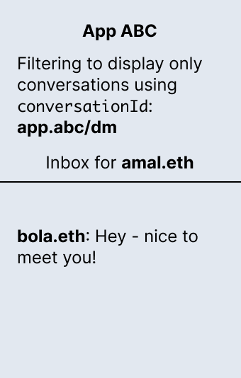
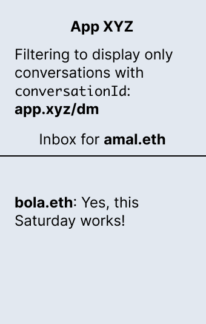
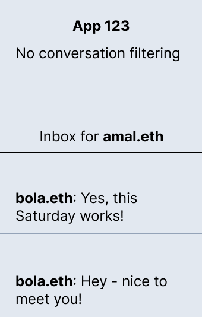
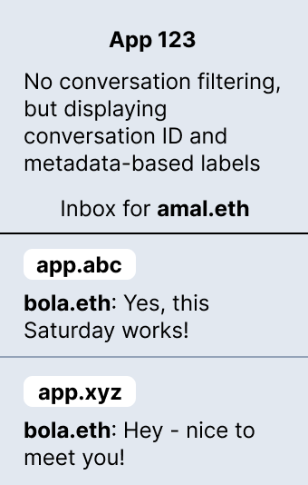

# Filter and label conversations using conversation IDs and metadata

With XMTP, a conversation is a set of messages sent between two blockchain account addresses (addresses). Two addresses can have multiple ongoing conversations.

**Optionally**, you can assign an ID and other metadata to a conversation to use as conversation filters and labels in your app.

For example, you can use conversation IDs and metadata to filter conversations by:

* An app  
Filter to display only conversations created by a specific app

* A message type<!--added this one because it matches the example we show in the code snippets - okay?-->  
Filter to display only conversations that are notifications or alerts, for example. Conversation IDs are different from [content types](/docs/dev-concepts/content-types). Using a custom content type does not require that you use conversation IDs.

* A subject line  
Filter to display only conversations with a specific subject line, as in email

* An NFT  
Filter to display only conversations about an NFT, though not based on ownership of an NFT

<!--What might this concrete NFT use case sound like? It is not based on ownership - but on a specific NFT contract address (NFT collection) or on a contract address and token ID - a specific instance of an NFT in a collection?-->

You can also use conversation IDs and metadata to display conversation labels to provide users with useful information about their conversations.

Use this tutorial to learn how to use conversation IDs and metadata to filter and label conversations in your app.

Conversation IDs and metadata are **not required**. Using them has downstream impact on the user experience in certain apps, so make sure to implement them only if you have a strategic need to filter conversations.

For example, when you set an ID for a conversation between two users, if they are messaging using multiple apps built with XMTP, they may see multiple conversations between their addresses in certain apps. To learn more about this scenario, see [Display labels to differentiate multiple conversations between a pair of addresses](#display-labels-to-differentiate-multiple-conversations-between-a-pair-of-addresses).


## Set a conversation ID

Set the `conversationId` when creating a conversation. `conversationId` values are private and encrypted.

<!--Per Bhavya's comment, I've added text about making this value unique. There is no way for a dev to guarantee uniqueness because devs can't look up the values because they are private and encrypted - so I'm not sure of how to handle that.-->

<!--I am curious about Bhavya's question about whether we should tell devs not to change their conversationID. I am curious about the granularity of the conversationId we are talking about. For example, take mydomain.xyz/notif. Is mydomain.xyz the ID? Or is mydomain.xyz/notif the ID? In the Lens tutorial, we call mydomain.xyz/alert the "domain prefix" and then the conversationId appears to be a string composed of the two profiles in the conversation, or does the concatenation of domain prefix and the profile IDs form the conversationId?-->

<!--I'm also curious about the impact of changing the conversationId value. I understand that once you are using a conversationId for a specific purpose, you shouldn't change it. For example, mydomain.xyz/notif. However if I have a new purpose, I could use mybestdomain.xyz/omg, and this would work in my app. But what would break? Conversation labeling in apps with universal inboxes? Not sure of what value we are using to get those labels...but it seems like a dev could make the label value the same for mydomain.xyz and mybestdomain.xyz, is that right? Should we provide best practice guidance for setting a label value that universal inboxes can use to identify conversations from your app? I'm out of my depth here for sure - just riffing on questions that are coming to mind based on Bhavya's prompt.-->

:::tip

As a best practice, start your `conversationId` with a domain unique to your app to help avoid collisions between your app and other apps on the XMTP network.

:::

This example sets `mydomain.xyz/notif` as the `conversationID` when creating a conversation with recipient address `0x3F11b27F323b62B159D2642964fa27C46C841897`:

```js showLineNumbers
// Start a scoped conversation with ID mydomain.xyz/notif
const conversation1 = await xmtp.conversations.newConversation(
  '0x3F11b27F323b62B159D2642964fa27C46C841897',
  {
    conversationId: 'mydomain.xyz/notif',
  }
)
```

This `conversationId` indicates that these conversations are notification messages created by `mydomain.xyz`, for example. The `mydomain.xyz/notif` conversation ID can the be used to display only notification messages created by the app.


## Set conversation metadata

In addition to setting a conversation ID when creating a conversation, you can set metadata to use as an additional filter. Conversation metadata is private and encrypted.

<!--You can just use metadata without a conversationId if you want, correct? Any guidance or best practices here?-->

<!--Not sure if the following use case makes sense. What might be a valid use case for filtering alerts? I also thought maybe one that expresses severity - as in P0?-->

This example sets `mydomain.xyz/alert` as the `conversationId`, indicating that these conversations are alerts. In addition, the example sets a conversation metadata `title` value to `user`.

You can then use this conversation ID and metadata to display only user-facing alerts created by your app, for example.

```js showLineNumbers
// Start a scoped conversation with ID mydomain.xyz/alert and add some metadata
const conversation2 = await xmtp.conversations.newConversation(
  '0x3F11b27F323b62B159D2642964fa27C46C841897',
  {
    conversationId: 'mydomain.xyz/alert',
    metadata: {
      title: 'user',
    },
  }
)
```


## Filter conversations by IDs and metadata

Now that you've set conversation IDs and metadata, you can use them to filter conversations in your app.

<!--I move between using conversation ID and conversationId - maybe just stick to conversationId? Any preferences? JHA to look up dev doc style guidelines.-->

1. Get all of the conversations, as shown in lines 1-2.

2. Filter by the domain value in your `conversationId`, `mydomain.xyz/` for example, to return only conversations created by your app, as shown in lines 3-8.

3. Further filter by the rest of the `conversationId` and metadata. For example, filter by `notif` to display only notification messages, as shown in lines 10-14. And separately filter by `alert` and display the metadata `title` value of `P0` in your app, as shown in lines 15-18.

<!--correct about lines 15-18 displaying the metadata title value of P0 in the app? just to be sure I understand, do we want to surface that you can use metadata values to display useful info about a conversation in your UI? Should I add it to the heading for this section? Can I also use metadata as a filter - or is it more for displaying info in the UI?-->

```js showLineNumbers
// Get all the conversations
const conversations = await xmtp.conversations.list()
// Filter for conversations from your application
const myAppConversations = conversations.filter(
  (convo) =>
    convo.context?.conversationId &&
    convo.context.conversationId.startsWith('mydomain.xyz/')
)

for (const conversation of myAppConversations) {
  const conversationId = conversation.context?.conversationId
  if (conversationId === 'mydomain.xyz/notif') {
    await conversation.send('notif')
  }
  if (conversationId === 'mydomain.xyz/alert') {
    await conversation.send('alert')
    console.log(conversation.context?.metadata.title)
  }
}
```

<!--I think I need to move the following section to a separate tutorial. I think the dev who needs the following info isn't filtering, but needs to adjust their universal inbox to accommodate other apps that are using conversation IDs to filter.-->

## Display labels to differentiate multiple conversations between a pair of addresses

With XMTP, a pair of blockchain account addresses can have multiple ongoing conversations. In addition, with XMTP, an app can display all conversations a user has, regardless of the app they used to create it.

Depending on how your app displays conversations for a user, a user might see multiple separate and ongoing conversations they are having with the same address, but originating in different apps. To help clarify this user experience, consider displaying conversation labels based on conversation IDs and metadata.

To illustrate this scenario, let's take a look at a couple of conversations between `amal.eth` and `bola.eth`.

`amal.eth` and `bola.eth` can have an ongoing conversation in App ABC. Let's say that App ABC sets a `conversationId` of `abc.dev/dm` and uses it to filter conversations to display only conversations users created using App ABC.



`amal.eth` and `bola.eth` can also have a separate and ongoing conversation in App XYZ. Let's say that App XYZ sets a `conversationId` of `xyz.dev/dm` and uses it to filter conversations to display only conversations users created using App XYZ.



Let's then take a look at App 123, which doesn't filter conversations and displays all conversations for a user regardless of where the conversations were created. In this case, the inbox for `amal.eth` might look something like this:



`amal.eth` may be confused by seeing two separate conversations they are having with the same address, `bola.eth`.

To help distinguish the multiple conversations `amal.eth` is having with the same address, you can implement labels based on conversation IDs and metadata that you display for each conversation. <!--are these labels based on the conversation ID or the metadata or the unique combination of both? I'm looking at the json here as an example: https://github.com/xmtp-labs/hq/issues/843#issuecomment-1317913220-->



This can help `amal.eth` recognize the source of each conversation with `bola.eth` and understand why multiple conversations are displaying.

For example:

```js

<code sample>

```


## Learn more

To learn about how a Lens app uses and filters by a conversation ID, see [Build key XMTP chat features in a Lens app](build-key-xmtp-chat-features-in-a-lens-app).

To learn more about conversation topics, see [XMTP V2 topics and message presentation flow](/docs/dev-concepts/architectural-overview#xmtp-v2-topics-and-message-presentation-flow).
