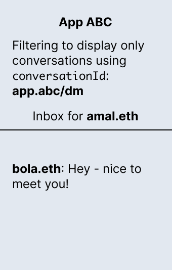
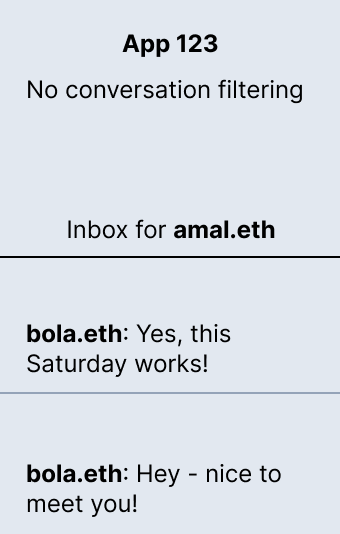
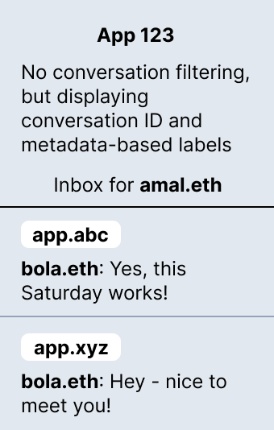

# Use labels to differentiate multiple conversations between a pair of addresses

With XMTP, a pair of blockchain account addresses can have multiple ongoing conversations. In addition, with XMTP, an app can display all conversations a user has, regardless of the app they used to create the conversation. This concept is known as a portable, or universal, inbox.

Alternatively, an app can implement conversation IDs and metadata to [filter conversations](filter-conversations). For example, a developer can choose to assign app-specific conversation IDs and metadata to filter and display only conversations created by their app.

Apps that assign conversation IDs in this way have an effect on apps that use a portable inbox model. For example, a user might see multiple separate and ongoing conversations they are having with the same address, but originating in different apps.

If you are using a portable inbox model for your app, you can display conversation labels based on conversation IDs and metadata to help clarify the user experience.

To illustrate this scenario, let's take a look at a couple of conversations between `amal.eth` and `bola.eth`.

`amal.eth` and `bola.eth` can have an ongoing conversation in App ABC. Let's say that App ABC sets a `conversationId` of `abc.dev/dm` and uses it to filter conversations to display only conversations its users created using App ABC.



`amal.eth` and `bola.eth` can also have a separate and ongoing conversation in App XYZ. Let's say that App XYZ sets a `conversationId` of `xyz.dev/dm` and uses it to filter conversations to display only conversations its users created using App XYZ.


Let's then take a look at App 123, which doesn't filter conversations and displays all conversations for a user regardless of where the conversations were created. In this case, the inbox for `amal.eth` might look something like this:



This scenario may display a confusing user experience for `amal.eth`, surfacing two separate conversations they are having with the same address, `bola.eth`.

To help distinguish the multiple conversations `amal.eth` is having with the same address, you can implement labels, based on conversation IDs and metadata, that display for each conversation.



These labels can help `amal.eth` recognize the source of each conversation with `bola.eth` and understand why multiple conversations are displaying.

**To use labels to differentiate multiple conversations between a pair of addresses:**

For example:

<!--do we have a code sample we can include here? perhaps from this XMTP Chat repo PR https://github.com/xmtp/example-chat-react/pull/140? Would love to be able to publish this tutorial for the XMTP V2 Dec. 5 due date - possible?-->

<!--can we provide some context about what the code is doing and where to put it?-->

```js

<code sample>

```


## Learn more

To learn more about conversation topics, see [XMTP V2 topics and message presentation flow](/docs/dev-concepts/architectural-overview#xmtp-v2-topics-and-message-presentation-flow).
