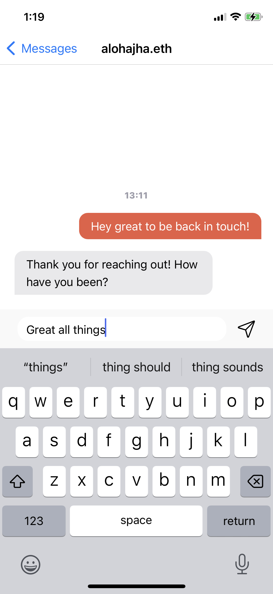

# Messages meet users where they are: The XMTP interoperable inbox

With apps built with XMTP, each user gets an interoperable inbox. This inbox provides access to all of the XMTP messages you’ve exchanged, regardless of the app used to create the message.

For example, this means that you and a friend can each use your own preferred app to exchange messages.

| Your friend using the [Converse app](https://getconverse.app/) to message you on the Orb app | You using the [Orb app](https://orb.ac/) to message your friend on the Converse app |
| :------------------------------------------------------------------------------------------- | :---------------------------------------------------------------------------------- |
|                           |                                            |

Love the UX of an app? Use it.

Does an app’s mission align with your mission? Use it.

If the app you use today no longer meets your needs, the interoperable inbox enables you to seamlessly pick up all of your conversations in another app.

You might wonder: I have a hard enough time keeping track of conversations over Messenger, WhatsApp, and Telegram. Aren’t there already too many platforms for keeping in touch with people?

For example, you might prefer using Messenger, but need to use WhatsApp to message your dad and Telegram to message your best friend because they don’t use Messenger. On top of this, even if you all agreed to align on using the same app, the two people who agreed to change apps would lose access to all of their existing messages and contacts.

If Messenger, Telegram, and WhatsApp were built with XMTP, everyone could use their preferred app. You could use Messenger to message your dad on WhatsApp and to message your friend on Telegram. And one day, if you all decide to use the same app, you could do so seamlessly with all your messages and contacts available in your interoperable inboxes.

With XMTP, you own and control your messages and are always free to use the app that best suits your needs.

## What makes the interoperable inbox possible?

### An open protocol and standards

Developers build messaging into their apps using the **XMTP open protocol and standards**. This makes the messaging features in these apps interoperable, or able to exchange information. This is what enables **all apps built with XMTP to automatically provide interoperable inboxes** for users.

To learn more about building with XMTP, see [Quickstart for the XMTP client SDK for JavaScript](/docs/sdks/js-quickstart).

### You own and control your XMTP identity

To use XMTP, you create an XMTP identity that you can use to send and receive messages with any app built with XMTP. Because you create the identity using an Ethereum account’s public and private keys that only you have access to, **you own and control your XMTP identity.**

To learn more about keys and XMTP identities, see [Key generation and usage in XMTP](/docs/concepts/key-generation-and-usage).

### You own and control your messages

When you send messages with an app built with XMTP, the messages are **end-to-end encrypted** and stored on and retrieved from the **XMTP network**. Because the XMTP network is progressively decentralized and not controlled by any single entity, **you own and control your messages.**

To learn more about message encryption, see [Invitation and message encryption](/docs/concepts/invitation-and-message-encryption).

### A vibrant ecosystem of apps built with XMTP

To explore the ecosystem of apps built with XMTP, see:

- [Built with XMTP](/built-with-xmtp): A curated showcase of apps built with XMTP‍
- [Awesome XMTP](https://github.com/xmtp/awesome-xmtp): A growing list of GitHub repos for projects built with XMTP‍
