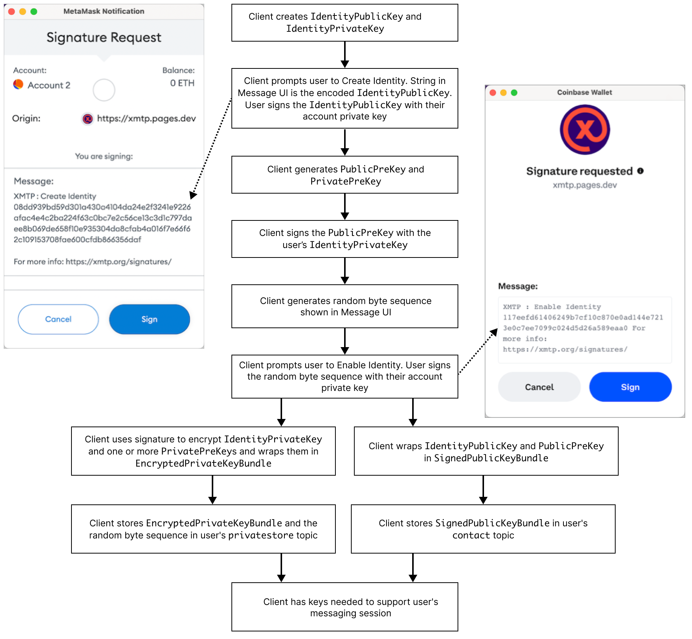
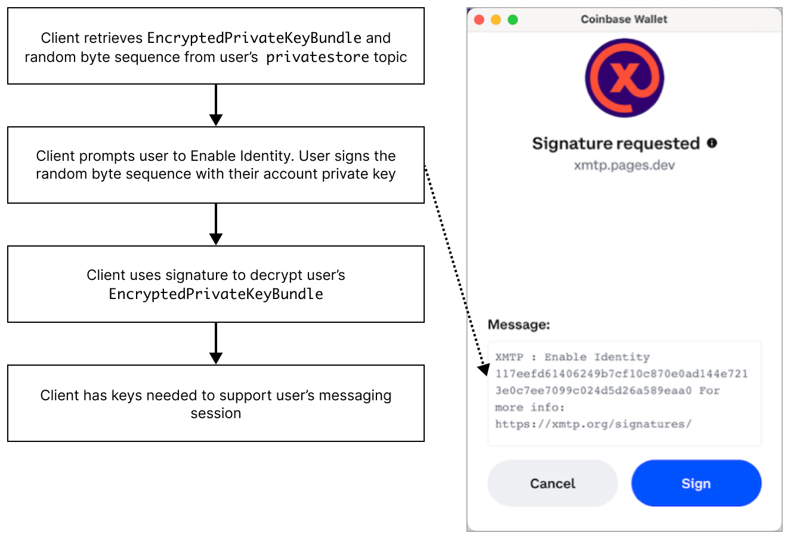

# Key generation and usage in XMTP

The XMTP client protocol supports the generation of keys that enable client apps to establish secure, unfalsifiable relationships between their users' blockchain accounts. These keys also enable client apps to ensure that only the sender and recipient can encrypt and decrypt messages sent between them.

To learn more about user authentication, see [Sign to send and receive messages using apps built with XMTP](/docs/concepts/signatures.md).

To learn more about message encryption, see [Invitation and message encryption with XMTP](invitation-and-message-encryption).

## Identity keys

An XMTP message API client (client) and the XMTP network cannot (and should not) access a user's blockchain account keys. For this reason, a client generates the following identity keys to serve as proxies for a user's blockchain account keys:

- `IdentityPublicKey`
- `IdentityPrivateKey`

A client prompts the user to sign the `IdentityPublicKey` with their blockchain account keys to confirm, or prove, that the user, as controller of the blockchain account, generated the `IdentityPublicKey`.

Anyone can verify the user's signature and consider it an attestation that the `IdentityPublicKey` is the user's true proxy key since only the user's blockchain account keys could have created the signature.

## Prekeys

A client also generates public and private prekeys. A client prompts the user to sign their public prekey with their `IdentityPrivateKey`.

The prekeys are used to encrypt invitations and sign encoded messages on behalf of an XMTP identity.

An XMTP identity may have multiple private prekeys. A client must be able to access every private prekey used by an XMTP identity to decrypt historical messages.

There is always only one public prekey for an XMTP identity, which is the most current prekey.

## Key generation and retrieval flow

The following diagrams show how a client generates and retrieves identity keys and prekeys. The diagrams also show details of how a client encrypts and stores keys.

Encrypted keys generated for a blockchain account are accessible by only the client apps authorized by the user (controller of the blockchain account).

To start the flow, a user accesses an app built with XMTP and connects the app to their desired blockchain account using their wallet app. The app then creates a client.

The client checks the XMTP network for keys associated with the account.

If the keys don't exist, [the client generates them](#key-generation-flow).

If the keys exist, [the client retrieves them](#key-retrieval-flow).

### Key generation flow

If the client checks the XMTP network for keys associated with the account and the keys don't exist, the client generates them according to this flow.

<!--source file: https://www.figma.com/file/77ToMB4T16NiLwJjIp7dU1/diagrams?node-id=47%3A755-->

### Key retrieval flow

If the client checks the XMTP network for keys associated with the account and the keys exist, the client can retrieve them according to this flow.

<!--source file: https://www.figma.com/file/77ToMB4T16NiLwJjIp7dU1/diagrams?node-id=48%3A813-->

## Learn more

To learn more about keys, see [Keys](https://github.com/xmtp/proto/blob/main/PROTOCOL.md#keys) in The XMTP Protocol specification.
