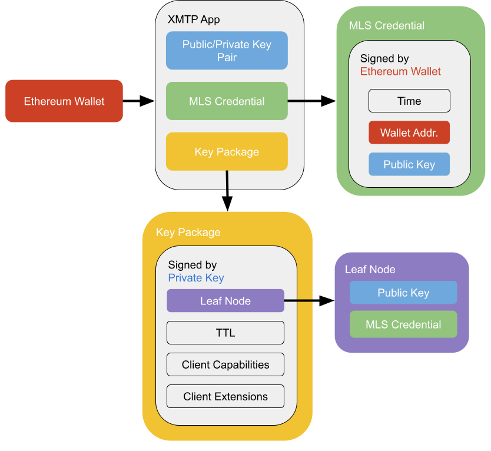
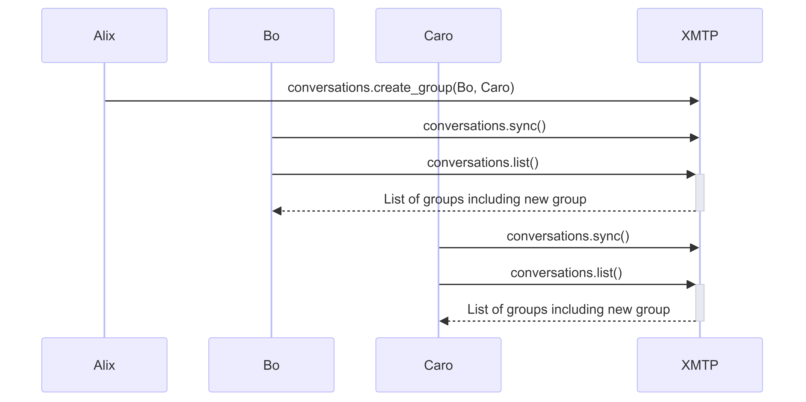
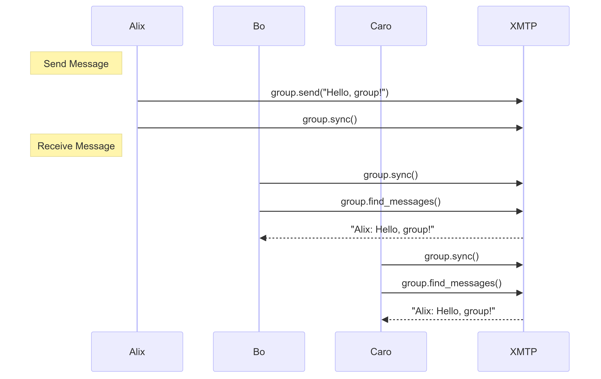
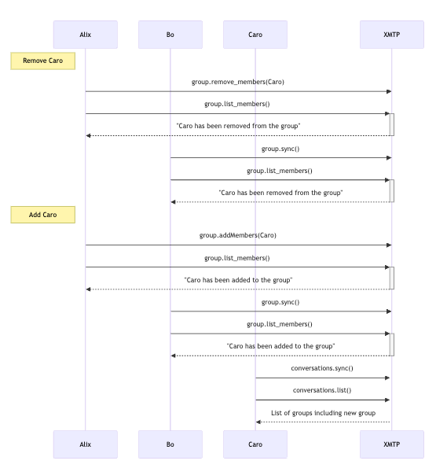
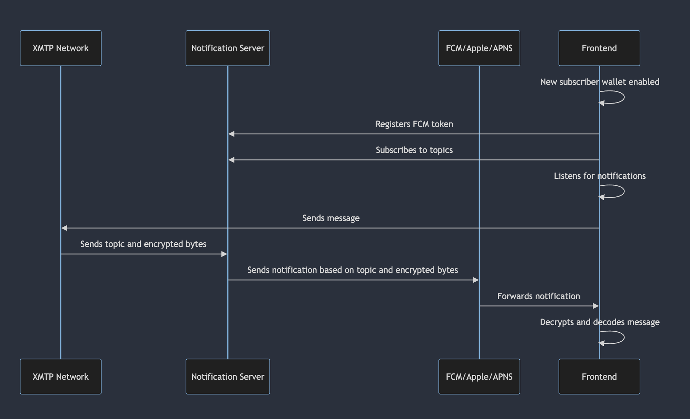

# Group chat

## Summary

* XMTP V3 is introducing Group Chat based on the MLS [specification](https://www.rfc-editor.org/rfc/rfc9420.html).
* XMTP group chats (via MLS) use rotating cryptographic keys, ensuring forward secrecy and post-compromise security. This means if a set of messages was to be broken, future messages can still be secure and the conversation can continue.
* A group can be anywhere from 1 person to 400.
* Groups can have administrators with special permissions. Those permissions include:
  * Add or remove group members.
  * Set a group title or other metadata.
  * Pin messages.
  * Promote members to admins or demote admins.
  * Update permissions policies.
* Every installation (app) registered to the user receives group messages as they are sent.
  * Messages are encrypted so only the installation can decrypt them. Apps do not share the same keys.
  * A user can prompt an existing app to send [message history](message-history) to a newly registered app.
* Apps can find out what groups a user is part of through the [conversations protocol](#conversations-protocol).
  * Apps can list existing groups.
  * Apps can poll or stream for new group invitations.
* Apps can manage group messages through the [group protocol](#group-protocol).
  * Apps can poll for updated group messages, or subscribe to them via streaming.
  * Apps use the group protocol to add and remove members.
  * Apps use the group protocol to update group metadata.
* Group chat messages have a delivery status of Published, Unpublished, or Failed.
  * Sent messages are added to the local database as Unpublished.
  * List functions will show Unpublished messages by default. There is a parameter to filter on status.
  * Messages that are not sent after three attempts are set to Failed.
  * Message status will not change from Unpublished to Published without calling `sync()`.
* Apps can use push notifications for group chats using Firebase Cloud Messaging.

## Security and encryption

A user starts with a predefined Ethereum Wallet and loads up an app that supports XMTP. Once the user has [joined or created an inbox](identity), XMTP creates an installation key pair for the app.  The public key component of this pair is also known as the *signature key*.

XMTP then takes the installation key and creates an *MLS credential*.  This is signed by the Ethereum wallet and contains the wallet address and a hash of the signature key. XMTP uses the [Ed25519](https://en.wikipedia.org/wiki/EdDSA#Ed25519) signature algorithm and curve25519 elliptic curve for the installation key. Because XMTP uses Ed25519, the public key is in the format specified in [RFC8032](https://www.rfc-editor.org/rfc/rfc8032.html).

Using the MLS credential and the signature key, the app then constructs the *key package*. The key package is used by other apps to contact this user on this app. The key package contains a leaf node, which is a combo of the signature key and MLS credential. The leaf node is stored in the MLS ratchet tree. The key package also contains the expiration date of the package (TTL) along with a list of the client capabilities and MLS extensions used by the app and XMTP. XMTP will rotate the key package when a new welcome message is received and delete expired key packages automatically.

Specifically, XMTP group chat inherits the comprehensive security properties of the MLS standard listed below:

- **Message confidentiality**  
Ensures that the contents of messages in transit cannot be read without the corresponding encryption keys.
    
- **Forward secrecy**  
Ensures that past messages remain secure even if current encryption keys are compromised.
    
- **Post-compromise security**  
Ensures that future messages remain secure even if current encryption keys are compromised.
    
- **Message authentication**  
Validates the identity of the participants in the conversation, preventing impersonation.
    
- **Message integrity**  
Ensures that messages cannot be tampered with during transit.
    
- **Group state and operation protection**  
Protects the group state cryptographically and hides group operations from the server or infrastructure.
    
In addition to the security properties provided by MLS, XMTP also adds:

- **User anonymity**  
Ensures that outsiders cannot deduce the participants of a group, users who have interacted with each other, or the sender or recipient of individual messages.
    
### A deep dive into group chat security properties

#### Message confidentiality

Message confidentiality is achieved through symmetric encryption, ensuring that only intended recipients can read the message content. [*AEAD*](#cryptographic-tools-in-use) (Authenticated Encryption with Associated Data) is used to encrypt the message content, providing robust protection against unauthorized access.

#### Forward secrecy

Forward secrecy ensures that even if current session keys are compromised, previous communications remain secure. MLS achieves this by using *the ratcheting mechanism,* where the keys used to encrypt application messages are ratcheted forward every time a message is sent. When the old key is deleted, old messages cannot be decrypted, even if the newer keys are known. This property is supported by using ephemeral keys during the *key encapsulation* process.

#### Post-compromise security

Post-compromise security ensures that future messages remain secure after a compromise. XMTP uses regular *key rotation* achieved through a *commit mechanism* with a specific *update path* in MLS, meaning a new group secret is encrypted to all other members. This essentially resets the key and an attacker with the old state cannot derive the new secret, as long as the private key from the leaf node in the ratchet tree construction has not been compromised. This ensures forward secrecy and protection against future compromises.

#### Message authentication

XMTP uses digital signatures to strongly guarantee message authenticity. These signatures ensure that each message is cryptographically signed by the sender, verifying the sender’s identity without revealing it to unauthorized parties. This prevents attackers from impersonating conversation participants.

#### Message integrity

Message integrity is crucial to ensure that messages are genuine and unaltered. XMTP achieves this through the use of MLS. The combination of digital signatures and [*AEAD*](#cryptographic-tools-in-use) enables XMTP to detect changes to message content.

#### User anonymity

User anonymity is achieved through a combination of the following functions:

- MLS Welcome messages encrypt the sender metadata and group ID, protecting the social graph.
- XMTP adds a layer of encryption to MLS Welcome messages using [HPKE](#cryptographic-tools-in-use) (Hybrid Public Key Encryption). This prevents multiple recipients of the same Welcome message from being correlated to the same group.
- XMTP uses MLS [PrivateMessage](https://www.rfc-editor.org/rfc/rfc9420.html#name-confidentiality-of-sender-d) framing to hide the sender and content of group messages.
- XMTP’s backend does not authenticate reads or writes and only implements per-IP rate limits. Aside from Welcome messages, all payloads for a given group are stored under a single group ID, and any client may anonymously query or write to any group ID. Only legitimate members possess the correct encryption keys for a given group.

It is technically possible for XMTP network node operators to analyze query patterns per IP address. However, clients may choose to obfuscate this information using proxying/onion routing.

XMTP currently hides the sender of Welcome messages (used to add users to a group) but does not hide the Welcome message recipients. This makes it possible to determine how many groups a user was invited to but not whether the user did anything about the invitations.

### Cryptographic tools in use

XMTP group chat uses the ciphersuite *MLS_128_HPKEX25519_CHACHA20POLY1305_SHA256_Ed25519*. 

Here is a summary of individual cryptographic tools used to collectively ensure that XMTP group chat communications are secure, authenticated, and tamper-proof:

- [HPKE](https://www.rfc-editor.org/rfc/rfc9180.html)  
Used to encrypt Welcome messages, protect the identities of group invitees, and maintain the confidentiality of group membership. The ciphersuite we use is *HPKEX25519*.
    
- [AEAD](https://developers.google.com/tink/aead)  
Used to ensure both confidentiality and integrity of messages. In particular, we use the ciphersuite *CHACHA20POLY1305.*
    
- [SHA3_256 and SHA2_256](http://nvlpubs.nist.gov/nistpubs/FIPS/NIST.FIPS.180-4.pdf)  
XMTP uses two cryptographic hash functions to ensure data integrity and provide strong cryptographic binding. SHA3_256 is used in the multi-wallet identity structure. SHA2_256 is used in MLS. The ciphersuite is *SHA256*.
    
- [Ed25519](https://ed25519.cr.yp.to/ed25519-20110926.pdf)  
Used for digital signatures to provide secure, high-performance signing and verification of messages. The ciphersuite is *Ed25519.*

## Group sizes

Group sizes can range from 1 to 400. XMTP expects most groups will fall into one of two profiles: The small group where everyone knows each other (e.g., texting) and large groups of relative strangers (e.g., Discord).  Small groups are your typical group chat - the group size is not large enough to require a lot of permissions or moderation.  Large groups often start with restricted permission and more moderation to ensure the group is not too noisy for its intended purpose.

A one-person group is allowed. Messages sent to the group will be broadcast to all the installations used by that person.

## Group permissions

:::info More Information
You can find more information on group chat permissions in [XIP-47](https://community.xmtp.org/t/xip-47-group-chat-permissions/651).
:::

### Admins

There are two kinds of group chat administrators: *admins* and *super admins*. The group creator starts as a super admin. Super admins start with the most permissions, so a normal admin cannot remove the creator or destroy a group.

While group membership is inherent to the MLS group, administrators are specified through the group metadata. Updating the metadata is how you add or remove admins and specify who are admins versus super admins.

### Permissions

These are the current permissions allowed for a group:

* Add Member
* Remove Member
* Update Metadata
* Add Admin
* Remove Admin
* Update Permissions

### Permission options

Permission options are the settings for each permission.  They include:

* Unspecified
* Allow
* Deny
* Allow if Admin or Super Admin
* Allow if Super Admin

## Form groups

Forming groups is fairly simple. Alix's app can use the conversation protocol to create a group with Bo and Caro. Behind the scenes, XMTP looks up every installation belonging to Bo and Caro and sends each installation a welcome message. Each installation has its own key pair, so each message is encrypted separately. 

Bo and Caro's apps then see the new conversation on the list when they use the conversation protocol to sync with XMTP. They then use the group protocol to engage with individual groups.

## Send and receive messages

When Alix sends a message to the group, XMTP sends the message to every installation of every group member. Other group member's apps use the group protocol to receive the message.

## Add and remove members

When you add or remove members from a group, a proposal/commit message is sent to all the installations in the group. When the commit happens, the cryptographic state of the group is changed. This allows new members to receive messages but not decrypt older ones and prevents removed members from decrypting messages after their departure.

## Conversations protocol

The conversations protocol contains methods to create groups, and monitor all groups the installation is part of. Each SDK has its own version of this protocol, using the underlying implementation in [LibXMTP](https://github.com/xmtp/libxmtp).

| Method | Description |
| ---- | ---- |
| create_group | Create a new group chat for multiple account addresses. Syncs automatically.|
| sync | Sync for welcome messages, creating new groups if one is found. |
| list | Returns a list of groups matching the chosen time frame and limit. Requires sync. |
| stream | Streams messages from the current group id to a callback function. |
| stream_all_messages | Streams all messages to a callback function. |

### Local database and syncing

:::info More Information
You can find more information on database operations in [XMTP MLS](https://github.com/xmtp/libxmtp/blob/main/xmtp_mls/README.md).
:::

When an app first calls `Client.create()` in one of the XMTP APIs, LibXMTP creates a local database to manage messaging between the app and the network. In subsequent calls, it loads the existing database. The database is encrypted using the keys from the `Signer` interface. See [Authentication](https://xmtp.org/docs/build/authentication#saving-keys) for instructions on how to extract the key, store it, and pass it to `Client.create()` later.  If you want to delete your local database, call `Client.deleteLocalDatabase()`.

Calling the `sync()` method on the Conversations protocol checks for welcome messages and creates a new group if one is found. The new group will not show up on the list until the app syncs. Calling the `sync()` method on the Group protocol prompts LibXMTP to pull updates from the network and push any unsent updates from the client related to the group. This will update the database for the group.

In some cases, LibXMTP will perform a sync automatically. This currently includes calls to add/remove members to a group or using the stream functions. Outside of those methods, apps can call `sync()` when they choose to efficiently manage network traffic.

## Group protocol

The Group protocol contains methods specific to individual groups, identified by their `group_id`. These methods allow a user to communicate with the group. Each SDK has its own version of this protocol, using the underlying implementation in [LibXMTP](https://github.com/xmtp/libxmtp).

| Method | Description |
| ---- | ---- |
| send | Send a message to this group. Requires sync. |
| sync | Query for new messages, proposals, and commits, and send unpublished messages related to this group. |
| find_messages | Query the database for stored messages, with filters for time frame and limit. Requires sync.|
| list_members | A list including the inboxId of each member and their associated account addresses. Requires sync. |
| add_members | Add multiple group members by account address. Syncs automatically.|
| add_members_by_inbox_id | Add multiple group members by inboxId.  Syncs automatically.|
| remove_members | Remove multiple group members by account address. Syncs automatically.|
| remove_members_by_inbox_id | Remove multiple group members by inboxId.  Syncs automatically.|
| stream | Stream messages to a callback function. Syncs automatically.|
| created_at_ns | Group creation time. |
| is_active | Whether the group is active. Requires sync. |
| added_by_inbox_id | The inboxId of the group member who added this user to the group. |
| group_metadata | Group metadata, such as group title and permissions. Requires sync.|

### Delivery status

When a message is sent, it is stored in the local database with a status of `Unpublished`. `find_messages()` will display unpublished messages by default unless you filter on `DeliveryStatus`. Unpublished messages can be displayed to the user but should be marked as not yet sent in the app UI.

When the app calls `sync()`, LibXMTP will make three attempts to automatically send the message to the network. If all three attempts fail, the message status will be marked as `Failed`. If it succeeds, it will be marked as `Published`.

## Spam protection

To prevent unwanted contacts, the app should apply the existing [Universal allow/block Preferences](/docs/build/user-consent) to group chats. The Group protocol provides the `added_by_inbox_id` method to find out who has initiated the user into a group chat. Apps can compare this inboxId using the standard `isInboxIdAllowed()` or `isInboxIdDenied()` functions on the contacts to determine how and whether the group should be listed and how and whether messages are displayed based on the design of the app and the user's settings.

:::note
Even if an app is not displaying a group chat, LibXMTP will keep receiving group messages and store them in the local database as long as the user is a member of the group.
:::

## Push notifications

Group chat supports push notifications. You can use a Firebase Cloud Messaging Server to serve push notifications with Android, iOS, or web apps.  For more information, see [Notifications with XMTP](/docs/build/notifications/notifications.md).
