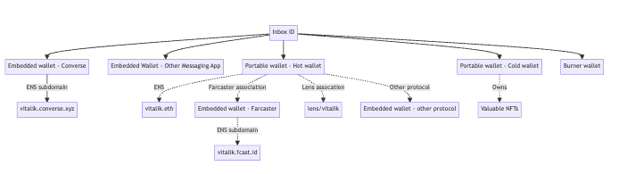
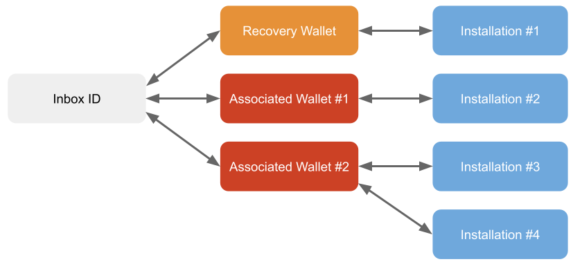

# Multi-wallet identity

## Summary

* XMTP v3 now supports multiple wallets per user, including [smart wallets](https://community.xmtp.org/t/xip-44-smart-contract-wallet-support/627).
* User wallets now belong to a shared Inbox with a single Inbox ID.
* The first wallet used to create an Inbox is a *recovery wallet*.
  * A recovery wallet can remove other wallets.
  * A user can use the recovery wallet to set a different recovery wallet.
  * A user with an existing V2 wallet gets an Inbox with that wallet as the recovery wallet.
* The Inbox can have multiple *associated wallets* (besides the recovery wallet).
  * Users can send a message to any name (ENS, cb.id, Farcaster ID, etc.) belonging to an associated wallet in the Inbox.
  * Associated wallets can add one or more *installations* as children (one per app/device pairing).
  * Removing the wallet removes all installations that are the child of that wallet.
* Adding/removing a wallet or installation is an *identity action*.
  * Associated wallets can add other associated wallets or installations.
  * Only recovery wallets can remove other associated wallets or installations.
* Identity actions for new associations are signed by the wallet or installation making the change.
  * In some cases, it may be signed by both.
  * Actions removing associations and changing the recovery wallet must be signed by the recovery wallet.
* XMTP maintains an *inbox log*.
  * The inbox log has a list of all identity actions affecting the inbox.
  * The inbox log can track 256 identity actions. Since identity actions can be combined, this can be more than 256 associations, removals, change of recovery wallets, etc.

:::info More Information
You can find more information on multi-wallet identity in [XIP-46](https:https://community.xmtp.org/t/xip-46-multi-wallet-identity/639).
:::

## Multi-wallet support

Within the Ethereum ecosystem, many people use multiple wallets, even wallets embedded inside of apps.  Users are likely to have multiple wallets, even multiple identities, outside of an EVM chain.

XMTP allows those users to be contacted through a single inbox for all of those identities by associating these multiple wallets with a single Inbox ID.



XMTP creates a log of all the wallets associated with an Inbox ID and makes this log available through a public API.  In the diagram above, this log charts the relationship between the solid lines, whereas the dotted lines will be resolved by the apps that use XMTP (for example, through services such as Airstack).

When a user messages another user by name, the app will use XMTP to resolve the name to an Inbox ID, starting at the bottom of the diagram and ending at the top.

When a participant is rendered in an app's UX, resolving the name from the Inbox ID will begin from the Inbox ID at the top of the tree and proceed to the name at the bottom.

### Recovery wallet

A recovery wallet is a single wallet in the Inbox that can manage any object in the Inbox. The first wallet used to create an Inbox is designated as the recovery wallet.  Users can change their recovery wallet to a different wallet as long as the recovery wallet assents to the change.

By default, a recovery wallet is not addressable for messages.  A recovery wallet can ALSO be an associated wallet, making it addressable for messages, but this is not required.

When an XMTP V2 user upgrades to XMTP V3, their wallet becomes the recovery wallet of the new Inbox and is associated with the Inbox.

### Associated wallets



Associated wallets are additional addressable wallets in the Inbox.  An associated wallet can have multiple *installations*.  A user can use the wallet on multiple apps on multiple devices, and each one would have its own installation.  When someone sends a message to the name associated with the wallet, it goes to all the installations in the entire Inbox, not just the installations associated with one wallet.

### Remove wallets

The recovery wallet has the authority to remove *any* wallet from the Inbox.

When a wallet is removed, all the installations registered for that wallet are removed as well.  That means the apps associated with that wallet will no longer be allowed to connect to XMTP (until they add a new wallet and register the new installation).

## Installations

Each wallet needs at least one installation to send and receive messages.  An installation is a combination of app and device and is registered as a child of a single wallet.

### Installation keys

When you register a new installation, XMTP creates a new Ed25519 key pair generated and stored on the device. XTMP uses the Ed25519 signature algorithm and curve25519 elliptic curve. Because XMTP uses Ed25519, the public key is in the format specified in RFC8032.

The public key of the pair is used as the XMTP *signature key*. This is the unique identifier for an XMTP installation.  Messages sent by that installation are encrypted with the private key. Recipient installations use the signature key to decrypt them.

Messages sent to the installation are encrypted using the encryption key, so only the installation can decrypt them.

## Update the inbox

Every action that changes the Inbox is stored in a sequential log, called the *inbox log*, and that log is available to all XMTP nodes.  There is a secondary log, the *address log*, that is just the address-related entries in the inbox log.  The logs are accessed and validated by XMTP and are not visible to client apps.  What apps can do is submit changes to the log through *identity actions*.

### Identity actions

An update to the Inbox is called an *identity action*. An identity action can have multiple events in one action, but the inbox log only stores 256 actions.

An identity action starts with a header, followed by one or more events.

The header contains the Inbox ID being updated and the time of the current update:

```text
XMTP : Authenticate to inbox

Inbox ID: ${INBOX_ID}
Current time: ${YYYY-MM-DD HH:MM:SS UTC}

```

An action contains text defining the action and the data for the update:

```text
- Create inbox
  (Owner: ${INITIAL_ADDRESS})
```

Once your actions are finished, you close them with a footer:

```text

For more info: https://xmtp.org/signatures/
```

So, a complete identity action could look like this:

```text
XMTP : Authenticate to inbox

Inbox ID: 4ccd089b28ff96da9db6c346ec114e0f5b8a319f35aba624da8cf6ed4fb8a6fb
Current time: 1970-01-01T00:00:00Z

- Create inbox
  (Owner: 0x1234567890abcdef1234)

For more info: https://xmtp.org/signatures/
```

:::tip
The blank lines below the time and above the footer are required.
:::

#### Sign identity actions

Once the SDK composes an identity action, the SDK signs it. If more than one cryptographic entity (wallet or installation) is involved in the action, they all must sign it. Each signature is based on the entire text of the update.

If an identity action has to be signed by a wallet, the wallet may pop up a request for the user to sign the update, including the entire text of the update.  No identity actions require more than one wallet signature.

<!--
Screenshot of wallet signing TBD
-->

:::infoImportant
When an identity action needs to be signed by an installation, the SDKs (via LibXMTP) will carry out that signing automatically.  Apps are not required to do it themselves.
:::

### Create a new inbox

<!--
Coinbase or other user UX screenshot signing a new inbox action goes here
-->

For a new user, the first thing the app will need to do is create an Inbox. This will automatically register the user's wallet as the recovery address. The app will also need to add itself as an installation ("Grant messaging access to app"), which it can do in the same combined action as creating the Inbox.

This is what a combined create/grant action would look like:

```text
XMTP : Authenticate to inbox

Inbox ID: 4ccd089b28ff96da9db6c346ec114e0f5b8a319f35aba624da8cf6ed4fb8a6fb
Current time: 1970-01-01T00:00:00Z

- Create inbox
  (Owner: 0x1234567890abcdef1234)
- Grant messaging access to app
  (ID: d75a980182b10ab7d54bfed3c964073a0ee172f3daa62325af021a68f707511a)

For more info: https://xmtp.org/signatures/
```

Create inbox, with or without the installation grant, will have to be signed by the recovery wallet.  Installation grants have to be signed by the installation private key.

### Migrate a V2 wallet

<!--
If there's any visible effect of migrating a wallet, screenshot goes here
-->

For an existing user with an upgraded app, XMTP will automatically migrate the V2 wallet into a new Inbox and mark that wallet as the recovery wallet. The app will still need to add itself as an installation ("Grant messaging access to app").

This is what the grant action would look like:

```text
XMTP : Authenticate to inbox

Inbox ID: 4ccd089b28ff96da9db6c346ec114e0f5b8a319f35aba624da8cf6ed4fb8a6fb
Current time: 1970-01-01T00:00:00Z

- Grant messaging access to app
  (ID: d75a980182b10ab7d54bfed3c964073a0ee172f3daa62325af021a68f707511a)

For more info: https://xmtp.org/signatures/
```

The installation grant has to be signed by the wallet that was upgraded from V2 and by the installation private key.

### Add a new wallet or installation

The Inbox supports multiple associated wallets and multiple associated installations per wallet. You can add and remove them individually.

#### Add a wallet

Adding a new wallet uses the "Link address to inbox" identity action:

```text
- Link address to inbox
  (Address: 0x234567890abcdef12345)
```

This action has to be signed by the app (already associated with the inbox) and the new wallet.

#### Add an installation

Adding an installation uses the "Grant message access to app" identity action that you saw when creating an inbox:

```text
- Grant messaging access to app
  (ID: 3d4017c3e843895a92b70aa74d1b7ebc9c982ccf2ec4968cc0cd55f12af4660c)
```

Both the parent wallet for the installation and the installation private key must sign this action. The wallet would already have to be associated with the inbox.

#### Remove a wallet

Removing a wallet uses the "Unlink address from inbox" action:

```text
- Unlink address from inbox
  (Address: 0x234567890abcdef12345)
```

This action must be signed by the recovery wallet.

#### Remove an installation

Removing an installation uses the "Revoke messaging access from app" action:

```text
- Revoke messaging access from app
  (ID: 3d4017c3e843895a92b70aa74d1b7ebc9c982ccf2ec4968cc0cd55f12af4660c)
```

This action must be signed by the recovery wallet.

### Set a new recovery wallet

You can change the recovery wallet to another wallet associated with the Inbox. You can add it beforehand or as part of a single action.

```text
- Change inbox recovery address
  (Address: 0x234567890abcdef12345)
```

This action must be signed by the existing recovery wallet.

Combining it with adding the new wallet would look like this:

```text
XMTP : Authenticate to inbox

Inbox ID: 4ccd089b28ff96da9db6c346ec114e0f5b8a319f35aba624da8cf6ed4fb8a6fb
Current time: 1970-01-01T00:00:00Z

- Link address to inbox
  (Address: 0x234567890abcdef12345)
- Change inbox recovery address
  (Address: 0x234567890abcdef12345)

For more info: https://xmtp.org/signatures/
```
