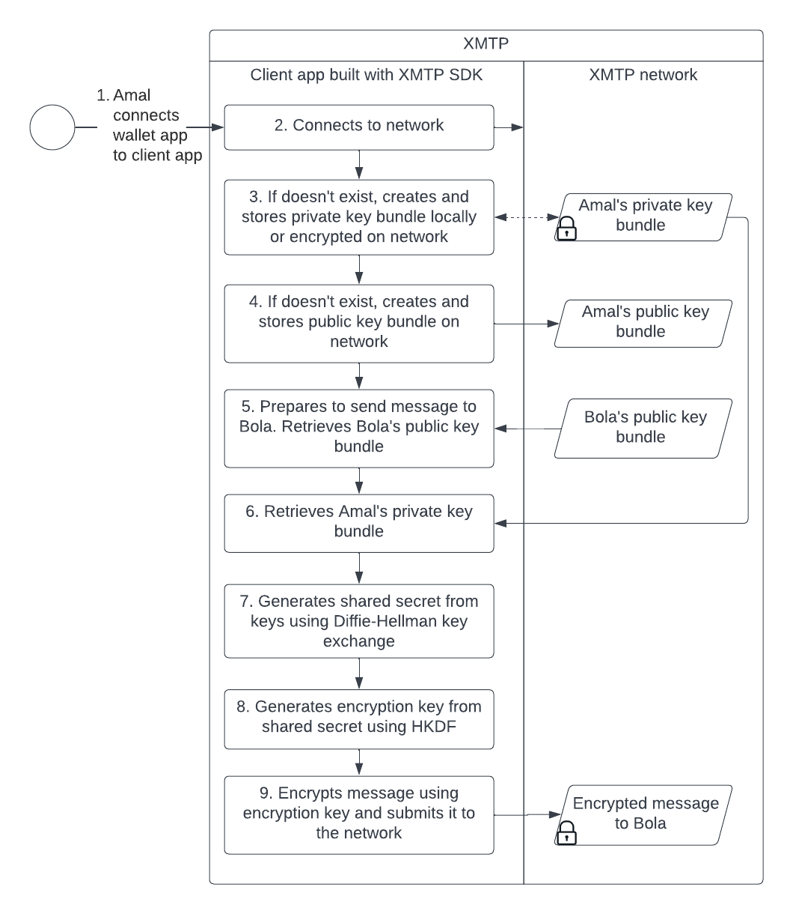
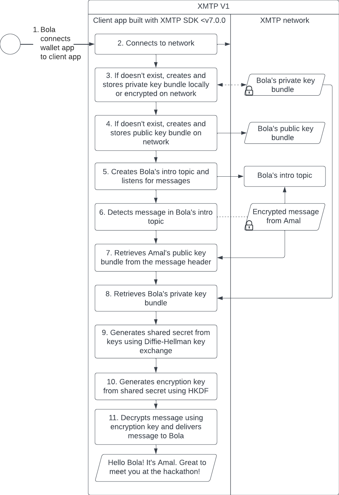

# Architectural overview of XMTP

This topic provides an introduction to the architecture of XMTP (Extensible Message Transport Protocol) and how it supports messaging between blockchain accounts.

You can use this information to get an overview of how XMTP works and how building with XMTP can fit into your architecture and environment.

At the most basic level, the architecture of XMTP includes three layers:

- [Network layer](#network-layer)
- [Client layer](#client-layer)
- [App layer](#app-layer)

 <!--source file: https://www.figma.com/file/1jasKMIn5sAL4855eTwgIm/xmtp-architectural-overview?node-id=407%3A1774-->

## Network layer

The network layer provides the XMTP network which is comprised of nodes (computers) running network client software. The primary responsibilities of the XMTP network and nodes are to:

- Relay messages to other nodes and to storage
- Make messages available for retrieval by client apps built with XMTP
- Store and advertise public key bundles for XMTP identities
- Store encrypted private key bundles for XMTP identities
- Bootstrap newly joined XMTP nodes

### Network topology

Diving a bit deeper into the XMTP network, this diagram illustrates key components of the network topology:

 <!--source file: https://www.figma.com/file/1jasKMIn5sAL4855eTwgIm/xmtp-architectural-overview?node-id=534%3A1663-->

:::note

At this time, XMTP Labs runs all nodes in the XMTP network. XMTP Labs aims to publish a phased decentralization roadmap in Fall 2022.

:::

The XMTP network has no security perimeter, enabling any node running XMTP network client software to participate in the network. Currently, the network client software is closed source and all nodes are operated by XMTP Labs.

Every XMTP node:

- Has a bootstrapping service that advertises information about all of the nodes it’s connected to, enabling newly joined nodes to connect to every other node in the network
- Connects to every other node, forming a peer-to-peer network
- Connects to a data store <!--To learn more about the vision for pre- and post-delivery storage, see the XMTP litepaper.-->
- Relays messages and key bundles to other nodes
- Stores and advertises public key bundles for XMTP identities
- Stores encrypted private key bundles for XMTP identities
- Stores messages sent by XMTP identities
- Has a private load balancer and connects to a single public load balancer

Here’s a high-level view of how client apps built with XMTP submit and retrieve messages using the XMTP network:

 <!--source file: https://www.figma.com/file/1jasKMIn5sAL4855eTwgIm/xmtp-architectural-overview?node-id=291%3A2607-->

### Network storage and message relay

The XMTP network uses pub/sub topics to relay and store messages and key bundles within the network. Here's an overview of the topics the network uses:

- Private store topic  
A developer building an app with XMTP can choose to store their users' private key bundles locally or encrypted on the XMTP network. When required by a client app, the XMTP network uses a private store topic to store a user's private key bundle.  
- Contact topic  
The XMTP network uses a contact topic to store a user’s public key bundle. The network advertises this public key bundle to enable other users to contact the user.  
- Intro topic  
The XMTP network uses an intro topic to store the first message sent between two participants (blockchain accounts). This enables client apps to know that messages exist in a given direct message topic.

<!--Per Jazz, currently, the first message in the concept of a conversation is sent to three topics: intro-amal, intro-bola, and dm-amal-bola. The message is copied to the intro topics so that client apps know that messages exist in a given dm topic. This will change in the future such that the intro topic may just include an index, or list, of conversations and no messages.-->

- Direct message topic  
The XMTP network uses a direct message topic to store messages sent between two participants. The direct message topic is shared by the two participants.

This diagram illustrates how these XMTP network topics are created and work together to enable a client app to deliver messages to a user:

 <!--source file: https://www.figma.com/file/1jasKMIn5sAL4855eTwgIm/xmtp-architectural-overview?node-id=535%3A1664-->

In this flow, the client app:

1. Retrieves Bola’s private key bundle from the network. If one doesn’t exist, it creates it and stores it encrypted on the network in a private store topic, or locally.
2. If one doesn't already exist, stores Bola’s public key bundle on the network in a contact topic, so others can message Bola.
3. Retrieves Bola’s intro topic to see which conversations they have.
4. Retrieves the messages between Bola and Amal from their direct message topic.
5. Uses Bola’s private key and Amal’s public key to create a shared secret. Uses the shared secret to create an encryption key to decrypt Amal’s message and present it to Bola.

For more details, see [Message encryption and decryption](#message-encryption-and-decryption).

Next, let’s look at the client layer and how apps connect to the XMTP network and send and receive encrypted messages.

## Client layer

The client layer consists of XMTP user clients embedded in client apps built with the XMTP SDK. The client layer’s main responsibilities are to:

- Create blockchain account-based XMTP identities, including public and private key bundles, and submit them to the network for storage
- Encrypt and decrypt messages
- Submit and retrieve messages from the XMTP network
- Encode and decode message content types
  To learn more, see [Content types](/docs/dev-concepts/content-types).

### Message encryption and decryption

All XMTP messages are encrypted. A client app encrypts and decrypts messages using the following artifacts:

- Public key bundle (per user)
- Private key bundle (per user)
- Shared secret (per sender and recipient pair)
- Encryption key (per sender and recipient pair)

Here’s a high-level overview of the message encryption and decryption flow:

 <!--source file: https://www.figma.com/file/1jasKMIn5sAL4855eTwgIm/xmtp-architectural-overview?node-id=324%3A1120-->

The following sequence diagram dives a bit deeper into the flow and illustrates how a client app creates and uses these artifacts to encrypt a message:

 <!--source file: https://lucid.app/lucidchart/d2985646-969e-4625-82f0-cb38853033c5/edit?viewport_loc=-216%2C-25%2C2184%2C1232%2C0_0&invitationId=inv_2faa4c23-7fdb-40d8-9b78-e9c4557b712d#-->

Likewise, this sequence diagram illustrates the message decryption process:

 <!--source file: https://lucid.app/lucidchart/eda3bcf7-69e5-4d31-b3cb-577399ae5d8b/edit?invitationId=inv_50b45a44-3475-486e-bc28-80c881f035cf#-->

## App layer

The app layer consists of client apps built with the XMTP SDK.

A developer can provide messaging between blockchain accounts in their app by building with the [XMTP SDK](https://github.com/xmtp/xmtp-js). When a developer builds with the XMTP SDK, their app embeds an XMTP user client, which handles XMTP network interactions required to enable their users to send and receive messages.

With XMTP network interactions handled by an XMTP client, developers can focus on the user-related aspects of building client apps, such as:

- User acquisition
- User interface
- User identity metadata
- Inbox filtering  
To learn about one developer's approach, see [Truths Not Spoofs](https://blog.xmtp.com/truths-not-spoofs/).
- Custom content types  
To learn more, see [Content types](/docs/dev-concepts/content-types).

Developers can also help shape XMTP by participating in [XMTP Improvement Proposals (XIPs)](https://github.com/xmtp/XIPs/blob/main/XIPs/xip-0-purpose-process.md) and [contributing](/docs/dev-concepts/contributing) to XMTP SDKs and tools.
