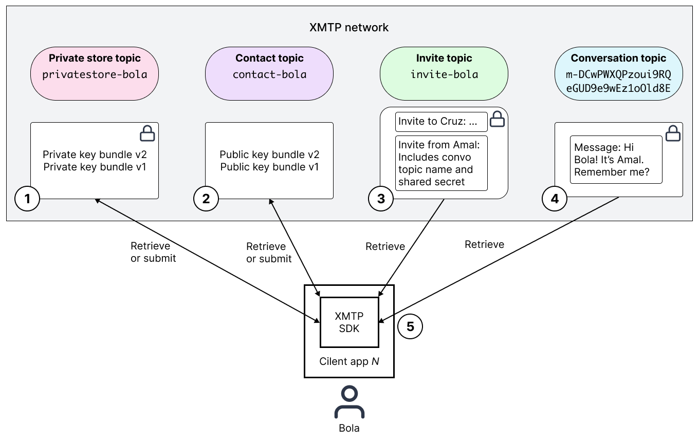
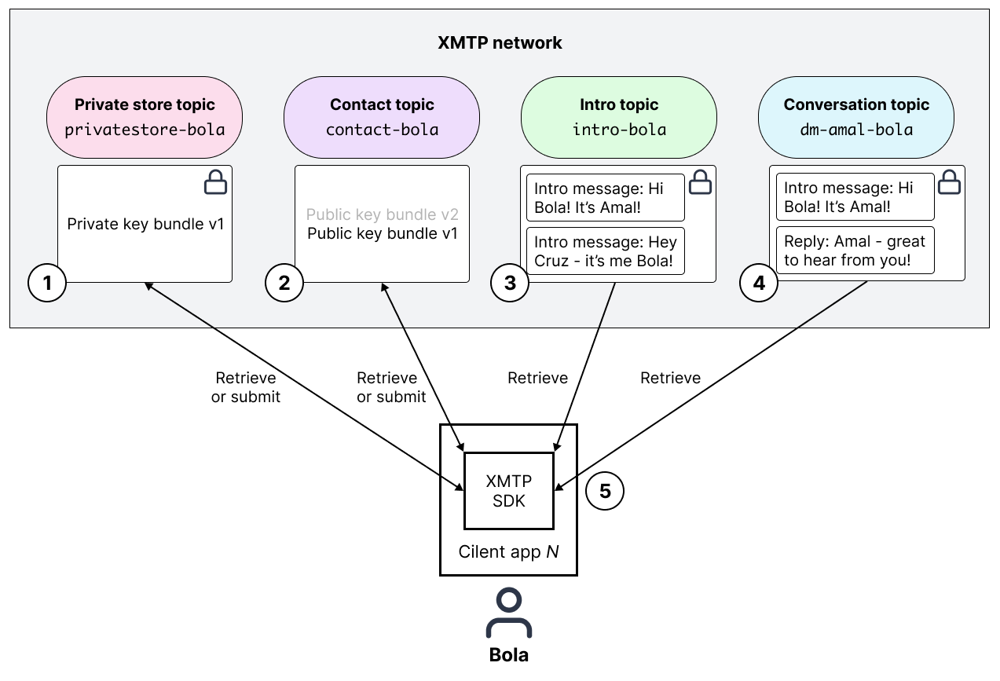
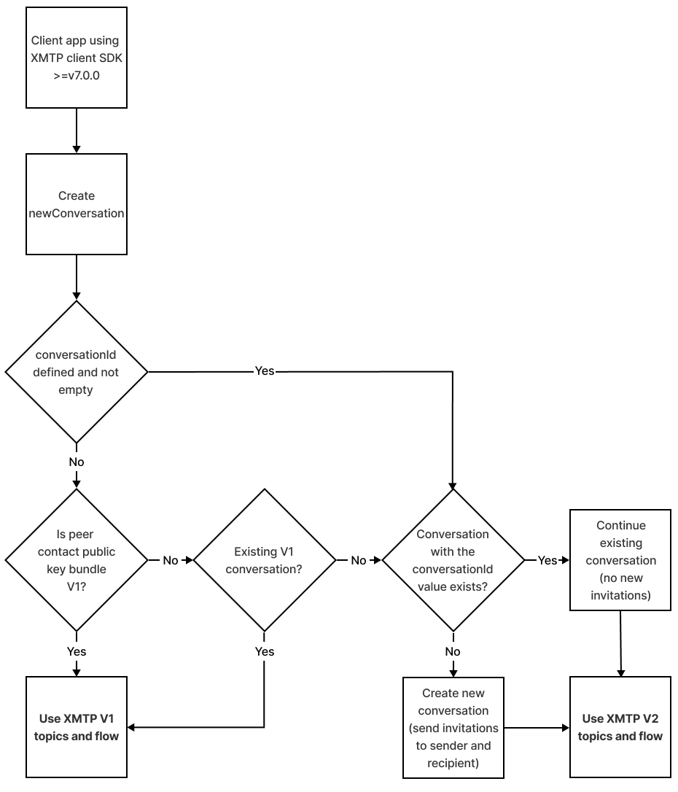

import Feedback from '/src/components/Feedback'

# Architectural overview of XMTP

This topic provides an introduction to the architecture of XMTP (Extensible Message Transport Protocol) and how it supports messaging between blockchain accounts.

You can use this information to get an overview of how XMTP works and how building with XMTP can fit into your architecture and environment.

At the most basic level, the architecture of XMTP includes three layers:

* [Network layer](#network-layer)
* [Client layer](#client-layer)
* [App layer](#app-layer)

<!--Source file: [https://www.figma.com/file/77ToMB4T16NiLwJjIp7dU1/diagrams?node-id=0%3A1](https://www.figma.com/file/77ToMB4T16NiLwJjIp7dU1/diagrams?node-id=0%3A1)-->

## Network layer

The network layer provides the XMTP network which is comprised of **nodes** (computers) running XMTP node software.

The XMTP network enables any computer running XMTP node software to participate in the network. Currently, the node software is closed source and all nodes in the XMTP network are operated by XMTP Labs. XMTP Labs is working toward a phased decentralization of the network and will share a roadmap in the coming months.

This diagram shows the key components of an XMTP node. The nodes provide a **message API** that enables client apps built with the XMTP client SDK to communicate with the XMTP network. The nodes use Waku node software to connect to other nodes and form a peer-to-peer network to relay and store envelopes submitted and requested by client apps.

<!--Source file: [https://www.figma.com/file/77ToMB4T16NiLwJjIp7dU1/diagrams?node-id=16%3A502](https://www.figma.com/file/77ToMB4T16NiLwJjIp7dU1/diagrams?node-id=16%3A502)-->

Currently, nodes are configured to rate limit high-volume publishing from message API clients. A rate-limited message API client can expect to receive a 429 status code response from node. Rate limits can change at any time in the interest of maintaining network health.

Every **envelope** contains a payload, often encrypted, that is not observable by nodes. The payload could be a public key bundle, private key bundle, or a message created by a client app, but this information is opaque to nodes. Meaning is assigned to these envelopes in the [Client layer](#client-layer).

Nodes can see envelope properties which help the nodes understand how to handle envelopes but the properties reveal nothing about message content. An example of an important envelope property is a **topic** name. A topic name is a required envelope property. A topic name helps a node understand where to relay and store the envelope. Each envelope belongs to exactly one topic.

The primary responsibilities of an XMTP node are to:

* Connect to other nodes, forming a peer-to-peer network
* Advertise information about all of the nodes it’s connected to, enabling newly joined nodes to connect to other nodes in the XMTP network
* Relay envelopes to other nodes
* Store envelopes in topics
* Make envelopes available for retrieval by client apps

<!--To learn more about the XMTP network layer, nodes, and topics, see Network Layer in The XMTP Protocol specifications.-->

Here’s a high-level view of how XMTP nodes relay and store envelopes containing payloads submitted and retrieved by client apps built with XMTP:

<!--Source file: [https://www.figma.com/file/77ToMB4T16NiLwJjIp7dU1/diagrams?node-id=1%3A169](https://www.figma.com/file/77ToMB4T16NiLwJjIp7dU1/diagrams?node-id=1%3A169)--><!--change paper icons to open vs closed envelopes-->

## Client layer

The client layer consists of XMTP message API clients (clients) embedded in client apps built with the XMTP client SDK. A message API client connects to the message API in an arbitrary XMTP node to communicate with the network, as shown in the [XMTP node diagram](#xmtp-node-diagram).

The primary responsibilities of a client are to:

* Create blockchain account-based XMTP identities, including public and private key bundles.  
To learn more, see [Key generation and usage](key-generation-and-usage).

* Encrypt and decrypt private key bundles, invitations, and messages.  
To learn more, see [Invitation and message encryption](invitation-and-message-encryption).

* Submit and retrieve public key bundles, encrypted private key bundles, encrypted invitations, and encrypted messages to and from the XMTP network.

* Encode and decode message content types.  
To learn more, see [Content types](content-types).

### XMTP V2 topics and message presentation flow

This section describes how topics and the message presentation flow work for the current version of the protocol, referred to as XMTP V2. Only client apps with XMTP client SDK >=v7.0.0 can use XMTP V2. To learn about how topics and flows work in XMTP V1, see [XMTP V1 topics and message presentation flow](#xmtp-v1-topics-and-message-presentation-flow).

In XMTP V2, clients use the following topics to perform their primary responsibilities:
<!--update invite row to link to conversation filtering section in SDK readme once releases-->
<table>
   <tr>
      <td><strong>Topic</strong>
      </td>
      <td><strong>Description</strong>
      </td>
      <td><strong>Example name</strong>
      </td>
   </tr>
   <tr>
      <td><strong>Contact</strong>
      </td>
      <td>A client uses a contact topic to advertise a user’s public key bundle on the XMTP network. The network advertises this public key bundle to enable other users to contact the user.
      </td>
      <td><code>contact-0x458dd9C5bf4d4E8f80Ba88923E3b94FD028CEe38</code>
      </td>
   </tr>
   <tr>
      <td><strong>Invite</strong>
      </td>
      <td>
         Clients use invite topics to initiate conversations between participants. The client sends an invitation to both the sender and recipient. The invitation includes no message content, but includes:
         <ul>
            <li>A randomly generated conversation topic name, which tells the client which conversation topic to use to send and retrieve messages.</li>
            <li>Encrypted key material, which includes a shared secret for message encryption.</li>
            <li>Invitations support custom <code>conversationIds</code> and other metadata. Clients can use these IDs and metadata to filter and organize conversations.</li>
         </ul>
      </td>
      <td><code>invite-0x458dd9C5bf4d4E8f80Ba88923E3b94FD028CEe38</code>
      </td>
   </tr>
   <tr>
      <td><strong>Conversation</strong>
      </td>
      <td>
         Clients use conversation topics to store messages sent between two participants. Here are some key features of conversation topics:
         <ul>
            <li>Two participants can have multiple ongoing conversations using separate and multiple conversation topics.</li>
            <li>The conversation topic name uses a random 32-byte alphanumeric string.</li>
         </ul>
      </td>
      <td><code>m-XxBHrITqjd00nLMuTyaaGDvTLnviazU8</code>
      </td>
   </tr>
   <tr>
      <td><strong>Private store</strong>
      </td>
      <td>A client built with XMTP can choose to store its users' private key bundles locally or encrypted on the XMTP network. When required, a client uses a private store topic to store a user's private key bundle.
      </td>
      <td><code>privatestore-0x458dd9C5bf4d4E8f80Ba88923E3b94FD028CEe38</code>
      </td>
   </tr>
</table>

This diagram shows how a client app uses these topics to present Bola with a message sent by Amal:

<!--Source file: [https://www.figma.com/file/77ToMB4T16NiLwJjIp7dU1/diagrams?node-id=1%3A1591](https://www.figma.com/file/77ToMB4T16NiLwJjIp7dU1/diagrams?node-id=1%3A1591)-->

In this flow, the client app:

1. Retrieves Bola’s private key bundle from the network. If one doesn’t exist, it creates it and stores it encrypted on the network in a private store topic, or locally.
2. If one doesn't already exist, stores Bola’s public key bundle on the network in a contact topic, so others can message Bola.
3. Retrieves Amal's encrypted invitation to Bola from Bola’s invite topic. Uses Bola's private key and Amal's public key from the invitation header to decrypt the invitation and get the conversation topic name and shared secret.
4. Uses the conversation topic name from the invitation to retrieve Amal's encrypted message to Bola.
5. Uses the shared secret from the invitation to create an encryption key to decrypt Amal’s message and present it to Bola.

<!--To learn more about keys, contacts, invitations, and messages, see Client Layer in The XMTP Protocol specifications.-->

### XMTP V1 topics and message presentation flow

This section describes how topics and the message presentation flow work for XMTP V1. To understand whether a client app will use XMTP V1 or V2, see [Determining whether to use XMTP V2 or V1 topics](#determining-whether-to-use-xmtp-v2-or-v1-topics).

In XMTP V1, client apps use the following topics to perform their primary responsibilities:

<table>
   <tr>
      <td><strong>Topic</strong>
      </td>
      <td><strong>Description</strong>
      </td>
      <td><strong>Example name</strong>
      </td>
   </tr>
   <tr>
      <td><strong>Contact</strong>
      </td>
      <td>A client uses a contact topic to advertise a user’s public key bundle on the XMTP network. The network advertises this public key bundle to enable other users to contact the user.
      </td>
      <td><code>contact-0x458dd9C5bf4d4E8f80Ba88923E3b94FD028CEe38</code>
      </td>
   </tr>
   <tr>
      <td><strong>Intro</strong>
      </td>
      <td>Clients use intro topics to store the first message sent between two participants (blockchain accounts). This enables clients to know that messages exist in a given conversation topic.
      </td>
      <td><code>intro-0x458dd9C5bf4d4E8f80Ba88923E3b94FD028CEe38-0x357540a11BE08e9264c348b346d0C7dBB7df80d7</code>
      </td>
   </tr>
   <tr>
      <td><strong>Conversation</strong>
      </td>
      <td>
         Clients use conversation topics to store messages sent between two participants. Here are some key features of conversation topics:
         <ul>
            <li>All messages between two participants are stored in a single conversation topic.</li>
            <li>No support for conversation IDs or other conversation metadata.</li>
            <li>The conversation topic name includes the blockchain account addresses of the participants, revealing some identifying information.</li>
         </ul>
      </td>
      <td><code>dm-0x458dd9C5bf4d4E8f80Ba88923E3b94FD028CEe38-0x357540a11BE08e9264c348b346d0C7dBB7df80d7</code>
      </td>
   </tr>
   <tr>
      <td><strong>Private store</strong>
      </td>
      <td>A client built with XMTP can choose to store its users' private key bundles locally or encrypted on the XMTP network. When required, a client uses a private store topic to store a user's private key bundle.
      </td>
      <td><code>privatestore-0x458dd9C5bf4d4E8f80Ba88923E3b94FD028CEe38</code>
      </td>
   </tr>
</table>

This diagram shows how a client app uses these XMTP V1 topics to present Bola with a message sent by Amal:

<!--Source file: [https://www.figma.com/file/77ToMB4T16NiLwJjIp7dU1/diagrams?node-id=1%3A1513](https://www.figma.com/file/77ToMB4T16NiLwJjIp7dU1/diagrams?node-id=1%3A1513)-->

In this flow, the client app:

1. Retrieves Bola’s private key bundle from the network. If one doesn’t exist, it creates it and stores it encrypted on the network in a private store topic, or locally.
2. If one doesn't already exist, stores Bola’s public key bundle on the network in a contact topic, so others can message Bola.
3. Retrieves Bola’s intro topic to see which conversations they have.
4. Retrieves the messages between Bola and Amal from their direct message topic.
5. Uses Bola’s private key and Amal’s public key to create a shared secret. Uses the shared secret to create an encryption key to decrypt Amal’s message and present it to Bola.

For more details, see [Invitation and message encryption](invitation-and-message-encryption).

### Determining whether to use XMTP V2 or V1 topics

The following diagram shows how a client app using XMTP client SDK >=v7.0.0 determines whether it can use [XMTP V2 topics and message presentation flow](#xmtp-v2-topics-and-message-presentation-flow) or if it must use [XMTP V1 topics and message presentation flow](#xmtp-v1-topics-and-message-presentation-flow) to communicate with another client app.

<!--Source file: [https://www.figma.com/file/77ToMB4T16NiLwJjIp7dU1/diagrams?node-id=1%3A1657](https://www.figma.com/file/77ToMB4T16NiLwJjIp7dU1/diagrams?node-id=1%3A1657)-->

A contact topic may contain multiple versions of a public key bundle for a user. For example, `PublicKeyBundleV2` and `PublicKeyBundleV1`.
<!--should I hide these for now? Not live yet, correct?-->

## App layer

The app layer consists of client apps built with the XMTP client SDK.

A developer can provide messaging between blockchain accounts in their app by building with the [XMTP client SDK](https://github.com/xmtp/xmtp-js). When a developer builds with the SDK, their app embeds an XMTP message API client, which communicates with a message API in an XMTP node to handle all XMTP network interactions required to enable their users to send and receive messages. To learn more, see [XMTP node diagram](#xmtp-node-diagram).

With XMTP network interactions handled by the message API client, developers can focus on the user-related aspects of building client apps, such as:

* User acquisition
* User interface
* User identity metadata
* Inbox filtering  
To learn about one developer's approach, see [Truths Not Spoofs](https://blog.xmtp.com/truths-not-spoofs/).
* Custom content types  
To learn more, see [Content types](content-types).

Developers can also help shape XMTP by participating in [XMTP Improvement Proposals (XIPs)](https://github.com/xmtp/XIPs/blob/main/XIPs/xip-0-purpose-process.md) and [contributing](contributing) to XMTP SDKs and tools.
