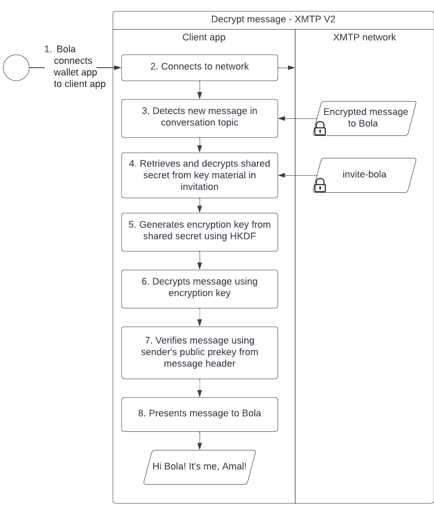
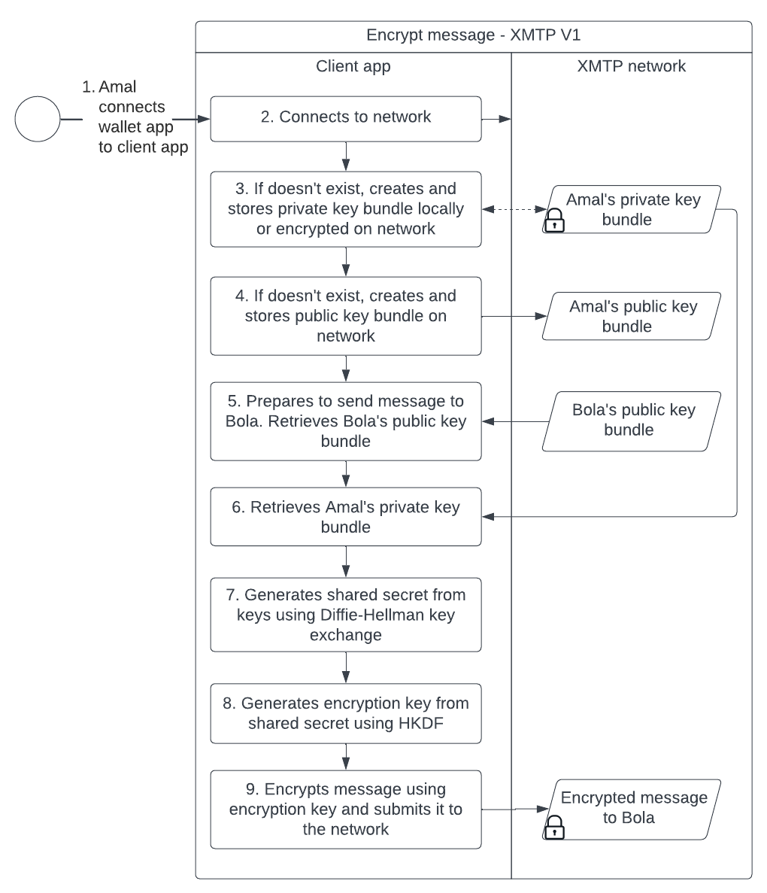

# Invitation and message encryption with XMTP

All XMTP invitations and messages are encrypted.

## XMTP V2 invitation and message encryption

This section describes how invitation and message encryption work for XMTP V2. Only client apps with XMTP client SDK >=v7.0.0 can use XMTP V2.

To learn more about invitations and messages, see [XMTP V2 topics and message presentation flow](architectural-overview#xmtp-v2-topics-and-message-presentation-flow).
<!--once specs are published, add link to Client Layer in The XMTP Protocol specifications.-->

To learn about how invitation and message encryption work in XMTP V1, see [XMTP V1 message encryption](#xmtp-v1-message-encryption).

### Invitation encryption

A client app encrypts and decrypts invites using the following artifacts:

* Public key bundle (per user)
* Private key bundle (per user)
* Shared secret (per sender and recipient pair)
* Encryption key (per sender and recipient pair)

The following sequence diagram dives a bit deeper into the flow and illustrates how a client app creates and uses these artifacts to encrypt an invite sent from Amal to Bola:

<!--Source file: https://lucid.app/lucidchart/e2f80322-b2c9-44c1-8f20-421628e4f9ed/edit?viewport_loc=-122%2C-1148%2C3032%2C1592%2C0_0&invitationId=inv_4013c892-b596-4097-bcfd-a50a233de812-->

Likewise, this sequence diagram illustrates the invite decryption process:

<!--Source file: https://lucid.app/lucidchart/e2f80322-b2c9-44c1-8f20-421628e4f9ed/edit?viewport_loc=-122%2C-1148%2C3032%2C1592%2C0_0&invitationId=inv_4013c892-b596-4097-bcfd-a50a233de812-->

### Message encryption

A client app signs, verifies, encrypts, and decrypts messages using the following artifacts:

* Pre-key (sender)
* Identity public key (sender)
* Shared secret (per invitees to a conversation)
* Encryption key (per invitees to a conversation)

On a related note, the encrypted message is signed by the sender using their private key. Upon decryption but before presentation to the recipient, the client app uses the sender's public key from the message header to verify the sender of the message.

The following sequence diagram dives a bit deeper into the flow and illustrates how a client app creates and uses these artifacts to encrypt and sign a message sent from Amal to Bola:

<!--Source file: https://lucid.app/lucidchart/9ec2b0e2-df13-4d06-82c7-59068059b8a7/edit?viewport_loc=-559%2C-817%2C2784%2C1462%2C0_0&invitationId=inv_857afa87-d52e-4236-8a9f-c5818c65df04-->

Likewise, this sequence diagram illustrates the message decryption and message verification process:

<!--Source file: https://lucid.app/lucidchart/9ec2b0e2-df13-4d06-82c7-59068059b8a7/edit?viewport_loc=-559%2C-817%2C2784%2C1462%2C0_0&invitationId=inv_857afa87-d52e-4236-8a9f-c5818c65df04-->

## XMTP V1 message encryption

This section describes how message encryption works for XMTP V1. To understand whether a client app will use XMTP V1 or V2, see [Determining whether to use XMTP V2 or V1 topics](architectural-overview#determining-whether-to-use-xmtp-v2-or-v1-topics).

With XMTP V1 message encryption, a client app encrypts and decrypts messages using the following artifacts:

* Public key bundle (per user)
* Private key bundle (per user)
* Shared secret (per sender and recipient pair)
* Encryption key (per sender and recipient pair)

Here’s a high-level overview of the message encryption and decryption flow for XMTP V1:

<!--Source file: https://www.figma.com/file/77ToMB4T16NiLwJjIp7dU1/diagrams?node-id=1%3A1769-->

The following sequence diagram dives a bit deeper into the flow and illustrates how a client app creates and uses these artifacts to encrypt a message:

<!--Source file: https://lucid.app/lucidchart/d2985646-969e-4625-82f0-cb38853033c5/edit?viewport_loc=-130%2C-308%2C3054%2C1604%2C0_0&invitationId=inv_2faa4c23-7fdb-40d8-9b78-e9c4557b712d-->

Likewise, this sequence diagram illustrates the message decryption process:

<!--Source file: https://lucid.app/lucidchart/d2985646-969e-4625-82f0-cb38853033c5/edit?viewport_loc=-130%2C-308%2C3054%2C1604%2C0_0&invitationId=inv_2faa4c23-7fdb-40d8-9b78-e9c4557b712d-->
