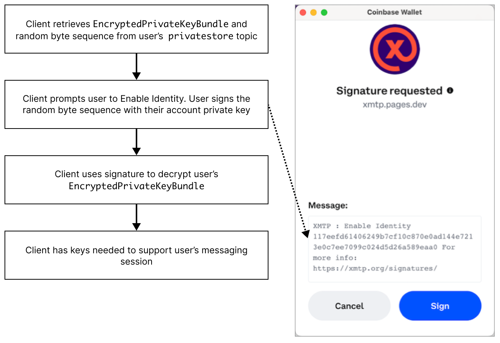

# Participant authentication with XMTP

<!--What do we think about the title of this topic? Consider this definition of "participant" - "Topics have participants, but not users. Client apps and the XMTP network have users, but not participants." Based on this definition I don't think we are authenticating participants, are we? I am thinking of "User authentication" (friendly language) or "Blockchain account authentication" (less friendly, but more accurate?)-->

<!--I removed the language about relationships between XMTP identities being established using a set of keys because the XMTP identity IS one of these keys. The way this is worded, if the relationship is established by the keys, the relationship must be between something that exists before key generation. Following the comment above, I think the keys enable establishing relationships between users (sender and recipient), or more specifically, the sender blockchain account and recipient blockchain account. Any thoughts?-->

<!--In the first sentence below, is it the XMTP client SDK that enables this - or the client/client protocol? I think the client provides this functionality based on the client protocol and the client SDK exposes it? What might make most sense to a developer reader here? I ask because I am seeing the opportunity, or need, the make a clearer division in the docs between the protocol and client -- and the SDK. For example, many of these topics in the Development concepts section are specifically about the protocols and could be refined to make this clearer.-->

The XMTP client SDK enables client apps to establish secure, unfalsifiable relationships between their users' blockchain accounts such that only the sender and recipient can decrypt messages sent between them.

These relationships are established by authenticating a user's blockchain account using the keys described here.

## Identity keys

A message API client (client) and the XMTP network cannot (and should not) access a user's blockchain account keys. For this reason, a client generates the following identity keys to serve as proxies for a user's blockchain account keys:

- `IdentityPublicKey` (also known as an XMTP identity)
- `IdentityPrivateKey`

A client prompts the user to sign the `IdentityPublicKey` with their blockchain account keys to confirm, or prove, that the user, as controller of the blockchain account, generated the XMTP identity.

Anyone can verify the user's signature and consider it as an attestation that the `IdentityPublicKey` is the user's true proxy keys since only the user's blockchain account keys could have created the signature.

## Prekeys

A client also generates public and private prekeys for use with a user's `IdentityPublicKey`, or XMTP identity.

A client prompts the user to sign their public prekey with their `IdentityPrivateKey`.

<!--Below, looking for an accurate positioning for prekeys - as signing on behalf of an XMTP identity? Something like - the prekeys belong to, or as associated with, the XMTP identity? Is the idea that the prekeys - once signed by the identity keys - are the keys that are doing all the work? And that's why being able to rotate them in the future is important? Whereas, the identity keys sign the prekeys, but then aren't actively being used to encrypt and sign anything. And the blockchain account keys after signing the identity keys are REALLY out of the picture. I am seeing something like layers of defense - or obfuscation - or abstraction - is this how it is meant?-->

The prekeys are used to encrypt invitations and sign encoded messages on behalf of the XMTP identity.
<!--I don't explicitly mention the prekey use in the invitation encryption flows. I mention the public and private key bundles - when we talk about these bundles - are we specifically talking about the public and private prekeys? https://xmtp.org/docs/dev-concepts/invitation-and-message-encryption#invitation-encryption.-->

<!--In the message encryption flows I show the sender signing the message with their prekey (I should specify private prekey). For the message decryption flow, I show the recipient verifying that message sender using the sender's public key from the message header - specifically, is this the public prekey? https://xmtp.org/docs/dev-concepts/invitation-and-message-encryption#message-encryption-->

An XMTP identity may have multiple private prekeys. A client must be able to access every private prekey used by an XMTP identity to decrypt historical messages.

There is always only one public prekey for an XMTP identity, which is the most current prekey.

## Key generation and retrieval flow

The following diagrams show how a client generates and retrieves identity keys and prekeys. The diagrams also show details of how a client encrypts and stores keys.

Encrypted keys generated for a blockchain account are accessible by only the client apps authorized by the user (controller of the blockchain account). By design, XMTP and the XMTP network cannot access these encrypted keys. <!--I think we should remove this "By design..." sentence. The message in the previous sentence is clearer without it. By mentioning two things that cannot access the keys only opens up the question of what else can't access the keys. Also, what do we mean by XMTP? I believe we mean XMTP Labs.-->

To start the flow, a user accesses an app built with XMTP and connects the app to their desired blockchain account using their wallet app. The app then creates a client.

The client checks the XMTP network for keys associated with the account.

If the keys don't exist, [the client generates them](#key-generation-flow).

If the keys exist, [the client retrieves them](#key-retrieval-flow).

### Key generation flow

If the client checks the XMTP network for keys associated with the account and the keys don't exist, the client generates them according to this flow.

<!--source file: https://www.figma.com/file/77ToMB4T16NiLwJjIp7dU1/diagrams?node-id=47%3A755-->

### Key retrieval flow

If the client checks the XMTP network for keys associated with the account and the keys exist, the client can retrieve them according to this flow.

The retrieval flow is not dictated by the XMTP client protocol. After the client has generated the keys, client apps can determine how to best retrieve and store keys. <!--something like this to define that the retrieval flow is not a part of the protocol?-->

<!--source file: https://www.figma.com/file/77ToMB4T16NiLwJjIp7dU1/diagrams?node-id=48%3A813-->

## Learn more

To learn more about keys, see [Keys](https://github.com/xmtp/proto/blob/main/PROTOCOL.md#keys) in The XMTP Protocol specification.
